# Circle C++ shaders
**2021 Sean Baxter ([@seanbax](https://www.twitter.com/seanbax))**
**[circle-lang.org](https://www.circle-lang.org/)**

1. [Shader quick guide](#shader-quick-guide)

    * [Driver disclaimers](#driver-disclaimers)
    * [Compiling the samples](#compiling-the-samples)
    * [Using the compiler](#using-the-compiler)
    * [Shader attributes](#shader-attributes)
    * [Interface attributes](#interface-attributes)

1. [Shaders as an embedded language](#shaders-as-an-embedded-language)

    * [Approaching Circle shaders from GLSL](#approaching-circle-shaders-from-glsl)
    * [Approaching Circle shaders from C++](#approaching-circle-shaders-from-glsl)
    * [Approaching Circle shaders from Circle](#approaching-circle-shaders-from-circle)
    
1. [The vertex and fragment stages](#the-vertex-and-fragment-stages)

    [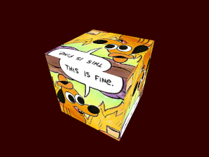](#the-vertex-and-fragment-stages)
    * [Specializing SPIR-V shaders](#specializing-spir-v-shaders)
    * [Variable templates](#variable-templates)
    * [Typed enums](#typed-enums)
    * [Typed enums and variable templates](#typed-enums-and-variable-templates)

1. [The geometry stage](#the-geometry-stage)

    [](#the-geometry-stage)

1. [The tessellation stages](#the-tessellation-stages)

    [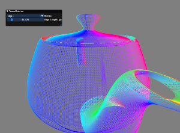](#the-tessellation-stages)
    * [Tessellation control](#tessellation-control)
    * [Tessellation evaluation](#tessellation-evaluation)

1. [The compute stage](#the-compute-stage)

    [](#the-compute-stage)
    [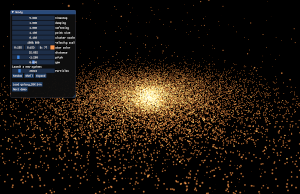](#the-compute-stage)

1. [Physically-based rendering of glTF models](#physically-based-rendering-of-gltf-models)

    [](#physically-based-rendering-of-gltf-models)
    * [Specialization constants](#specialization-constants)
    * [Reflecting on specialization constants](#reflecting-on-specialization-constants)

1. [Reflection and attributes for Shadertoy development](#reflection-and-attributes-for-shadertoy-development)

    [](#reflection-and-attributes-for-shadertoy-development)
    [](#reflection-and-attributes-for-shadertoy-development)
    [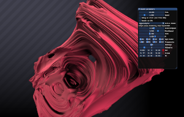](#reflection-and-attributes-for-shadertoy-development)
    [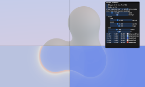](#reflection-and-attributes-for-shadertoy-development)
    [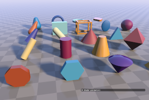](#reflection-and-attributes-for-shadertoy-development)
    [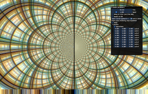](#reflection-and-attributes-for-shadertoy-development)
    * [User attributes](#user-attributes)
    * [User attributes and Dear ImGui](#user-attributes-and-dear-imgui)
    * [Shader programming with composition](#shader-programming-with-composition)
    * [Unified CPU and GPU rendering and CPU debugging](#unified-cpu-and-gpu-rendering-and-cpu-debugging)
    * [if-codegen statements](#if-codegen-statements)
    * [Configuring a shader from JSON](#configuring-a-shader-from-json)

1. [Compiled sprites with compile-time PNG decoding](#compiled-sprites-with-compile-time-png-decoding)
   
    [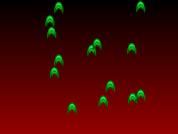](#compiled-sprites-with-compile-time-png-decoding)
    [](#compiled-sprites-with-compile-time-png-decoding)
    * [Decoding sprites at compile time](#decoding-sprites-at-compile-time)
    * [Generating compiled sprite compute shaders](#generating-compiled-sprite-compute-shaders)
    * [Compile-time calls to external libraries](#compile-time-calls-to-external-libraries)

1. [Compiling CUDA code with C++ shaders](#compiling-cuda-code-with-c-shaders)

    [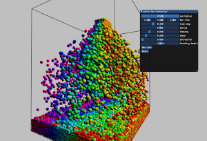](
    #compiling-cuda-code-with-c-shaders)

    * [Moderngpu for shaders](#moderngpu-for-shaders)
    * [The particles demo](#the-particles-demo)

1. [Advanced compute with Vulkan]

    * [Shader parameters and push constants](#shader-parameters-and-push-constants)
    * [Chevron launches](#chevron-launches)
    * [Physical storage buffers](#physcial-storage-buffers)
    * [Lambda dispatch](#lambda-dispatch)
    * [Moderngpu for Vulkan](#moderngpu-for-Vulkan)

1. [Ray Tracing with Vulkan RTX](#ray-tracing-with-vulkan-rtx)

    [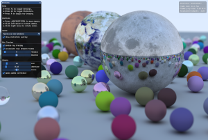](#ray-tracing-with-vulkan-rtx)
    [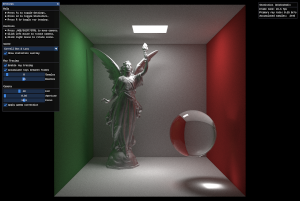](#ray-tracing-with-vulkan-rtx)
    [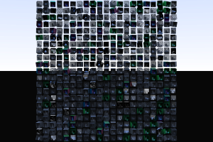](#ray-tracing-with-vulkan-rtx)
    [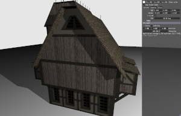](#ray-tracing-with-vulkan-rtx)

    * [Mini path-tracing tutorial](#mini-path-tracing-tutorial)
    * [Vulkan Ray Tracing in a Weekend](#vulkan-ray-tracing-in-a-weekend)
    * [Nonuniform resource array access](#nonuniform-resource-array-access)

1. [The mesh shader pipeline](#the-mesh-shader-pipeline)

    [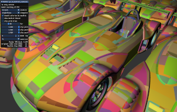](#the-mesh-shader-pipeline)
    [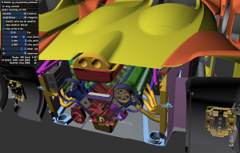](#the-mesh-shader-pipeline)

    * [The meshlet cadscene sample](#the-meshlet-cadscene-sample)

1. [Vectors and matrices](#vectors-and-matrices)

    * [Vector swizzle](#vector-swizzle)
    * [Vector initializers](#vector-initializers)
    * [Element-wise vector operations](#element-wise-vector-operations)
    * [Vector conversion to bool](#vector-conversion-to-bool)
    * [Matrix types](#matrix-types)

1. [Shader extension declarations](#shader-extension-declarations)

1. [Under construction features](#under-construction-features)

## Shader quick guide

### Driver disclaimers

Working on this compiler has exposed _a lot_ of graphics driver bugs. The vendors test their drivers on glslang output, and glslang doesn't generate multi-shader SPIR-V modules. But Circle does, and this causes the graphics drivers to segfault or error or render incorrectly in most of the samples, if run without workarounds. 

* **NVIDIA**: You must use the [Vulkan beta driver 455.46.04](https://developer.nvidia.com/vulkan-driver) or later. It must be the beta driver. A release driver will fail in the teacups (segfault) and ray-tracing samples (no pretty pictures, just sky). The compiler itself has a workaround to prevent a segfault in the glTF sample viewer. The workarounds will be removed as driver bugs are fixed.

* **INTEL/AMD**: Use a recent release driver. There are a number of driver bugs preventing proper execution, but I'm working to get them fixed. Check out the [intel](https://github.com/seanbaxter/shaders/tree/intel) branch in this repository for Intel-compatible source for all the samples. Note that this branch significantly trails the master branch; namely, it lacks many of the advanced Shadertoy shaders.

### Compiling the samples

This repository requires Git Large File Storage to support the HDR environment maps used by the glTF viewer project. Make sure to install [Git LFS](https://git-lfs.github.com/) before pulling this project.

The repository has some submodule dependencies. Pull them with:
```
git submodule update --init --recursive
```

These samples include individual `CMakeLists.txt` files for easy compilation:
```
# cd into each sample folder
$ cd cube

# invoke cmake to construct a Makefile. point CMAKE_CXX_COMPILER at the circle
# binary on your system.
$ cmake -DCMAKE_CXX_COMPILER=circle .
-- Configuring done
-- Generating done
-- Build files have been written to: /home/sean/projects/shaders/cube

# build the project with make. -jN uses N threads for parallel compilation.
$ make -j4
[ 50%] Building CXX object CMakeFiles/cube.dir/cube.cxx.o
... wrote CMakeFiles/cube.dir/cube.cxx.spv
[100%] Linking CXX executable cube
[100%] Built target cube

$ ./cube
```

To build the `sprites2` sample you'll need to compile STB image into a shared object:
```
$ cd thirdparty
$ gcc -shared -fPIC stbi.c -o libstbi.so
```

### Using the compiler

Enable shader generation with the `-shader` the command line switch.

To process a C++ file and output a .spv module, use the `-c -emit-spirv` switches. The output file takes the name of the input file with the extension replaced with ".spv".

**vert.cxx**
```cpp
[[spirv::vert]]
void vert_main() { 
  glvert_Output.Position = vec4(.5, 0, 0, 0);
}
```
```
$ circle -shader -c -emit-spirv vert.cxx
$ spirv-dis vert.spv
  OpCapability Shader
  OpExtension "GL_EXT_scalar_block_layout"
  OpMemoryModel Logical GLSL450
  OpEntryPoint Vertex %_Z9vert_mainv "_Z9vert_mainv" %glvert_Output
  ...
```

When an output filename is provided, Circle will infer what kind of operation you want. You can drop the `-c -emit-spirv` switches, but you'll need to keep `-shader`:

```
$ circle -shader -o vert.spv vert.cxx
$ spirv-dis vert.spv
  OpCapability Shader
  OpExtension "GL_EXT_scalar_block_layout"
  OpMemoryModel Logical GLSL450
  OpEntryPoint Vertex %_Z9vert_mainv "_Z9vert_mainv" %glvert_Output
  ...
```

You can define as many shaders as you'd like in one translation unit. When using Circle to generate external SPIR-V modules, you'll need to explicitly specialize shader function templates:

**vert2.cxx**
```cpp
template<int X>
[[spirv::vert]]
void vert_main() { 
  glvert_Output.Position = vec4(X, 0, 0, 0);
}

template void vert_main<5>();
template void vert_main<10>();
```
```
$ circle -shader -c -emit-spirv vert2.cxx
$ spirv-dis vert2.spv
  OpCapability Shader
  OpExtension "GL_EXT_scalar_block_layout"
  OpMemoryModel Logical GLSL450
  OpEntryPoint Vertex %_Z9vert_mainILi5EEvv "_Z9vert_mainILi5EEvv" %glvert_Output
  OpEntryPoint Vertex %_Z9vert_mainILi10EEvv "_Z9vert_mainILi10EEvv" %glvert_Output
  ...
```

To turn off name mangling of shaders, mark the shader entry points `extern "C"` or use an [_asm-label_](https://gcc.gnu.org/onlinedocs/gcc-6.3.0/gcc/Asm-Labels.html) between the function signature and the the curly braces. 

Recommended operation is to define shader code directly in a normal translation unit. This is the "single-source" mode. Use `-shader` without `-emit-spirv` to enable this mode.

In single-source mode only shader functions that are ODR-used are included in the SPIR-V module. The SPIR-V binary is embedded right into the compiled object file, accessible at the symbol `__spirv_data` with a length in bytes of `__spirv_size`. ODR use shaders by using them as arguments in the `@spirv` operator. This intrinsic yields the name of the shader, for use with `glSpecializeShader` or `VkPipelineShaderStageCreate`, and causes the shader to be lowered to SPIR-V and included in the compiled object's binary. In single-source mode, the SPIR-V module is written to file as a side effect, and is given the name of the input C++ file but with the extension replaced with ".spv".

**vert3.cxx**
```cpp
#include <cstdio>

template<int X>
[[spirv::vert]]
void vert_main() { 
  glvert_Output.Position = vec4(X, 0, 0, 0);
}

int main() {
  // Using shader functions in the @spirv operator ODR uses them
  // and returns their module names.
  printf("%s\n", @spirv(vert_main<5>));
  printf("%s\n", @spirv(vert_main<10>));
}
```
```
$ circle -shader vert3.cxx 
... wrote vert3.spv
$ ./vert3
_Z9vert_mainILi5EEvv
_Z9vert_mainILi10EEvv
$ spirv-dis vert3.spv
  OpCapability Shader
  OpExtension "GL_EXT_scalar_block_layout"
  OpMemoryModel Logical GLSL450
  OpEntryPoint Vertex %_Z9vert_mainILi5EEvv "_Z9vert_mainILi5EEvv" %glvert_Output
  OpEntryPoint Vertex %_Z9vert_mainILi10EEvv "_Z9vert_mainILi10EEvv" %glvert_Output
  ...
```

### Shader attributes

Mark shader entry points with one of these attributes:

* `[[spirv::vert]]` - Vertex stage.
* `[[spirv::tesc(num_vertices)]]` - Tessellation control stage. 
    `num_vertices` - Incoming patch size.
* `[[spirv::tese(primitive, spacing, ordering)]]` - Tessellation evaluation stage. 
    `primitive`, `spacing` and `ordering` must be values from these enumerations:

```cpp
enum class gltese_primitive_t : unsigned {
  triangles,
  quads,
  isolines,
};

enum class gltese_spacing_t : unsigned {
  equal,
  fractional_even,
  fractional_odd,
};

enum class gltese_ordering_t : unsigned {
 cw,
 ccw, 
};
```
* `[[spirv::geom(input, output, max_vertices)]]` - Geometry stage.
    `input` and `output` must be values from these enumerations:

```cpp
enum class glgeom_input_t : unsigned {
  points,
  lines,
  lines_adjacency,
  triangles,
  triangles_adjacency,
};

enum class glgeom_output_t : unsigned {
  points,
  line_strip,
  triangle_strip,
};
```
* `[[spirv::frag(origin)]]` - Fragment stage.
    `origin` is an _optional_ argument and must be a value from `glfrag_origin_t`:

```cpp
enum class glfrag_origin_t : unsigned {
  lower_left,   // OpenGL style
  upper_left,   // Vulkan style
};
```
* `[[spirv::comp]]` - Compute stage.
* `[[spirv::task]]` - Task stage.
* `[[spirv::mesh(output)]]` - Mesh stage.
    `output` must be a value from `glmesh_output_t`.

```cpp
enum class glmesh_output_t : unsigned {
  points,
  lines,
  triangles,
};
```
* `[[spirv::rgen]]` - Ray generation stage.
* `[[spirv::rint]]` - Ray intersection stage.
* `[[spirv::rahit]]` - Ray any hit stage.
* `[[spirv::rchit]]` - Ray closest hit stage.
* `[[spirv::rmiss]]` - Ray miss stage.
* `[[spirv::rcall]]` - Ray callable stage.

The `spirv::local_size` attribute is required when declaring compute, task and mesh stages.
* `[[spirv::local_size(x, y, z)]]` - The workgroup size. The `x` argument is mandatory. The `y` and `z` arguments are optional.

### Interface attributes

Shaders stages are distinguished by a shader attribute. Interface variables are distinguished by interface attributes. In all cases, the interface attribute name indicates the storage class for the variable.

* `[[spirv::in]]` - Input scalar or vector. Requires a `spirv::location` attribute.
* `[[spirv::out]]` - Output scalar or vector. Requires a `spirv::location` attribute.
* `[[spirv::uniform]]` - A `Uniform` or `UniformConstant` interface variable. The former require a `spirv::binding` and optional `spirv::set`. The latter require a `spirv::location` attribute.
* `[[spirv::buffer]]` - Shader stage storage buffer. Requires `spirv::binding`. Optional `spirv::set`.
* `[[spirv::shared]]` - Workgroup shared memory. Declare these inside a compute, task or mesh shader.
* `[[spirv::push]]` - Push constant. Vulkan only. Defaults to 128 byte structure.
* `[[spirv::push(max-size)]]` - Push constant with explicit structure size limit.
* `[[spirv::rayPayload]]`
* `[[spirv::rayPayloadIn]]`
* `[[spirv::hitAttribute]]`
* `[[spirv::callableData]]`
* `[[spirv::callableDataIn]]`
* `[[spirv::shaderRecord]]` - Ray tracing storage classes. See [GLSL_nv_ray_tracing](https://github.com/KhronosGroup/GLSL/blob/master/extensions/nv/GLSL_NV_ray_tracing.txt).
* `[[spirv::perTaskOut]]` - Outgoing payload from task shader into mesh shader. See [GLSL_nv_mesh_shader](https://github.com/KhronosGroup/GLSL/blob/master/extensions/nv/GLSL_NV_mesh_shader.txt)
* `[[spirv::perTaskIn]]` - Incoming payload to mesh shader from task shader.
* `[[spirv::constant(index)]]` - Specialization constant or structure of specialization constants. The index is equivalent to GLSL's `constant_id`. This is not technically a storage class. See [Specialization constants](#specialization-constants).

In addition to the storage class attributes, GLSL includes a number of layout qualifiers:
* `[[spirv::location(index)]]` - Binding location for `in`, `out` and `uniform` interface variables.
* `[[spirv::component(index)]]` - Specifies a component within a shader stage `in` or `out` attribute. This allows packing multiple scalars or small vectors inside the `vec4` layout for shader stage atrtibutes. 
* `[[spirv::binding(index)]]` - Binding location for uniform buffers, storage buffers, images, textures and samplers.
* `[[spirv::set(index)]]` - Descriptor set that may optionally be provided with `spirv::binding`. Vulkan only.
* `[[spirv::format(format)]]` - A compatible internal format for image buffers. Must be a value from the `gl_format_t` enumeration: 
* `[[spirv::invocations(count)]]` - The number of times to invoke the geometry shader. `glgeom_InvocationID` specifies the particular instance.

```cpp
enum class gl_format_t : unsigned {
  unknown,
  
  // float-image-format-qualifier:
  rgba32f,
  rgba16f,
  r32f,
  rgba8,
  rgba8_snorm,
  rg32f,
  rg16f,
  r11f_g11f_b10f,
  r16f,
  rgba16,
  rgb10_a2,
  rg16,
  rg8,
  r16,
  r8,
  rgba16_snorm,
  rg16_snorm,
  rg8_snorm,
  r16_snorm,
  r8_snorm,

  // int-image-format-qualifier:
  rgba32i,
  rgba16i,
  rgba8i,
  r32i,
  rg32i,
  rg16i,
  rg8i,
  r16i,
  r8i,

  // uint-image-format-qualifier:
  rgba32ui,
  rgba16ui,
  rgba8ui,
  r32ui,
  rgb10_a2ui,
  rg32ui,
  rg16ui,
  rg8ui,
  r16ui,
  r8ui,
};
```

There are some mutually-exclusive auxiliary modifiers:
* `[[spirv::noperspective]] and [[spirv::flat]]` - Control interpolation of shader stage attributes. Use at most one of these.
* `[[spirv::patch]]`, `[[spirv::centroid]]` and `[[spirv::sample]]` - Use at most one of these.

## Shaders as an embedded language

The Circle shader extension aims to bring the entire capability of the OpenGL Shading Language (GLSL) into C++ as a first-class language feature. Write graphics code using Standard C++ and mark interface variables and shader functions with C++ attributes to indicate their role in the graphics pipeline. When the program is compiled, all shader declarations are lowered to the SPIR-V binary intermediate representation, which is the portable shader storage format Vulkan and OpenGL programs.

The guiding vision behind this extension was to make shader programming idiomatic to both C++ and GLSL users, at the same time. GLSL has a lot of conveniences that Standard C++ lacks, so these were added to the Circle frontend:

### Approaching Circle shaders from GLSL

GLSL-like vector and matrix types are now built into the C++ compiler. These builtins provide a canonical definition for interface variables which expect vector and matrix types. Additionally, the vector type provides both source and destination [component swizzle](#vector-swizzle), a critical convenience that both GLSL and HLSL offer but is impractical to implement using Standard C++. 

Nearly the entire slate of GLSL builtin functions has been added to the Circle compiler. In addition to the expected elementary math functions, you get things like `mix`, `smoothstep`, `refract` and `clamp`. When invoked, these functions lower directly to their SPIR-V and GLSL.std.450 opcodes, resulting in a compact shader encoding that more closely resembles the glslang output that graphics drivers are tested and tuned on.

The many choices in storage classes, layout modifiers, formats, thread group sizes and the like have been moved inside C++ attributes. Recognizable semantics, modern syntax.

Uniform and storage buffers were not cleanly defined in GLSL, requiring an apparently superfluous block structure that encapsulates buffer contents. While the block requirement remains in SPIR-V, the Circle shader extension internalizes their definition. You can now define uniform and storage buffers directly with ordinary C++ structs and arrays.

Array members in GLSL storage buffers may have a "runtime" length. This length may be queried with the `.length` operator. This operator has been added to the Circle compiler. I'm committed to implementing even marginal GLSL features. I want GLSL users to be able to move to an all-C++ enivronment and continue banging out shaders with minimal retraining.

### Approaching Circle shaders from C++

From the front-end perspective, anything you can express in C++ you can now express in a C++ shader. Your shaders can be _function templates_. Your interface variables (such as ins, outs, samplers, uniform buffers) can be _variable templates_. Shader attribute values can be template-dependent expressions. You can bind C++ structures directly to interface variables, and member functions can be invoked on objects of any shader storage class. If you're a C++ power user, you don't have to dumb down how you code: modern C++ can now be brought to bear on graphics.

From the back-end perspective, the shader abstract machine model is less flexible than a CPU. Indirect and virtual function calls, exceptions, dynamic memory, virtual inheritance and RTTI cannot be provided. More troubling, most operations involving pointers are incompatible with the "Logical" memory model that SPIR-V graphics defines. Of course, pointers and references (which are just pointers after a value category transformation) are at the core of C++. Circle has special control-flow graph passes to de-pointerize functions. In practice this involves splitting apart base pointer from offset terms, propagating this split up the control flow graph, and replacing accesses via pointers, which is prohibited, into direct indexing on variables, which is supported. In short, pointers aren't _guaranteed_ to lower to SPIR-V, but with the help of these transforms, pointers in the code you wrote likely will.

Other aspects of C++ reside in an implementation gray area, including unions and bit-fields. These can be supported _for most use cases_ with CFG transformations. They will be incorporated into the compiler when I'm satisfied with their robustness.

### Approaching Circle shaders from Circle

The original design principle of Circle was to rotate C++ from the runtime onto the compile-time axis, allowing the developer to metaprogram C++ using plain C++, as opposed to a ghoulish recursive template and SFINAE dialect. This principle motivates the integration of GLSL functionality directly into C++. What's the big reason for choosing such a rich, general purpose language to write shaders? I've already conceded that it can't use virtual and indirect calls, exceptions, dynamic memory, file or network i/o, and many other features that C++ programmers consider essential. But those features may still be used in shader definitions _at compile time_. 

I think it makes sense to target devices with limited flexibility in a maximally-expressive language like C++ if that power can be used in the service of program generation. Two example projects examine this idea:
1. The [Shadertoy](#shadertoy) demo includes five simple fragment shaders, each encapsulated with its uniform data in a C++ function object. User attributes annotate data members with configuration metadata, and Circle reflection generically iterate over the uniform data members and defines an ImGui user interface automatically. 
  
    Attributes are an important tool for connecting host code (C# in the case of [Unity](https://docs.unity3d.com/Manual/Attributes.html) and C++ in the case of [Unreal Engine](https://docs.unrealengine.com/en-US/Programming/UnrealArchitecture/Reference/Properties/index.html)) with script engines, editors and other subsystems. Many frameworks define their own "pipeline" file formats which combine shader text and attribute metadata. With the Circle shader extension, user attributes are a first-class part of the language.

1. The [sprite compiler](#sprite-compiler) knocks down preconceptions about what is supported during C++ source translation. Games from the pre-accelerator era often compiled sprites directly into functions, eliminating branching over transparent values and lowering to machine code that was basically a continuous stream of store operations. Developers would write sprite compiler tools using C or a scripting language which would consume an image file and sprite sheet metadata, and emit textual C code or assembler, which effectively drew the sprite into memory.

    This Circle example eliminates the discrete sprite compiler by loading the sprite sheet and PNG image at compile time. (It uses the the popular [STB image decoder](https://github.com/nothings/stb).) Compile-time control flow visits sections of the decompressed image defined by the sprite sheet and emits `imageStore` operations into a compute shader, thereby encoding the information in a sprite directly into SPIR-V binary. Allow me to repeat: you can #include the code for a PNG decoder immediately use that _at compile time_ to load an image and generate custom shader logic from its pixel values. Whatever imaginative leap you've made with regard to generative metaprogramming, this compiler can probably do it.

The limited semantics of GLSL, while by construction adequete for expressing any accelerated graphics operation, is insufficient for expressing higher-level functionality that may be useful for _metaprogramming_ your shader. While the C++ shaders use only a subset of Standard C++, the surrounding metaprogram may use the whole thing, plus user-attributes, reflection and compile-time execution in addition to that.

## The vertex and fragment stages

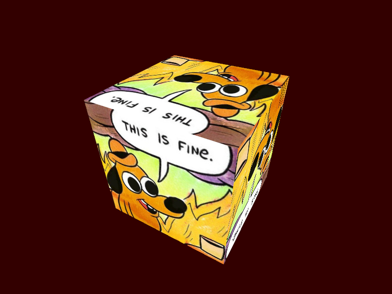

All programs using the raster pipeline require a vertex and fragment shader. A vertex array, which is defined using the API, defines the mapping from buffer memory to vertex stage interface variables, which are defined by the shader extension. Data may be passed from the vertex stage to the fragment stage, via interpolators, using interface variables which are reconciled when the shader program is linked by the graphics driver.

Even in their vanilla forms, the shader functions and interface variables as expressed with Circle look quite different from GLSL:

[**cube/cube.cxx**](cube/cube.cxx)
```cpp
[[using spirv: in, location(0)]]
vec3 in_position_vs;

[[using spirv: in, location(1)]]
vec2 in_texcoord_vs;

[[using spirv: out, location(1)]]
vec2 out_texcoord_vs;

[[using spirv: in, location(1)]]
vec2 in_texcoord_fs;

[[using spirv: out, location(0)]]
vec4 out_color_fs;

[[using spirv: uniform, binding(0)]]
sampler2D texture_sampler;

struct uniforms_t {
  mat4 view_proj;
  float seconds;
};

[[using spirv: uniform, binding(0)]]
uniforms_t uniforms;

[[spirv::vert]]
void vert_main() {
  // Create a rotation matrix.
  mat4 rotate = make_rotateY(uniforms.seconds);

  // Rotate the position.
  vec4 position = rotate * vec4(in_position_vs, 1);

  // Write to a builtin variable.
  glvert_Output.Position = uniforms.view_proj * position;

  // Pass texcoord through.
  out_texcoord_vs = in_texcoord_vs;
}

[[spirv::frag]]
void frag_main() {
  // Load the inputs. The locations correspond to the outputs from the
  // vertex shader.
  vec2 texcoord = in_texcoord_fs;
  vec4 color = texture(texture_sampler, texcoord);

  // Write to a variable template.
  out_color_fs = color;
}
```

Maybe the most conspicuous difference is that the vertex and fragment shaders are written in the same file! GLSL requires each shader be written in its own translation unit, and that it must be called "main". In Circle, shaders can be given any name, and may be function templates. Write as many of them in one translation unit, and they'll all be compiled into a single SPIR-V module.

The next thing to catch your eye is probably the unfamiliar look of the C++ attribute:
```cpp
[[using spirv: in, location(0)]]
vec3 in_position_vs;
```

That `using` token at the front? It opens an _attribute_ namespace. Subsequent attribute names all come from this namespace. If you prefer the feel of it, you can write this is an equivalent piece of code:
```cpp
[[spirv::in, spirv::location(0)]]
vec3 in_position_vs;
```
By carving out a `spirv` namespace, the compiler avoids naming conflicts with other extensions that may use C++ attributes.

This declaration is the C++ equivalent of this bit of GLSL:
```cpp
layout(location=0)
in vec3 in_position_vs;
```

How do you declare a uniform buffer? Simply use a `[[spirv::uniform]]` storage class on a namespace-scope object declaration. A `binding` attribute is also required. The shader uses the layout of the type according to the Itanium C++ ABI. This is different from the `std140` layout of GLSL. See the [layout](#layout) section for C++ attributes to arrange data members according to the `std140`, `std430` or `scalar` buffer layouts.

The interface variables appear to be global variables, but they don't actually emit any storage on the host side. Fundamentally these declarations relate type with layout qualifiers and storage class. On the host, the user can't write to or read from any of these interface variables; you'd get an undefined symbol error. To change the data the uniform buffer refers to, use the appropriate Vulkan or OpenGL API with the interface variable's binding location.

`glvert_Output.Position` is the Circle name for `gl_Position`. Builtin variables are named according to their shader stage and storage class. Because shaders from all stages may coexist in a single C++ translation unit, more specific names are required to distinguish the type and storage class of builtin objects.

### Specializing SPIR-V shaders

```cpp
void myapp_t::create_shaders() {
  GLuint vs = glCreateShader(GL_VERTEX_SHADER);
  GLuint fs = glCreateShader(GL_FRAGMENT_SHADER);
  GLuint shaders[] { vs, fs };
  glShaderBinary(2, shaders, GL_SHADER_BINARY_FORMAT_SPIR_V_ARB,
    __spirv_data, __spirv_size);

  glSpecializeShader(vs, @spirv(vert_main), 0, nullptr, nullptr);
  glSpecializeShader(fs, @spirv(frag_main), 0, nullptr, nullptr);

  program = glCreateProgram();
  glAttachShader(program, vs);
  glAttachShader(program, fs);
  glLinkProgram(program);
}
```

All shaders in a C++ translation unit are linked in a single SPIR-V binary module, which is bound in the byte array `__spirv_data` with length, in bytes, `__spirv_size`. Pass these terms to `glShaderBinary` or `VkShaderModuleCreate` where you'd typically pass data loaded from file. Due to the multi-entry-point module nature of the system, you only need one `glShaderBinary` or `VkCreateShaderModule` per C++ translation unit. All the `glSpecializeShader` and `VkPipelineShaderStageCreate` calls source into this common module.

Shader functions are only lowered to SPIR-V if they are _ODR-used_. ODR usage is a complex topic, but for our purposes, it just means that the shader name or the specialization of a shader function template must appear inside a `@spirv` operator. This special operator causes the shader to be lowered to SPIR-V binary and returns the mangled name of the shader. It's intended to provide the _name_ argument of `glSpecializeShader` and `VkPipelineShaderStageCreate`. Requesting the name of the shader is its ODR usage. This is similar to 'inline' linkage for normal functions: you can include as many shaders in your translation unit as you want, either directly or through headers, but only those used by `@spirv` are ODR-used and lowered to code.

### Variable templates

The many interface declarations in our cube sample is unacceptably clumsy. You need a separate variable for every input and output to every shader stage in your program. GLSL limits you to one shader per file, so they don't look too bad; but when you define many shaders in one translation unit, you really see how they pile up, and choosing names for each of them is a burden.

Variable templates are a little-known C++14 feature. They're little-known because they're very rarely used outside of the implementation of C++17 type traits. (I mean the type traits with a "\_v" on the end). They're basically template versions of objects, but because their dynamic initialization order is hard to pin down, in practice they're only used to hold constexpr values, for which dynamic initialization order does not matter.

I use variable templates for shader interface variables all the time. Interface variables don't have storage so they don't get initialized. They only exist to relate types with layout qualifiers and storage classes. This is an ideal use case for variables templates. Rather than defining interface as a bunch of global variables for each location, shader stage and storage class, we can define the interface as _specializations_ from a library of interface variable templates.

```cpp
// The interface variable template. This can go in a library.
template<typename type_t, int I>
[[using spirv: out, location(I)]]
type_t shader_out;

// A fragment shader that writes a blue output.
[[spirv::frag]]
void frag_main() {
  shader_out<vec4, 0> = vec4(0, 0, 1, 1);
}
```

The `shader_out` variable template can be defined once and then put out of sight. It's not an interface variable by itself. Rather, its specialization generates an interface variable. The shader `frag_main` generates an `out` storage class variable with type `vec4` and location `0` simply by using the template with those arguments.

### Typed enums

Circle includes a powerful type called the typed enum. It's like an ordinary enum, but each enumerator constant also has an associated type. It provides the capability of a compile-time type list. Associated keywords like `@enum_type` (to yield the type associated with a single enumerator) and `@enum_types` (to yield a parameter pack of types associated with all the enumerators) provide reflection on typed enums. The associated type is specified in the _enum-specifier_. In a normal enum, the name is required and the value is optional. In a typed enum, the name is optional, the value is automatically assigned, and the type is required.

```cpp
#include <cstdio>

enum typename type_list_t {
  Nothing = void,
  Counter = int,
  char*,
  double[5],
};

int main() {
  printf("type_list_t has values:\n");
  @meta for enum(type_list_t x : type_list_t)
    printf("  %s (%d) = %s\n", @enum_name(x), (int)x, @enum_type_string(x));
}
```
```
$ circle typelist.cxx
$ ./typelist
type_list_t has values:
  Nothing (0) = void
  Counter (1) = int
  _2 (2) = char*
  _3 (3) = double[5]
```

`type_list_t` is a typed enum serving as a type list. It has four enumerators: `Nothing`, `Counter`, `_2` and `_3`. A name that isn't specified is set to its ordinal, automatically. Converting these enumerators to integers also reveal they have ascending values: `Nothing` is 0, `Counter` is 1, `_2` is 2 and  `_3` is 3.

Access the name of each enumerator with `@enum_name`. Access its type with `@enum_type`. Access a string literal spelling of its type with `@enum_type_string`. The _for-enum_ statement is a compile-time loop special to Circle. It visits all enumerators in an enum, and binds each of them to a constexpr loop value.

```cpp
#include <cstdio>

enum typename type_list_t {
  Nothing = void,
  Counter = int,
  char*,
  double[5],
};

int main() {
  printf("type_list_t has values:\n");
  printf("  %s (%d) = %s\n", @enum_names(type_list_t), 
    (int)@enum_values(type_list_t), @enum_type_strings(type_list_t))...;
}
```
```
$ circle typelist.cxx
$ ./typelist
type_list_t has values:
  Nothing (0) = void
  Counter (1) = int
  _2 (2) = char*
  _3 (3) = double[5]
```

Pack-yielding versions of these extensions are also provided, so you can access the names, values, types and type strings of all enumerators without even having to write a loop. In this example, `@enum_names`, `@enum_values` and `@enum_type_strings` all yield length-four non-type parameter packs. They can be expanded with a `...` at the end of the statement, which generates four `printf` expressions.

### Typed enums and variable templates

```cpp
template<auto index, typename type_t = @enum_type(index)>
[[using spirv: in, location((int)index)]]
type_t shader_in;

template<auto index, typename type_t = @enum_type(index)>
[[using spirv: out, location((int)index)]]
type_t shader_out;

enum typename vattrib_t {
  vattrib_position = vec4,    // The enum's value is 0
  vattrib_texcoord = vec2,    // The enum's value is 1.
};

[[spirv::vert]]
void vert_main() {
  // Write the position.
  glvert_Output.Position = shader_in<vattrib_position>;

  // Pass the texcoord through to the next shader stage.
  shader_out<vattrib_texcoord> = shader_in<vattrib_texcoord>;
}
```

Typed enums make an excellent argument for interface variable templates. In this snippet, `shader_in` and `shader_out` are templates residing in a helper library: they're generic, so they don't live in the application source and clutter it up.

The first template parameter is `auto index`, which accepts any non-type expression. This value is set as the location or binding attribute of the interface variable. (We explicitly cast to int to get the value out of a scoped enum, if one of those is provided.)

The second template parameter defines the type of the interface variable. Why's it the second parameter rather than the first? Because we use a default value to make it optional. If a type argument is not passed, the compiler attempts to read the associated type from the first parameter with `@enum_type`. You can explicitly provide both the location and variable type, or just provide a typed enumerator by name that has an automatically-assigned value and an associated type.

[**cube2/cube2.cxx**](cube2/cube2.cxx)
```cpp
// Use typed enums to associate binding attributes with types.
enum typename vattrib_t {
  vattrib_position = vec3,
  vattrib_texcoord = vec2,
};

// Can do it for samplers too.
enum typename sampler_t {
  sampler_color = sampler2D,
};

struct uniforms_t {
  mat4 view_proj;
  float seconds;
};

[[using spirv: uniform, binding(0)]]
uniforms_t uniforms;

[[spirv::vert]]
void vert_main() {
  // Create a rotation matrix.
  mat4 rotate = make_rotateY(uniforms.seconds);

  // Rotate the position.
  vec4 position = rotate * vec4(shader_in<vattrib_position>, 1);

  // Write to a builtin variable.
  glvert_Output.Position = uniforms.view_proj * position;

  // Pass texcoord through.
  shader_out<vattrib_texcoord> = shader_in<vattrib_texcoord>;
}

[[spirv::frag]]
void frag_main() {
  // Load the inputs. The locations correspond to the outputs from the
  // vertex shader.
  vec2 texcoord = shader_in<vattrib_texcoord>;
  vec4 color = texture(shader_sampler<sampler_color>, texcoord);

  // Write to a variable template.
  shader_out<0, vec4> = color;
}
```

The modified cubes program banishes its variable template declarations to the utility header [include/appglfw.hxx](include/appglfw.hxx). The application source uses two typed enums to assist with interface variables: `vattrib_t` assigns names and types to the in and out storage-class variables that get passed from the vertex array to the vertex shader and from the vertex shader to the fragment shader. The `sampler_t` enum defines a name and type for the texture sampler.

Using a typed enum guarantees that we provide the same location/binding attribute and the same type every time we access an interface variable. Normally this agreement is enforced at program runtime when the shaders are linked by the graphics driver. By using single-source C++, we can move this contract to compile time.

Notice that the fragment color is written to `shader_out<0, vec4>`. You aren't compelled to use typed enums with these variable templates. If you know the location/binding attribute and type of a variable aren't going to change, plug those in by hand.

I also explicitly declare the uniform buffer variable. If you only have one of something, it's easier to declare it manually.

## The geometry stage

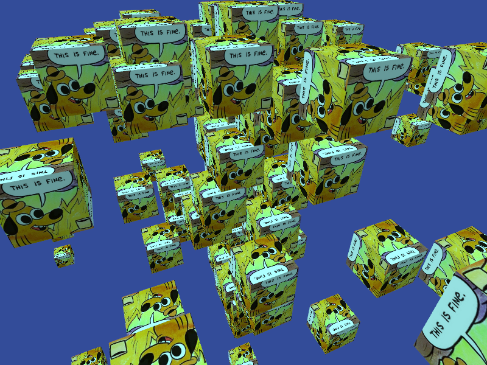

[**geom/geom.cxx**](geom/geom.cxx)

The raster pipeline consists of five stages: vertex, tessellation control, tessellation evaluation, geometry and fragment. Most of the surface area of new front-end features is to capture the many options relating to shader stages and interface variables. This example shows how to use the geometry shader to produce a fountain of textured cubes from point vertex data.

```cpp
enum class glgeom_input_t : unsigned {
  points,
  lines,
  lines_adjacency,
  triangles,
  triangles_adjacency,
};

enum class glgeom_output_t : unsigned {
  points,
  line_strip,
  triangle_strip,
};
```

Values from two enums must be provided to all Circle geometry shaders. `glgeom_input_t` specifies the kind of vertex input. It corresponds to the symbolic constants provided to `glDrawElements` or `glDrawArrays` which gets the raster operation started. The geometry shader reads between one and six different vertex inputs and generates one, two or three vertices per output primitive, as governed by the `glgeom_output_t` enum. 

Finally, the maximum number of vertices emitted by a single geometry shader instance is provided as the third `spirv::geom` attribute argument. Together these three terms allow the driver to efficiently configure the device.

[**geom/geom.cxx**](geom/geom.cxx)
```cpp
[[spirv::geom(points, triangle_strip, 24)]]
void geom_main() {
  ...
}
```

The attributes on `geom_main` indicate that the shader consumes one point per thread and emits at most 24 vertices, to be interpreted as triangle strip primitives. Even though `glgeom_input_t` and `glgeom_output_t` are scoped enumerations, you don't have to provide the enumeration names on the left-hand side of the constants; the Circle attribute is smart enough to know what you mean. Additionally, if you mistype an attribute, the compiler will list all options in the error message.

```cpp
template<glgeom_input_t input, glgeom_output_t output, int max_vertices>
[[spirv::geom(input, output, max_vertices)]]
void geom_main() {
  ...
}
```

If you really love templates and want to have a single shader entry point for many shader specializations, all these attribute arguments may be parameterized. This is true for all Circle shader attributes, and is quite useful for setting compute shader local group sizes and other qualifiers that effect performance.

[**geom/geom.cxx**](geom/geom.cxx)
```cpp
enum typename vattrib_t {
  vattrib_position = vec3,
  vattrib_texcoord = vec2,
  vattrib_color    = vec3,
};

[[spirv::geom(points, triangle_strip, 24)]]
void geom_main() {
  static constexpr vec3 vertices[6][4] {
    { {  1,  1,  1 }, {  1, -1,  1 }, {  1,  1, -1 }, {  1, -1, -1 } },
    { {  1,  1,  1 }, { -1,  1,  1 }, {  1, -1,  1 }, { -1, -1,  1 } },
    { {  1,  1,  1 }, {  1,  1, -1 }, { -1,  1,  1 }, { -1,  1, -1 } },
    { { -1, -1, -1 }, { -1,  1, -1 }, {  1, -1, -1 }, {  1,  1, -1 } },
    { { -1, -1, -1 }, { -1, -1,  1 }, { -1,  1, -1 }, { -1,  1,  1 } },
    { { -1, -1, -1 }, {  1, -1, -1 }, { -1, -1,  1 }, {  1, -1,  1 } },
  };

  static constexpr vec3 normals[6] {
    { 1,  0,  0 }, {  0,  0,  1 }, { 0,  1,  0 },
    { 0,  0, -1 }, { -1,  0,  0 }, { 0, -1,  0 },
  };

  static constexpr vec2 uv[4] {
    { 0, 1 }, { 1, 1 }, { 0, 0 }, { 1, 0 },
  };

  float phi = radians(30.f);
  float theta = radians(-45.f);

  vec3 light_dir = 1.2f * vec3(
    sin(phi) * cos(theta),
               sin(theta),
    cos(phi) * cos(theta)
  );
  float ambient = .5f;
  float box_size = .4f;

  vec4 position = glgeom_Input[0].Position;

  for(int face = 0; face < 6; ++face) {
    float brightness = clamp(-dot(normals[face], light_dir), ambient, 1.f);

    shader_out<vattrib_color> = brightness * vec3(.8, 1.2, 1.2);

    for(int i = 0; i < 4; ++i) {
      // Create a new vertex and project.
      vec4 vertex = position + vec4(box_size * vertices[face][i], 0);
      glgeom_Output.Position = view_mat * vertex;
      
      // Create a new uv coordinate.
      shader_out<vattrib_texcoord> = uv[i];

      // Emit the vertex.
      glgeom_EmitVertex(); 
    }

    // Finish the triangle strip primitive.
    glgeom_EndPrimitive();    
  }
}
```

Let's break down the actual geometry shader. We want to emit geometry for a cube as six triangle-strip primitives, each with four vertices. The first thing is to read the position data emitted by the vertex shader. The geometry shader specified "point" input, so we only have access to `glgeom_Input[0]`. 

Next we loop over each face and write values for a colored light to the `vattrib_color` output variable. This'll be consumed by the fragment shader to modulate the texel value. Since this value is constant over the face of the cube, we only write it once per face rather than once per vertex.

Now we loop over each of the four vertices of the face. We index into a constant array of vertex positions and transform by the projection matrix to put it in clip space. The resulting vector is stored in `glgeom_Output.Position`.

Finally we pass texture coordinates to the `vattrib_texcoord` output variable. This, along with the `vattrib_color` variable and the vertex position, will be interpolated by the device before getting passed to the fragment shader.

`glgeom_EmitVertex` reads values from `glgeom_Output` and all attached output interface variables and assembles them as new vertex structures. `glgeom_EndPrimitive` ends the current _primitive_ (a triangle strip in this case) and implicitly starts a new one.

## The tessellation stages

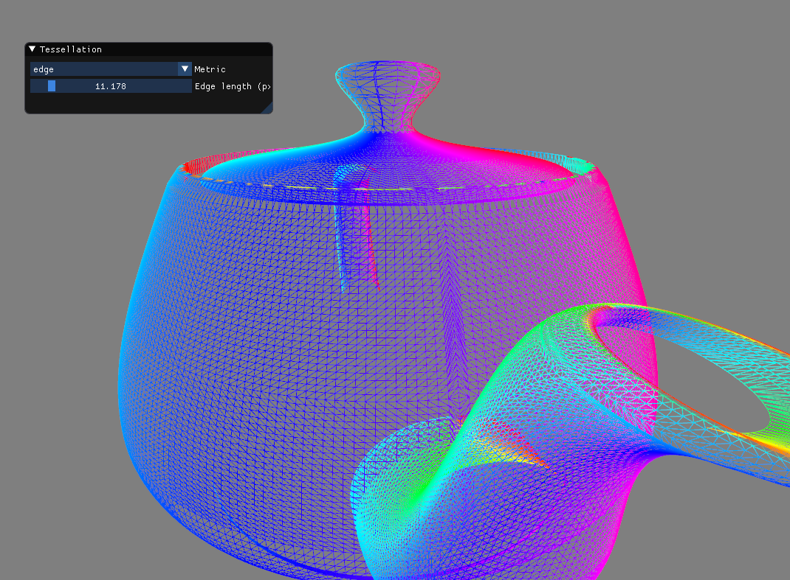

The tessellation control and evaluation stages round out the raster pipeline. This example uses template programming to encapsulate composable logic for selecting tessellation levels, according to three different metrics, with the uniform buffer object that stores its parameters. Circle shaders allow object-oriented programming even when the objects are SPIR-V interface variables. 

### Tessellation control

[**teapot/teapot.cxx**](teapot.cxx)
```cpp
template<typename tess_t>
[[spirv::tesc(16)]]
void tesc_shader() {
  vec3 v00 = gltesc_Input[0].Position.xyz;
  vec3 v10 = gltesc_Input[3].Position.xyz;
  vec3 v01 = gltesc_Input[12].Position.xyz;
  vec3 v11 = gltesc_Input[15].Position.xyz;

  // Make a counter-clockwise pass from OL0 through OL3. See Figure 11.1 
  // in OpenGL 4.6 specification.
  gltesc_LevelOuter[0] = shader_ubo<0, tess_t>.get_level(v01, v00);
  gltesc_LevelOuter[1] = shader_ubo<0, tess_t>.get_level(v00, v10);
  gltesc_LevelOuter[2] = shader_ubo<0, tess_t>.get_level(v10, v11);
  gltesc_LevelOuter[3] = shader_ubo<0, tess_t>.get_level(v11, v01);

  // Average the opposing outer edges for inner edge levels.
  gltesc_LevelInner[0] = .5f * (gltesc_LevelOuter[1] + gltesc_LevelOuter[3]);
  gltesc_LevelInner[1] = .5f * (gltesc_LevelOuter[0] + gltesc_LevelOuter[2]);

  gltesc_Output[gltesc_InvocationID].Position = 
    gltesc_Input[gltesc_InvocationID].Position;
}
```

The control shader (tesc) is the first tessellation stage. It consumes a patch of vertices and analyzes them to set tessellation levels. It usually passes the input vertex patches through to the evaluation stage.

The Circle `spirv::tesc` attribute takes one argument: the number of patch vertices. This corresponds with a host call to `glPatchParameteri(GL_PATCH_VERTICES, count)` to set the patch size on the vertex array. This example also templates the tessellation levels logic. Note the four `get_level` calls:

```cpp
  gltesc_LevelOuter[0] = shader_ubo<0, tess_t>.get_level(v01, v00);
  gltesc_LevelOuter[1] = shader_ubo<0, tess_t>.get_level(v00, v10);
  gltesc_LevelOuter[2] = shader_ubo<0, tess_t>.get_level(v10, v11);
  gltesc_LevelOuter[3] = shader_ubo<0, tess_t>.get_level(v11, v01);
```

`shader_ubo` is a variable template bound to an object with `uniform` storage class. This code gets the uniform object at binding 0 with type `tess_t` and invokes its `get_level` member function, passing corners for each of the four patch edges in order.

```cpp
struct tess_edge_t {
  vec3 camera_pos;
  float edge_length = 100;
  float screen_width;

  float get_level(vec3 a, vec3 b) const noexcept {
    // Get the distance to the line segment defined by a and b.
    float dist = point_segment_distance(camera_pos, a, b);

    // length of the edge
    float len = distance(a, b);

    // edgeLen is approximate desired size in pixels
    float f = max(len * screen_width / (edge_length * dist), 1.0f);
    return f;
  }
};
```

`tess_edge_t` is the edge-length metric. The `get_level` member function returns a tessellation level so that each edge is tesselated to triangles approximately `edge_length` pixels in extent. This is a non-static member function, meaning it takes an implicit `this` pointer parameter. The argument passed is the specialized variable template `shader_ubo<0, tess_t>`. That is, `this` points to a uniform buffer! The class itself has no knowledge of SPIR-V storage classes, and it has no shader-specific functionality. It's a normal class, and we instantiate it not as an object with static or automatic storage duration, but with `spirv::uniform` duration.

```cpp
  glSpecializeShader(vs, @spirv(vert_shader), 0, nullptr, nullptr);
  glSpecializeShader(ts0, @spirv(tesc_shader<tess_constant_t>), 0, 
    nullptr, nullptr);
  glSpecializeShader(ts1, @spirv(tesc_shader<tess_distance_t>), 0, 
    nullptr, nullptr);
  glSpecializeShader(ts2, @spirv(tesc_shader<tess_edge_t>), 0, 
     nullptr, nullptr);
  glSpecializeShader(es, @spirv(tese_shader), 0, nullptr, nullptr);
  glSpecializeShader(fs, @spirv(frag_shader), 0, nullptr, nullptr);
```

To generate a shader from the `tesc_shader` function template, we have to ODR use its specialization with `@spirv`. This operation causes it to be lowered to the translation unit's SPIR-V module, and its Itanium-ABI mangled name is returned to help the graphics API locate it in the binary.

Note the `float edge_length = 100` defaulted data member. This default is not applied to the uniform buffer object itself, since interface variables are not _really_ instantiated. Instead, it applies to normal instantiations of the type on the host or on the GPU. In this example, its instantiated as a data member of `myapp_t` and copied into the uniform buffer each frame.

### Tessellation evaluation

```cpp
[[spirv::tese(quads, fractional_even, ccw)]]
void tese_shader() {
  float u = gltese_TessCoord.x;
  float v = gltese_TessCoord.y;
  
  const mat4 Bezier(
     1,  0,  0,  0,
    -3,  3,  0,  0,
     3, -6,  3,  0,
    -1,  3, -3,  1
  );

  // Compute Bezier values.
  vec4 uvec = Bezier * vec4(1, u, u * u, u * u * u);
  vec4 vvec = Bezier * vec4(1, v, v * v, v * v * v);

  // Compute Bezier tangents.
  vec4 d_uvec = Bezier * vec4(0, 1, 2 * u, 3 * u * u);
  vec4 d_vvec = Bezier * vec4(0, 1, 2 * v, 3 * v * v); 

  vec3 pos { }, du { }, dv { };
  @meta for(int j = 0; j < 4; ++j) {
    @meta for(int i = 0; i < 4; ++i) {
      pos +=   uvec[i] *   vvec[j] * gltese_Input[4 * j + i].Position.xyz;
      du  += d_uvec[i] *   vvec[j] * gltese_Input[4 * j + i].Position.xyz;
      dv  +=   uvec[i] * d_vvec[j] * gltese_Input[4 * j + i].Position.xyz;
    }
  }

  // Pass the position in model space. Let the geometry shader project
  // into clip space.
  gltese_Output.Position = mat_view * vec4(pos, 1);

  // Use the xz plane angle to define a hue between 0 and 1.
  vec3 normal = normalize(cross(du, dv));
  float hue = (atan2(normal.x, normal.z) + M_PIf32) / (2 * M_PIf32);

  // Convert hue to RGB.
  shader_out<0, vec3> = clamp(
    vec3(
      abs(hue * 6 - 3) - 1,
      2 - abs(hue * 6 - 2),
      2 - abs(hue * 6 - 4)
    ), 0.f, 1.f
  );
}

[[spirv::frag]]
void frag_shader() {
  shader_out<0, vec4> = vec4(shader_in<0, vec3>, 1);
}
```

The evaluation shader (tesc) is the second tessellation shader. It takes in primitives generated by the GPU according to the tessellation levels set by the previous shader stage. It has to declare what kinds of primitives inputs it expects.

The Circle `spirv::tese` attribute takes three enumeration arguments:

```cpp
enum class gltese_primitive_t {
  triangles,
  quads,
  isolines,
};

enum class gltese_spacing_t {
  equal,
  fractional_even,
  fractional_odd,
};

enum class gltese_ordering_t {
 cw,
 ccw, 
};
```

The `gltese_primitive_t` argument reiterates the kind of input patch. We're working with Bezier patches, so `quads` is passed. The `gltese_spacing_t` argument selects between different spacing strategies: I think `fractional_even` looks best. The `gltese_ordering_t` argument specifies the winding order of the input primitive, either clockwise or counter-clockwise. Since output geometry isn't provided by the vertex array object (instead, patch geometry is), the primitive and winding order parameters must be specified on the shaders themselves.

## The compute stage

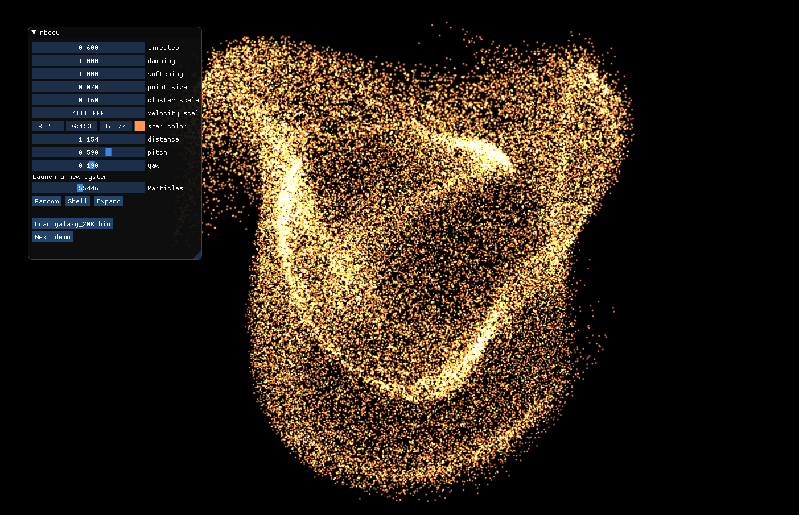
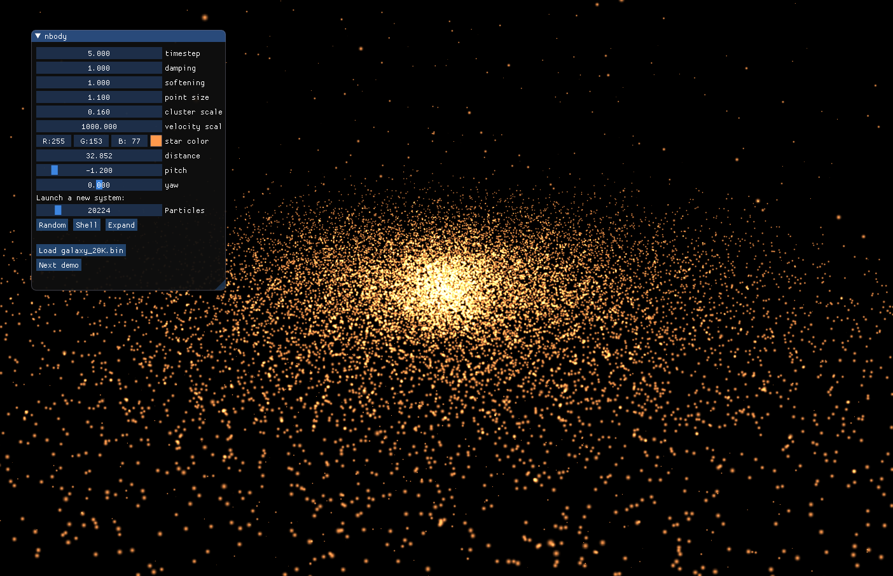

All modern graphics APIs provide integrated compute shaders. The single-stage compute pipeline has access to the same buffer objects as the raster pipeline, but it's launched as a grid of blocks. Compute shaders have some different functionality that allows for cooperative parallelism: each thread is assigned a thread ID (technically an "invocation ID") that identifies it within its workgroup, and each workgroup is assigned a workgroup ID to identify it within the grid.

This example is an OpenGL 4.6 and Circle shader rewrite of the classic n-body CUDA demo. The main difference is that I took out all the CUDA. A compute shader evaluates gravitational interactions, accumulates forces and integrates. Since it's a shader, it natively uses the same buffer resources as vertex array objects, so there's no need for an interop layer. The resulting program is very simple, occupying only 600 lines in a single translation unit.

[**nbody/nbody.cxx**](nbody/nbody.cxx)
```cpp
[[using spirv: buffer, binding(0)]]
vec4 buffer_pos_in[];

[[using spirv: buffer, binding(1)]]
vec4 buffer_pos_out[];

[[using spirv: buffer, binding(2)]]
vec4 buffer_vel[];

// Return the force on a from the influence of b.
inline vec3 interaction(vec3 a, vec4 b) {
  vec3 r = b.xyz - a;

  float softeningSq = uniforms.softening * uniforms.softening;
  float dist2 = dot(r, r) + softeningSq;
  float invDist = inversesqrt(dist2);
  float invDistCube = invDist * invDist * invDist;

  float s = b.w * invDistCube;
  return s * r;
}

const int NT = 128;

[[using spirv: comp, local_size(NT)]] 
void integrate_shader() {
  int tid = glcomp_LocalInvocationID.x;
  int gid = glcomp_GlobalInvocationID.x;

  // Query the length of the mapped position buffer for particle count.
  int num_particles = buffer_vel.length;
  int num_tiles = glcomp_NumWorkGroups.x;

  // Load the position for this thread.
  vec4 pos { };
  if(gid < num_particles)
    pos = buffer_pos_in[gid];

  // Compute the total acceleration on pos.
  vec3 acc { };
  for(int tile = 0; tile < num_tiles; ++tile) {
    // Buffer the next NT particles through shared memory.
    [[spirv::shared]] vec4 cache[NT];
    int index2 = NT * tile + tid;
    cache[tid] = index2 < num_particles ? buffer_pos_in[index2] : vec4();
    glcomp_barrier();

    // Use @meta for to unroll all NT number of particle interactions.
    @meta for(int j = 0; j < NT; ++j)
      acc += interaction(pos.xyz, cache[j]);    

    // Once all threads complete, go to the next tile.
    glcomp_barrier();
  }

  if(gid < num_particles) {
    // Load the velocity for this thread.
    vec4 vel = buffer_vel[gid];

    // Update the velocity and position.
    // Draw the particle back to the center.
    vel.xyz += uniforms.dt * acc;
    vel.xyz *= uniforms.damping;

    pos.xyz += uniforms.dt * vel.xyz;

    // Store the updated position and velocity.
    buffer_pos_out[gid] = pos;
    buffer_vel[gid] = vel;
  }
}
```

`integrate_shader` is our compute shader. It requires a `spirv::local_size` attribute, which must specify a block width, and optionally provide a block height and depth. The block width is required by the host code to form a `glDispatchCompute` call, so it's stored in global scope in the constant `NT`.

The GLSL variables `gl_LocalInvocationID`, `gl_GlobalInvocation` and `gl_NumWorkGroups` have been renamed in the Circle extension to better indicate their shader stage. Note that these are also accessible by mesh shaders.

The biggest thing that separates from compute shaders from raster shaders is the availability of shared memory. These allocations are shared by all threads in the workgroup, and can help build cooperative algorithms. Here we simply use shared memory to cache particle vectors, since it has higher bandwidth than the GPU's L2 cache.

For each tile (workgrouup) in the grid, each thread stores its particle position to shared memory. The shader then calls `glcomp_barrier`. This is identical to `__syncthreads` in CUDA. It synchronizes threads within the workgroup so that all threads complete their store to shared memory before any thread can load from it.

The function `interaction` computes the acceleration on particle `a` from particle `b`. This function is called inside an unrolled loop to expose more optimization opportunities for both the Circle compiler backend and the GPU driver. The Circle keyword `@meta` does whatever statement that follows at compile time, so `@meta for` executes a compile-time loop. This generates equivalent AST as writing `acc += interaction(pos.xyz, cache[j])` 128 times, once for each value of `j`.

Also note the usage of `int num_particles = buffer_vel.length`. Circle implements the `.length` operator from GLSL to support querying storage buffer arrays. When the buffer is created, its length in the unit of the array type is inferred from its size in bytes, and this length is accessible at runtime in a shader. Naturally, you can use `.length` on any ordinary C++ array and get a constant expression of its length.

## Physically-based rendering of glTF models


> glTF™ (GL Transmission Format) is a royalty-free specification for the efficient transmission and loading of 3D scenes and models by applications. glTF minimizes both the size of 3D assets, and the runtime processing needed to unpack and use those assets. glTF defines an extensible, common publishing format for 3D content tools and services that streamlines authoring workflows and enables interoperable use of content across the industry.
> 
> [https://github.com/KhronosGroup/glTF](https://github.com/KhronosGroup/glTF)

In other words, glTF is an interchange format designed to quickly get high-quality graphics assets into a renderer. The main part of the specification is a JSON schema that describes a scene with indices into binary geometry data and image files.

I use the library [cgltf](https://github.com/jkuhlmann/cgltf) to load glTF JSON files. It efficiently exposes the asset metadata as a collection of C objects.

The core glTF specification defines many kinds of rendering and extensions add many more. Does the asset use image based lighting? Point lights? An emissive layer? Does it take a normal map? Is its geometry specified with vertex normals? What about tangents and bi-tangents? Is skeletal animation used? If so, how many skin matrices per vertex? What material models does it use?

Separable shaders are out, since we've chosen a forward rendering model. All these options puts a burden on the viewer: how does it deal with the combinatorial explosion of feature requirements? 

C++ provides one good tool: templates. You can implement features in self-contained units and use template-driven composition to generate a single fragment shader that does exactly what's desired and no more. 

SPIR-V includes a complementary feature: specialization constants.

### Specialization constants

The GLSL specification exposes [specialization constants](
https://www.khronos.org/registry/OpenGL/specs/gl/GLSLangSpec.4.60.html#specialization-constant-qualifier) with the `constant_id` layout qualifier. Similarly, Circle characterizes them with the `spirv::constant(id)` C++ attribute.

Specialization constants must currently be bools or integers. To the shader, they look like normal variables, and are not constant when the shader compiler (be it glslang or Circle) runs. However, SPIR-V is just an intermediate representation, for removed from the machine language of the GPU. This necessitates another compile and link phase, just for the shaders, when the program actually gets run. The user provides constant values during shader specialization, and the graphics driver's internal SPIR-V compiler is able to treat the specialization constants as real constants during this second compile phase, entirely eliminating unvisited branches and possibly unrolling loops.

This gives us a mechanism to author _uber-shaders_, highly parameterized shaders implementing the outer product of many feature choices. The application can ship one uber-shader and provide sets of specialization constants to Vulkan or OpenGL during shader creation to generate dozens of optimized linked shader programs.

The availability of both specialization constants and templates gives developers two dimensions of control over how generic code is structured.

```cpp
  // Incoming vertex properties.
  bool normal;
  bool tangents;

  // Available texture maps.
  bool normal_map;
  bool emissive_map;
  bool occlusion_map;
  
  // Material properties.
  bool metallicRoughness;
  bool anisotropy;
  bool ibl;
  bool point_lights;
```

These flags indicate a few of the feature options for fragment shaders presented by glTF. We'll write a single fragment shader that branches over these flags. This is straight-through design is easier to implement and reason about than template composition, which textually separates parts of the shader.

GLSL requires each specialization constant be declared as a separate interface variable and marked with the `constant_id` layout qualifier. But loose specialization constants are a pain. We want to deal with _structs_ of constants, in order to use them as a key to help locate shader specializations once they are compiled by the driver. Grouping constants into structs also assists with constant id assignment, and makes it much easier for the host code to be confident that it's actually providing all specialization constants to the driver.

[**viewer/viewer.cxx**](viewer/viewer.cxx)
```cpp
struct frag_features_t {
  // Incoming vertex properties.
  bool normal;
  bool tangents;

  // Available texture maps.
  bool normal_map;
  bool emissive_map;
  bool occlusion_map;
  
  // Material properties.
  bool metallicRoughness;
  bool anisotropy;
  bool ibl;
  bool point_lights;
};

[[spirv::constant(0)]]
frag_features_t frag_features;
```

The Circle shader extension supports declaring class objects with the `spirv::constant` attribute. Each data member must be a bool or integer, and internally these are broken down to individual specialization constant scalars. However, from the C++ level, they are accessed as data members of the variable `frag_features`. Constant IDs are assigned in ascending order, starting with the first member which is assigned the index argument to `spirv::constant`. 

Additionally, specialization constants may be given default values so that the user doesn't have to provide all of them during shader specialization. In the Circle extension, these are taken straight from default member initializers in the class definition:

```cpp
struct frag_features_t {
  // Incoming vertex properties.
  bool normal = true;
  bool tangents;

  // Available texture maps.
  bool normal_map = true;
  bool emissive_map = true;
  bool occlusion_map;
  
  // Material properties.
  bool metallicRoughness = true;
  bool anisotropy;
  bool ibl = true;
  bool point_lights;
};

[[spirv::constant(0)]]
frag_features_t frag_features;
```

If a shader that uses these specialization constants is compiled without specialization info, it'll be built with vertex normals, normal and emissive maps, a metallic-roughness model and image-based lighting.

### Reflecting on specialization constants

Specialization info is provided to OpenGL with [`glSpecializeShader`](https://www.khronos.org/opengl/wiki/SPIR-V/Compilation) and to Vulkan with[`VkSpecializationInfo`](https://www.khronos.org/registry/vulkan/specs/1.2-extensions/man/html/VkSpecializationInfo.html). However, it's tedious and error-prone to use these mechanisms directly. You should be able to add or remove specialization constants without having to also update the specialization code every time. We want a design with a single constant specialization set definition to eliminate all the points of failure.

[**include/appglfw.hxx**](include/appglfw.hxx)
```cpp
template<typename type_t>
void specialize_shader(GLuint shader, const char* name, const type_t& obj) {
  const int count = @member_count(type_t);
  GLuint indices[count];
  GLuint values[count] { };
  @meta for(int i = 0; i < count; ++i) {
    indices[i] = i;
    memcpy(values + i, &@member_value(obj, i), sizeof(@member_type(type_t, i)));
  }

  glSpecializeShader(shader, name, count, indices, values);
}
```

This utility code uses Circle's reflection mechanism to specialize a shader given the structure of constants. The first member is assumed to have `constant_id=0`, and subsequent members have ascending IDs. The `@member_value` Circle keyword yields a member glvalue when provided a class object glvalue and the ordinal of a data member. `@member_type` yields the type of that member. The `@meta for` statement is a compile time loop which visits each data member, provided by `@member_count`. 

[**viewer/viewer.cxx**](viewer/viewer.cxx)
```cpp
  // Compile the shaders.
  GLuint vs = glCreateShader(GL_VERTEX_SHADER);
  GLuint fs = glCreateShader(GL_FRAGMENT_SHADER);
  GLuint vs_sky = glCreateShader(GL_VERTEX_SHADER);
  GLuint fs_sky = glCreateShader(GL_FRAGMENT_SHADER);

  GLuint shaders[] { vs, fs, vs_sky, fs_sky };
  glShaderBinary(4, shaders, GL_SHADER_BINARY_FORMAT_SPIR_V_ARB,
    __spirv_data, __spirv_size);

  vert_features_t vert_features { };
  vert_features.normal = true;
  vert_features.texcoord0 = true;
  specialize_shader(vs, @spirv(vert_main), vert_features);

  frag_features_t frag_features { };
  frag_features.normal = true;
  frag_features.normal_map = true;
  frag_features.emissive_map = true;
  frag_features.occlusion_map = true;
  frag_features.metallicRoughness = true;
  frag_features.ibl = true;
  specialize_shader(fs, @spirv(frag_main), frag_features);

  program = glCreateProgram();
  glAttachShader(program, vs);
  glAttachShader(program, fs);
  glLinkProgram(program);

  skybox = glCreateProgram();
  glSpecializeShader(vs_sky, @spirv(vert_sky), 0, nullptr, nullptr);
  glSpecializeShader(fs_sky, @spirv(frag_sky), 0, nullptr, nullptr);
  glAttachShader(skybox, vs_sky);
  glAttachShader(skybox, fs_sky);
  glLinkProgram(skybox);
```

The application initializer for the glTF viewer demonstrates specialization constants.

## Reflection and attributes for Shadertoy development

[](images/egg.png)
[](images/bands.png)
[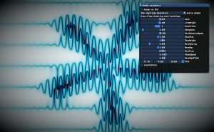](images/modulation.png)
[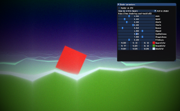](images/square.png)
[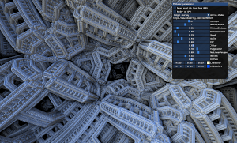](images/menger.png)
[](images/hypercomplex.png)
[](images/segment_tracer.png)
[](images/bandlimited.png)
[](images/raymarcher.png)
[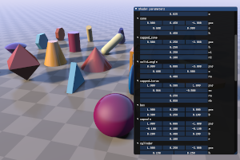](images/raymarcher2.png)

[Shadertoy](https://www.shadertoy.com/) is an incredible creative showcase for graphics programmers. The host provides some basic uniform variables like `iResolution` and `iTime`. You provide the fragment shader. A full-window quad is drawn once per frame, and amazing imagery comes out.

I tried to produce the C++ equivalent of this WebGL application. The host application updates uniform buffer with `resolution` and `time` members. It makes the once-per-frame quad draw. The shader developer provides a fragment shader. But there's a twist: the fragment shader is a member function of a function object. The data members of that function object comprise its uniform buffer (which Shadertoy doesn't do), holding frame parameters. Each frame, a configure function uses Circle reflection to iterate over the data members. It uses the new Circle user attributes to automatically configure an ImGui editor.

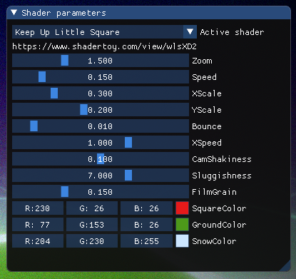

User attributes are a popular C++ feature request by game developers. Unreal Engine has its own attribute system, [`UPROPERTY`](https://docs.unrealengine.com/en-US/Programming/UnrealArchitecture/Reference/Properties/index.html), which uses C macros and a [special build step](https://docs.unrealengine.com/en-US/Programming/BuildTools/UnrealHeaderTool/index.html) to help marshal metadata between the C++ source and designer-facing tools like editors and script languages.

User attributes are now a Circle language feature. Combined with introspection and reflection, Circle can deliver generative metaprogramming without involving additional build steps. 

 What's the markup look like to generate an ImGui editor for an object full of shader parameters?

[**shadertoy/shadertoy.cxx**](shadertoy/shadertoy.cxx)
```cpp
struct [[
  .imgui::title="Keep Up Little Square",
  .imgui::url="https://www.shadertoy.com/view/wlsXD2"
]] keep_up_square_t {

  // This is the fragment shader function.
  vec4 render(vec2 frag_coord, shader_uniforms_t u);

  [[.imgui::range_float {  .1,  5 }]] float Zoom = 1.5;
  [[.imgui::range_float {   0,  1 }]] float Speed = .15;
  [[.imgui::range_float {  .1,  1 }]] float XScale = .3;
  [[.imgui::range_float {   0, .5 }]] float YScale = .2;
  [[.imgui::range_float {   0, .1 }]] float Bounce = .01;
  [[.imgui::range_float {  -3,  3 }]] float XSpeed = 1;
  [[.imgui::range_float {   0, .2 }]] float CamShakiness = .1;
  [[.imgui::range_float {   1, 10 }]] float Sluggishness = 7;
  [[.imgui::range_float { .01, .5 }]] float FilmGrain = .15;
  [[.imgui::color3]] vec3 SquareColor = vec3(0.9, 0.1, 0.1);
  [[.imgui::color3]] vec3 GroundColor = vec3(.3, .6, .1);
  [[.imgui::color3]] vec3 SnowColor   = vec3(0.8, 0.9, 1.0);
}
```

The class type `keep_up_square_t` is a normal C++ class. It has normal C++ data members. The ImGui attributes are a compile-time feature only. The do not effect the struct layout. The generated ImGui editor lets the user slide through parameters, use color picker widgets, checkboxes, and the like, to change the contents of a uniform buffer at each frame, allowing users to interactively explore the parameter space of a shader.

How does all this get lowered to shaders?

[**shadertoy/shadertoy.cxx**](shadertoy/shadertoy.cxx)
```cpp
struct shadertoy_uniforms_t {
  // shader-specific parameters.
  vec2 resolution;       // width and height of viewport in pixels.
  float time;            // seconds since simulation started.
};

[[using spirv: uniform, binding(0)]]
shadertoy_uniforms_t uniforms;

template<typename shader_t>
[[using spirv: uniform, binding(1)]]
shader_t shader_ubo;

template<typename shader_t>
[[spirv::frag(lower_left)]]
void frag_main() {
  fragColor = shader_ubo<shader_t>.render(glfrag_FragCoord.xy, uniforms);
}
```

We just call the `render` member function of the uniform object holding the shader's parameter data. A variable template abstracts the type of the uniform object, allowing the template parameter of the fragment shader to control the type of the interface varibale.

Does GLSL actually allow calls to member functions on uniform or storage buffer objects? It does not. SPIR-V doesn't either. Non-static member functions take an implicit `this` parameter, indicating the location of the object the function is invoked on. In this case, `this` is a pointer with `Uniform` storage duration. But SPIR-V doesn't support `Uniform` storage pointers. To get around this, Circle's shader backend inlines all code that returns pointers or references of any type, or takes pointers or references to non-`Function` storage classes in any parameter, including the implicit `this` parameter. To put it simply, Circle optimizes out the function call entirely, dumping the contents of the member function into the scope of the caller, `frag_main`, resulting in valid shader code.

The upside is an object-oriented shader language. Define a type, declare member functions in it, then bind it to a uniform or shader storage buffer, and call them from your shaders. It's another step towards "write once, run anywhere."

### User attributes

Let's go deep on user attributes. You may want to freshen up on syntax of attributes in Standard C++ [here](https://en.cppreference.com/w/cpp/language/attributes).

Circle user attributes are introduced with a dot. `[[noexcept]]` is a Standard attribute. `[[.noexcept]]` is a user attribute. The dot serves to avoid name collisions between what compiler vendors come up with (they've come up with quite a lot) and what the user comes up with. The dot also enables a much richer syntax, designed to support for C++ initializer expressions, than the Standard attributes allow.

The text after the dot is an attribute name. The attribute name is a type. It may be a class type, an enumeration type, or an _attribute alias_. The attribute alias is essentially an opaque typedef. It defines one type that references a second type, but does not allow implicit conversion to it, as normal typedefs do.

```cpp
using title [[attribute]] = const char*;
using tooltip [[attribute]] = const char*;
``` 

`title` and `tooltip` are an attribute aliases. They're types. But you can't instantiate objects or subobjects from them. You can specify and request user attributes with them. Or you can pass them as a template arguments to templates expecting type template parameters.

Different attribute aliases are distinct from each other. `title` and `tooltip` are not the same type. However, they both declare `const char*` attributes.

```cpp
[[.title="Moby-Dick", .tooltip="Great book"]] int x;

std::cout<< @attribute(x, title)<< "\n";    // prints Moby-Dick
std::cout<< @attribute(x, tooltip)<< "\n";  // prints Great book 
```

Attribute aliases must be defined in namespace scope, and must not include placeholder names like `auto`. Attribute aliases, as currently implemented, are strongly typed. Every time you ask for a `title` attribute you'll get back a `const char*`.

The `@attribute` keyword yields an lvalue expression to the compile-time value stored at the attribute. Attributes are essentially key-value maps on each declaration in the translation unit. The `@attribute` keyword is your search function on a particular declaration. The dot prefix inside the attribute brackets goes with this theme: an attribute is conceptually a compile-time _data member_ on a declaration.

```cpp
using checkbox [[attribute]] = void;
using color [[attribute]] = void;

[[.checkbox]] bool is_night;   // no attribute initializer, because it's void.
[[.color]] vec3 sky_color;

std::cout<< @has_attribute(is_night, checkbox)<< "\n";   // prints 1
std::cout<< @has_attribute(sky_color, checkbox)<< "\n";  // prints 0
```

The text after the attribute name is an initializer expression. It should start with a `=`, a `(` or a `{`. If the attribute name maps to a `void`, or if you want to use the default initializer, omit the initializer. This is helpful when you want to treat the attribute like a set member, rather than a key-value map member:

[**attributes/attrib1.cxx**](attributes/attrib1.cxx)
```cpp
#include <cstdio>

template<typename type_t>
const char* enum_to_name(type_t x) {
  switch(x) {
    @meta for enum(type_t x2 : type_t)
      case x2:
        return @enum_name(x2);
    default:
      return "<unknown>";
  }
}

// Three kinds of attributes:
// 1. Class types.
// 2. Enum type.
// 3. Attribute aliases to any other type.

// Define a class type to be used as an attribute.
struct extent_t {
  int width, height;
};

// Name the class type after a dot in the attribute sequence.
// Because this is an aggregate (no user-provided constructor), use the
// braced aggregate initializer.
[[.extent_t { 800, 600 }]] int X;

// Define an enum for an attribute.
enum class shape_t {
  circle,
  square,
  triangle,
};

// Name the enum after the dot. For enum attributes, a single-identifier 
// token initializer will be matched to enumeration names.
[[.shape_t=triangle]] int Y;

// Define an attribute alias to some other type. This lets us reuse types
// without ambiguity.
using title_t [[attribute]] = const char*;

// Name the attribute alias. We can't name the underlying type. 
// The attribute alias is like an opaque typedef.
[[.title_t="A great var"]] int Z;

int main() {
  // The @attribute keyword is provided a declaration and an 
  // attribute type or attribute alias. It gives an lvalue to that
  // compile-time attribute.
  printf("X width = %d\n", @attribute(X, extent_t).width);  

  // If non-const, you can even modify it at compile time. This is helpful
  // for keeping counters.
  @meta ++@attribute(X, extent_t).width;
  printf("X width = %d\n", @attribute(X, extent_t).width);  

  // Use Circle reflection to turn this enum attribute into a string:
  printf("Y shape = %s\n", enum_to_name(@attribute(Y, shape_t)));

  // Print directly from a compile-time const char*.
  printf("Z title = %s\n", @attribute(Z, title_t));
}
```
```
$ circle attrib1.cxx
$ ./attrib1
X width = 800
X width = 801
Y shape = triangle
Z title = A great var
```

This example shows the operation of attributes with all three attributes types: class, enumerations and attribute aliases. Note that attributes are mutable, like most other compile-time entities in Circle. If you want to slide into a meta context and change an attribute value, go ahead. 

[**attributes/attrib2.cxx**](attributes/attrib2.cxx)
```cpp
#include <iostream>
#include <type_traits>

template<typename type_t>
const char* enum_to_name(type_t x) {
  switch(x) {
    @meta for enum(type_t x2 : type_t)
      case x2:
        return @enum_name(x2);
    default:
      return "<unknown>";
  }
}

using title [[attribute]] = const char*;
using url   [[attribute]] = const char*;
using magic [[attribute]] = int;

enum class edge {
  left, top, right, bottom,
};
enum class corner {
  nw, ne, se, sw,
};

template<typename type_t>
std::string to_string(type_t x) {
  if constexpr(std::is_enum_v<type_t>) {
    return enum_to_name(x);

  } else if constexpr(std::is_same_v<bool, type_t>) {
    return x ? "true" : "false";

  } else if constexpr(std::is_arithmetic_v<type_t>) {
    return std::to_string(x);

  } else {
    static_assert(std::is_same_v<const char*, type_t>);
    return x;
  }
}

struct foo_t {
  [[.edge=right, .url="https://www.fake.url/"]] int x;
  [[.title="Sometimes a vowel", .corner=ne]]    int y;
  [[.magic=10101, .title="The magic number"]]   int z;
};

template<typename type_t>
void print_member_attributes() {
  std::cout<< "Member attributes for "<< @type_string(type_t)<< "\n";

  @meta for(int i = 0; i < @member_count(type_t); ++i) {{
    // Loop over each member.
    std::cout<< "  "<< @member_name(type_t, i)<< ":\n";

    // @member_attribute_list is a type parameter pack of all attribute names.
    // Loop over them and print them out.
    @meta for typename(t : { @member_attribute_list(type_t, i)... }) {
      std::cout<< "    "<< @type_string(t)<< " = "<< 
        to_string(@member_attribute(type_t, i, t))<< "\n";
    }
  }}
}

int main() {
  print_member_attributes<foo_t>();
}
```
```
$ circle attrib2.cxx 
$ ./attrib2
Member attributes for foo_t
  x:
    edge = right
    url = https://www.fake.url/
  y:
    title = Sometimes a vowel
    corner = ne
  z:
    magic = 10101
    title = The magic number
```

The second example uses reflection to print all attributes on all data members in a class. The first task is a generic `to_string` function, which pretty prints any type in our little scenario. Reflection on enums is used to implement `enum_to_name`, so that enumerations are printed by name rather than integer value. C++ type traits are used to detect the kind of parameter passed in, and an appropriate printer is chosen for each one.

The `foo_t` class-specifier specifies three data members, each with two attributes. These are just like the uniform object members in the Shadertoy example. And as in that example, Circle reflection allows us access each of them.

`print_member_attributes` is entry-point for attribute pretty printing. `@type_string` gives the name of the specified type. Since we specialize over `foo_t`, it prints `foo_t`. The function enters a compile-time loop over each data member of `type_t`. The loop index `i` is a compile-time variable. (It's not a compile-time constant, obviously, since we're incrementing it each step.) `@member_name(type_t, i)` returns the constant character array that spells out the i'th data member for the type. 

The wild part is the _for-typename_ statement. This is an over-powered Circle feature. It lays waste to Standard C++ metaprogramming challenges. It's a ranged loop over a collection of _types_. Just throw any old type inside brackets and you can loop over them. The declaration to the left of the colon is bound to a different type at each step. Where does this really come in handy? Unpacking type parameter packs! Use a pack expansion operator `...` to blow out a parameter pack into the braces, then step over them one by one. No template recursion!

`@member_attribute_list` yields a type parameter pack with all attributes on a member declaration. In our case, this includes a mix of enums and attribute aliases. `@type_string` turns each attribute name into its character array, and that gets printed to the screen. `@member_attribute` gets each of the attributes on the member in turn, which we run through `to_string` and print the result to the screen.

In this first experimental release, attributes are accessed with seven keywords:

* `@attribute(declaration, attrib-name)` - yield the lvalue of the atrtibute on the declaration.
* `@member_attribute(class-type, ordinal, attrib-name)` - yield the lvalue of the attribute on the i'th data member.
* `@member_attributes(class-type, attrib-name)` - yield a non-type parameter pack of the attribute on every data member in the class. Let's say each member is expected to have a `description` attribute. This keyword gets you all of them at once.
* `@has_attribute(declaration, attrib-name)` - a boolean expression indicating that the declaration has this attribute.
* `@has_member_attribute(class-type, ordinal, attrib-name)` - ditto but for data members.
* `@attribute_list(declaration)` - a type parameter pack with all attribute names on the declaration.
* `@member_attribute_list(class-type, ordinal)` - ditto but for data members.

### User attributes and Dear ImGui

[**shadertoy/shadertoy.cxx**](shadertoy/shadertoy.cxx)
```cpp
namespace imgui {
  // imgui attribute tags.
  using color3   [[attribute]] = void;
  using color4   [[attribute]] = void;
  
  template<typename type_t>
  struct minmax_t {
    type_t min, max;
  };
  using range_float [[attribute]] = minmax_t<float>;
  using range_int   [[attribute]] = minmax_t<int>;

  using title    [[attribute]] = const char*;
  using url      [[attribute]] = const char*;
}
```

A couple basic user attributes are declared in the namespace `imgui` to select the most appropriate widget. If the attribute `color3` or `color4` exists on a declaration, a color picker widget is created. If `range_float` or `range_int` exists, a slider with those extents is generated. Otherwise, the type of the data member is examined and a suitable widget is chosen for those: a checkbox for bools, a `DragFloat` for floats or a `DragInt` for ints.

[**shadertoy/shadertoy.cxx**](shadertoy/shadertoy.cxx)
```cpp

// Return true if any option has changed.
template<typename options_t>
bool render_imgui(options_t& options, const char* child_name = nullptr) {

  bool changed = false;
  if(!child_name || 
    ImGui::TreeNodeEx(child_name, ImGuiTreeNodeFlags_DefaultOpen)) {

    using namespace imgui;
    if constexpr(@has_attribute(options_t, url))
      ImGui::Text(@attribute(options_t, url));

    @meta for(int i = 0; i < @member_count(options_t); ++i) {{
      typedef @member_type(options_t, i) type_t;
      const char* name = @member_name(options_t, i);
      auto& value = @member_value(options, i);

      if constexpr(@member_has_attribute(options_t, i, color4)) {
        changed |= ImGui::ColorEdit4(name, &value.x);

      } else if constexpr(@member_has_attribute(options_t, i, color3)) {
        changed |= ImGui::ColorEdit3(name, &value.x);

      } else if constexpr(@member_has_attribute(options_t, i, range_float)) {
        auto minmax = @member_attribute(options_t, i, range_float);
        changed |= ImGui::SliderFloat(name, &value, minmax.min, minmax.max);

      } else if constexpr(@member_has_attribute(options_t, i, range_int)) {
        auto minmax = @member_attribute(options_t, i, range_int);
        changed |= ImGui::SliderInt(name, &value, minmax.min, minmax.max);

      } else if constexpr(std::is_same_v<type_t, bool>) {
        changed |= ImGui::Checkbox(name, &value);

      } else if constexpr(std::is_same_v<type_t, vec4>) {
        changed |= ImGui::DragFloat4(name, &value.x, .1f);

      } else if constexpr(std::is_same_v<type_t, vec3>) {
        changed |= ImGui::DragFloat3(name, &value.x, .1f);

      } else if constexpr(std::is_same_v<type_t, vec2>) {
        changed |= ImGui::DragFloat2(name, &value.x, .1f);
        
      } else if constexpr(std::is_same_v<type_t, float>) {
        changed |= ImGui::DragFloat(name, &value, .1f);
    
      } else if constexpr(std::is_same_v<type_t, int>) {
        changed |= ImGui::DragInt(name, &value);

      } else if constexpr(std::is_class_v<type_t>) {
        // Iterate over each data member.
        changed |= render_imgui(value, name);

      }
    }}

    if(child_name)
      ImGui::TreePop();
  }

  return changed;
}
```

The `render_imgui` utility uses C++17's _if-constexpr_ statement and C++ <type_traits> to switch over attributes and types of a data member to generate the most suitable widget. But it requires the Circle-specific introspection keywords `@member_count`, `@member_name` and `@member_type` and `@member_values` to loop over each data member in the function object.

The uniform buffer is a struct that may have struct members. In this case, `std::is_class_v` indicates a class (or struct) type. `render_imgui` recursively opens that struct member inside a tree node and processes all its data members. This is an important feature for allowing shader construction through object composition.

### Shader programming with composition

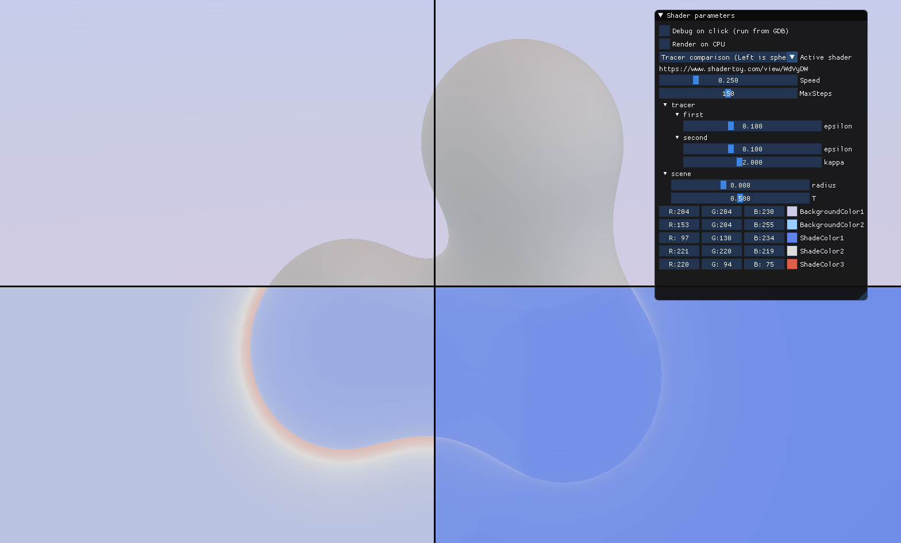

**NOTE:** This sample uses features from Circle build 102. Download it [here](https://www.circle-lang.org/index.html#the-program). 

Ray marching is the most popular approach to rendering procedural geometries. You can define a [signed distance field](https://iquilezles.org/www/articles/distfunctions/distfunctions.htm) for simple primitives and combine them with elementary functions like min, max, mod, sum, sine and cosine, and so on, to generate infinitely detailed worlds. Scalar fields, like the one shown here, work similarly.

The conservative approach to rendering SDFs is sphere tracing. However, exploiting the derivatives of the SDF may result in fewer ray marching iterations. The [Segment Tracing Using Local Lipschitz Bounds](https://hal.archives-ouvertes.fr/hal-02507361/) paper describes one approach to this. The authors provide a [Segment Tracing shadertoy](https://www.shadertoy.com/view/WdVyDW) that visualizes the difference in step counts between conventional sphere tracing and their novel approach.

Programming an application that uses ray marchers and signed distance fields combines several separable ideas. The choice of ray marching metric (eg spheres vs segments) is orthogonal to the underlying field function that defines the geometry of the scene. The application code that invokes the ray marcher on the field function is also orthogonal to the design of both of those components. A language with good generics, like C++, supports a separation of concerns, so that the ray marcher, field function and application can be written in discrete, self-contained packages.

Virtual functions are a runtime polymorphic mechanism for abstracting implementation from interface. Templates are C++'s compile-time mechanism for doing this. This Circle sample defines the ray marching sample application as a _class template_ with two template parameters: one for the ray marching algorithm, one for the scene logic. Each implementation of a ray marcher on scene is defined as a class that encapsulates parameter data and methods. When instantiated through the template, their data is composited into the data of the client, resulting in a single OpenGL uniform buffer object with distinct subobjects for the ray marcher, the field function and the application logic.

[**shadertoy/shadertoy.cxx**](shadertoy/shadertoy.cxx)
```cpp
struct trace_result_t {
  bool hit;
  int steps;
  float t;
};

struct sphere_tracer_t {
  template<typename scene_t>
  trace_result_t trace(const scene_t& scene, vec3 o, vec3 dir, float ra, 
    float rb, int max_steps);

  [[.imgui::range_float {0, .3 }]] float epsilon = .1;
};

struct segment_tracer_t {
  template<typename scene_t>
  trace_result_t trace(const scene_t& scene, vec3 o, vec3 dir, float ra,
    float rb, int max_steps);

  [[.imgui::range_float { 0, .3 }]] float epsilon = .1;
  [[.imgui::range_float { 0, 5 }]] float kappa = 2.0;
};
```

Both ray marching metrics are defined in their own classes with their own attributed data members. The ImGui reflection code will render these parameters inside collapsible trees of the application's control panel. Both classes also implement a `trace` member function. They don't necessarily need to have the same interface, but the interfaces must at least compile when called from the application logic.

The important thing to note is that the object that evaluates the scene field function and its gradient is passed in as a function parameter. The type of the function parameter (and by extension the definition of the field function) is deduced as a template parameter. This completely separates ray marching logic from the field function.

[**shadertoy/shadertoy.cxx**](shadertoy/shadertoy.cxx)
```cpp
struct blobs_t {

  float Object(vec3 p) const;
  float KSegment(vec3 a, vec3 b) const;
  float KGlobal() const;
  vec3 ObjectNormal(vec3 p) const;

  [[.imgui::range_float {1, 20 }]] float radius = 8; // Distance between blobs.
  [[.imgui::range_float {0,  1 }]] float T = .5;     // Surface epsilon. 
};
```

This sample implements a single scene defined as the union of three point functions. The inter-point spacing is held in the `radius` data member. The object implements the field function evaluation function, `Object`, and its normal vector function, `ObjectNormal`. The `KSegment` and `KGlobal` provide derivative information for ray marching.

[**shadertoy/shadertoy.cxx**](shadertoy/shadertoy.cxx)
```cpp
template<const char title[], typename tracer_t, typename scene_t>
struct [[
  .imgui::title=title,
  .imgui::url="https://www.shadertoy.com/view/WdVyDW"
]] tracer_engine_t {

  vec4 render(vec2 frag_coord, shadertoy_uniforms_t u);

  [[.imgui::range_float { 0, 1 }]] float Speed = .25f;
  [[.imgui::range_int {1, 300 }]] int MaxSteps = 150;

  tracer_t tracer;
  scene_t scene;

  [[.imgui::color3]] vec3 BackgroundColor1 = vec3(.8, .8, .9);
  [[.imgui::color3]] vec3 BackgroundColor2 = vec3(.6, .8, 1.0);

  [[.imgui::color3]] vec3 ShadeColor1 = vec3(97, 130, 234) / 255;
  [[.imgui::color3]] vec3 ShadeColor2 = vec3(221, 220, 219) / 255;
  [[.imgui::color3]] vec3 ShadeColor3 = vec3(220, 94, 75) / 255;
}
```

Declare the application engine as a class template. It has parameters for the tracer and scene classes. It also parameterizes the `imgui::title` user attribute. (Circle supports string literal class template parameters to make this work.)

The `tracer_t` and `scene_t` template parameters become data members of the application class. This is what I mean by "composition." A single uniform buffer object holds all the parameters for this shader program, yet the two subsystems only know about their own members.

```cpp
enum typename class shader_program_t {
  DevilEgg = devil_egg_t,
  HypnoBands = hypno_bands_t,
  Modulation = modulation_t,
  Square = keep_up_square_t,
  Paint = paint_t,
  MengerJourney = menger_journey_t,
  HyperComplex = hypercomplex_t,
  SphereTracer = tracer_engine_t<
    "Sphere tracer (Click to display step counts)", 
    sphere_tracer_t, 
    blobs_t
  >,
  SegmentTracer = tracer_engine_t<
    "Segment tracer (Click to display step counts)", 
    segment_tracer_t, 
    blobs_t
  >,
  DualTracer = tracer_engine_t<
    "Tracer comparison (Left is sphere tracing, right is segment tracing", 
    std::pair<sphere_tracer_t, segment_tracer_t>, 
    blobs_t
  >,
  band_limited1_t,
  band_limited2_t,
};
```

Specialize the `tracer_engine_t` class with a title string, a ray marcher implementation and a scene implementation. We want to support two variants of the application: in one, the sphere tracer or segment tracer renders the entire window; in the other, the left half is rendered by the sphere tracer and the right half by the segment tracer, and the user can set the separation by clicking the mouse. To accommodate the latter version, form an `std::pair` over the two ray marcher implementations.

```cpp
template<const char title[], typename tracer_t, typename scene_t>
struct tracer_engine_t {
  vec4 render(vec2 frag_coord, shadertoy_uniforms_t u) {
    vec2 pixel = 2 * (frag_coord / u.resolution) - 1;
    vec2 mouse = 2 * (u.mouse.xy / u.resolution.xy) - 1;

    float asp = u.resolution.x / u.resolution.y;
    vec3 rd = normalize(vec3(asp * pixel.x, pixel.y - 1.5f, -4.f));
    vec3 ro(0, 18, 40);

    float a = Speed * u.time;
    ro = RotateY(ro, a);
    rd = RotateY(rd, a);

    // Shade this object.
    vec3 color = Background(rd);

    trace_result_t result { };

    constexpr bool is_dual = @is_class_template(tracer_t, std::pair);
    if constexpr(is_dual)
      result = (pixel.x < mouse.x) ?
        tracer.first.trace(scene, ro, rd, 20, 60, MaxSteps) :
        tracer.second.trace(scene, ro, rd, 20, 60, MaxSteps);
    else
      result = tracer.trace(scene, ro, rd, 20, 60, MaxSteps);

    // Render the window.
    if(pixel.y > mouse.y) {
      if(result.hit) {
        vec3 pos = ro + result.t * rd;
        vec3 n = scene.ObjectNormal(pos);
        color = Shade(pos, n);
      }

    } else
      color = ShadeSteps(result.steps);

    // Draw a horizontal line to mark the render vs the step count.
    color *= smoothstep(1.f, 2.f, abs(pixel.y - mouse.y) / (2 / u.resolution.y));

    // Draw a vertical line to mark the sphere vs segment tracer.
    if constexpr(is_dual)
      color *= smoothstep(1.f, 2.f, abs(pixel.x - mouse.x) / (2 / u.resolution.x));

    return vec4(color, 1);
  }
};
```

The main `render` function implements the single-tracer and dual-tracer variants. It checks if the template parameter `tracer_t` is a specialization of `std::pair`. If it is, the _if-constexpr_ statement takes the branch where the `trace` function is called on the `.first` or `.second` subobject, depending on the location of the pixel compared to the last mouse click location. Note that the `.first` and `.second` members are _only defined_ when the template parameter is an `std::pair`. This function compiles even for the single-tracer versions because the _if-constexpr_ branch is only injected when its predicate can be determined to be true or false at compile time. The `.first` data member access won't generate a compiler error for the single-tracer variant, because that statement isn't even instantiated for those specializations.

Template composition provides a powerful approach to generics. It can be combined with [Specialization constants](#specialization-constants) to give the user both a compile-time and a shader link-time mechanism for specializing big generic programs into lean, special-purpose programs.

### Unified CPU and GPU rendering and CPU debugging

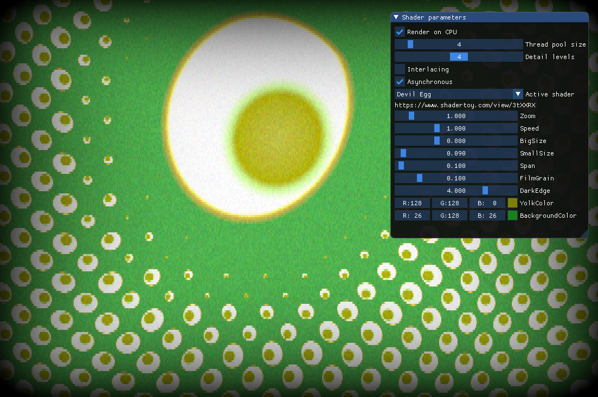

The Circle Shadertoy example includes a fully-functioning CPU render mode. The interface is designed to abstract away shader-specific features like interface variables. Because the shaders in this example don't access textures or other features unavailable on the CPU, they can be rendered on the CPU without any kind of translation attempt.

The frontend processes each shader function object and constructs a single AST representation for it. If ODR-used from a SPIR-V entry point (i.e. either called directly or indirectly from a shader function), the AST is lowered to SPIR-V IR. If ODR-used from x86-64 LLVM, the AST is lowered to x86-64 LLVM. Since there's nothing preventing the shader body from being lowered to both targets, this is added as a selectable feature. Thread pools and optional interlacing and asynchronous updates are added as ImGui options when "Render on CPU" is checked.

[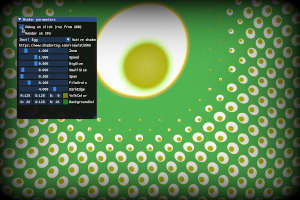](images/debug1.png)
[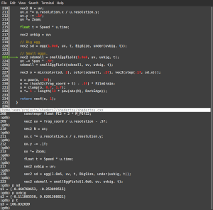](images/debug2.png)

A big advantage in adopting single-source shaders is the ability to analyze shaders using CPU debuggers. Clicking anywhere on the application prints to the terminal the input coordinates and the output color. Selecting the "Debug on click (run from GDB)" checkbox will generate a `SIGINT` signal, which triggers a breakpoint in an attached debugger.

To use GDB debugging, compile the sample with debug info:
```
$ cmake -CMAKE_CXX_COMPILER=circle -DCMAKE_BUILD_TYPE=Debug .
$ make -j5
```

Launch the program inside gdb:
```
$ cgdb shadertoy

(gdb) start
```

Now which you check "Debug on click (run from GDB)", the generated breakpoint deposits you right at the `render` function, which is called on the host and with the screen coordinates of the mouse click.

### if-codegen statements

Circle uses a single AST to represent all its C++ entity declarations. There's no annotation for discriminating code that's intended to run in a shader versus code that is meant for host execution. Including a `printf`, file operation or dynamic memory allocation in your function would pass the parser and break when lowering for SPIR-V. Sampling a texture or using a shader interface variable would pass the parser and break when lowering to LLVM.

We need a way to be able to select code that gets emitted for shader targets vs CPU targets, within a function definition. The _if-codegen_ mechanism does this. Provide a boolean expression, and the body of the _if-codegen_ will get included when lowering to either IR if the predicate is true, or else it'll be skipped over, preventing ODR-usage errors.

The builtin variable `__is_spirv_target` has unknown value when the parser is run, but has a set value when code generation is run. This makes it a _codegen variable_. Use it inside your _if-codegen_ predicate to direct blocks of code to CPU or shader targets.

[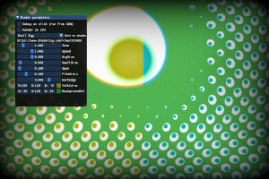](images/shader_flip.png)
[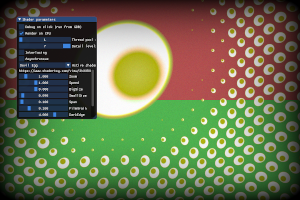](images/cpu_flip.png)

```cpp
  vec4 render(vec2 frag_coord, shadertoy_uniforms_t u) {
    constexpr float PI2 = 2 * M_PIf32;
    vec2 uv = frag_coord / u.resolution - .5f;
    vec2 N = uv;
    uv.x *= u.resolution.x / u.resolution.y;
    uv.y -= .1f;
    uv *= Zoom;

    float t = Speed * u.time;

    vec2 uvbig = uv;

    // Big egg.
    vec2 sd = egg(1.0e6, uv, t, BigSize, under(uvbig, t));

    // Small eggs.
    vec2 sdsmall = smallEggField(1.0e6, uv, uvbig, t);
    uv -= Span * .5f;
    sdsmall = smallEggField(sdsmall, uv, uvbig, t);

    vec3 o = mix(color(sd, 2), color(sdsmall, .2f), vec3(step(.1f, sd.x)));

    o = pow(o, .5f);
    o += (hash32(frag_coord + t) - .5f) * FilmGrain;
    o = clamp(o, 0.f, 1.f);
    o *= 1 - length(13 * pow(abs(N), DarkEdge));

    if codegen(__is_spirv_target) {
      // Swap the right-half red and blue channels if this is a 
      // SPIR-V target.
      if(N.x > 0)
        o.rb = o.br;

    } else {
      // Swap the top-half red and green channels if this is a CPU target.
      if(N.y > 0)
        o.rg = o.gr;
    }

    return vec4(o, 1);
  }
```

The _if-codegen_ statement is illustrated by inserting some color component swaps in the egg shader. This is very similar to the _if-constexpr_ mechanism, in that it prunes branches at compile time to protect targets from ODR exposure to code they can't compile. However, the predicate is resolved after parsing or template instantiation and at codegen time. You can use this section to include logging code and debugging code, or choose special features that are only available for shaders.

### Configuring a shader from JSON

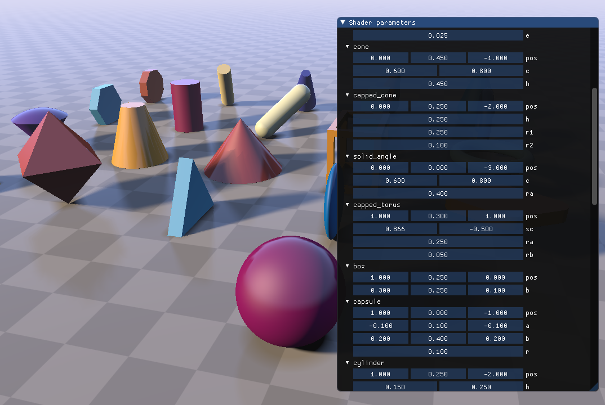

The shadertoy demo includes a C++ port of [iq](https://twitter.com/iquilezles)'s classic [SDF solids raymarcher](https://www.shadertoy.com/view/Xds3zN). The original GLSL code includes SDFs for each of the 21 solids as global functions, and the caller passes all shape parameters in. Circle C++ shaders factors each SDF into its own C++ class, encapsulating the shape's parameters (eg length, radius) and the logic for computing the signed distance. By making these data members of the shader's function object, they're automatically aggregated into the program's uniform buffer object and an ImGui to fully control this parameterization is generated automatically.

This is a more complex shader, but it's really no different from the others in this sample. We can, however, use Circle's compile-time execution capability to further abstract the rendering algorithm from the scene definition.

Consider using a configuration language like JSON or Wavefront .obj to define scene geometry. These formats are both human readable and machine readable, with reliable libraries available for every major programming language. By adopting an interchange format as a source of scene definitions, we add the ability for special tooling to configure a shader.

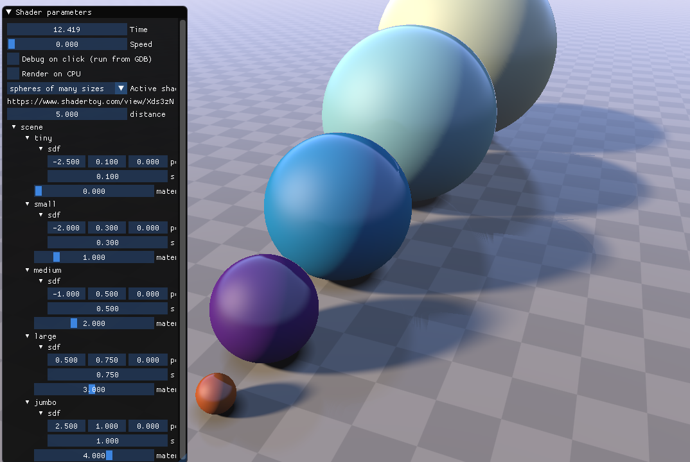
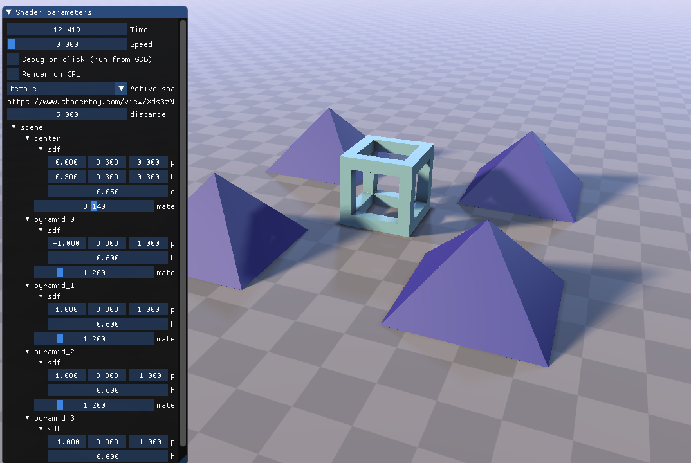

[scene.json](shadertoy2/scene.json)
```json
{
  "scenes": [
    {
      "name" : "spheres of many sizes",
      "objects" : [
        {
          "name"     : "tiny",
          "type"     : "sphere_t",
          "pos"      : [ -2.5, 0.1, 0.0 ],
          "s"        : 0.1,
          "material" : 0.0
        }, {
          "name"     : "small",
          "type"     : "sphere_t",
          "pos"      : [ -2, 0.3, 0.0 ],
          "s"        : 0.3,
          "material" : 1.0
        }, {
          "name"     : "medium",
          "type"     : "sphere_t",
          "pos"      : [ -1, 0.5, 0.0 ],
          "s"        : 0.5,
          "material" : 2.0
        }, {
          "name"     : "large",
          "type"     : "sphere_t",
          "pos"      : [ 0.5, 0.75, 0.0 ],
          "s"        : 0.75,
          "material" : 3.0
        }, {
          "name"     : "jumbo",
          "type"     : "sphere_t",
          "pos"      : [ 2.5, 1.0, 0.0 ],
          "s"        : 1.0,
          "material" : 4.0
        }
      ]
    }, {
      "name" : "temple",
      "objects" : [
        {
          "name"       : "center",
          "type"       : "bounding_box_t",
          "pos"        : [ 0, 0.3, 0 ],
          "b"          : [ 0.3, 0.3, 0.3 ],
          "e"          : 0.05,
          "material"   : 3.14
        },
        {
          "name"       : "pyramid_0",
          "type"       : "pyramid_t",
          "pos"        : [ -1, 0, 1 ],
          "h"          : 0.6,
          "material"   : 1.2
        },
        {
          "name"       : "pyramid_1",
          "type"       : "pyramid_t",
          "pos"        : [ 1, 0, 1 ],
          "h"          : 0.6,
          "material"   : 1.2
        },
        {
          "name"       : "pyramid_2",
          "type"       : "pyramid_t",
          "pos"        : [ 1, 0, -1 ],
          "h"          : 0.6,
          "material"   : 1.2
        },
        {
          "name"       : "pyramid_3",
          "type"       : "pyramid_t",
          "pos"        : [ -1, 0, -1 ],
          "h"          : 0.6,
          "material"   : 1.2
        }
      ]
    }
  ]
}
```

The "spheres of many sizes" and "temple" scenes are defined in a JSON file. In order to create a shader that generates these signed distance fields, the JSON file must be parsed at compile time. Although the specific parameter values can be adjusted at runtime, the shader must know which shape types contribute to the SDF to generate code for them.

The `shadertoy2` project is a fork of `shadertoy` that only features the SDF solids raymarcher, but has three different scenes: one is defined directly in C++ and the other two in JSON.

[shadertoy2.cxx](shadertoy2/shadertoy2.cxx)
```cpp

template<typename scene_t>
struct [[
  .imgui::title=@attribute(scene_t, imgui::title),
  .imgui::url="https://www.shadertoy.com/view/Xds3zN"
]] raymarch_prims_t {

  vec2 map(vec3 pos) const noexcept {
    vec2 res(1e10, 0);

    // Ray cast over all scene objects.
    @meta for(int i = 0; i < @member_count(scene_t); ++i) {
      res = opU(res, vec2(
        scene.@member_value(i).sdf.sd(pos), 
        scene.@member_value(i).material / 2 + 1.5f
      ));
    }

    return res;
  }

  ...

  scene_t scene;
};
```

The raymarcher function object becomes a class template, parameterized over a `scene_t` type. `raymarch_prims_t` has one instance of this as a member object. We can no longer name the shape members directly, because they're specified by the JSON asset. Instead, reflection is used to visit all the shape subobjects of the `scene` data member.

```cpp
// Load a class object consisting of class objects, vectors and scalars from
// a JSON.
template<typename obj_t>
obj_t load_from_json(std::string name, nlohmann::json& j) {
  obj_t obj { };

  if(j.is_null()) {
    fprintf(stderr, "no JSON item for %s\n", name.c_str());
    exit(1);
  }

  if constexpr(std::is_class_v<obj_t>) {
    // Read any class type.
    check(j.is_object(), name, "expected object type");
    @meta for(int i = 0; i < @member_count(obj_t); ++i)
      obj.@member_value(i) = load_from_json<@member_type(obj_t, i)>(
        name + "." + @member_name(obj_t, i),
        j[@member_name(obj_t, i)]
      );

  } else if constexpr(__is_vector(obj_t)) {
    static_assert(std::is_same_v<float, __underlying_type(obj_t)>);
    constexpr int size = __vector_size(obj_t);

    check(j.is_array(), name, "expected array type");
    check(j.size() == size, name, 
      "expected " + std::to_string(size) + " array elements");

    for(int i = 0; i < size; ++i) {
      obj[i] = load_from_json<__underlying_type(obj_t)>(
        name + "[" + std::to_string(i) + "]",
        j[i]
      );
    }

  } else {
    static_assert(std::is_integral_v<obj_t> || std::is_floating_point_v<obj_t>);
    check(j.is_number(), name, "expected number type");
    obj = j;
  }
  return obj;
}
```

This utility function populates the values of an object from a JSON file using the super popular [json.hpp](https://github.com/nlohmann/json) header-only library. In this simple implementation, I support objects, vectors of any size, and scalar values. This covers the definitions for all the SDF shape classes. Circle being Circle, we can execute this function at runtime (of course) _or at compile time_. Since [scene.json](shadertoy2/scene.json) is parsed at compile time, this funtion gets executed by the compiler's integrated interpreter.

```cpp
@meta nlohmann::json scene_json;

template<int scene_index>
struct [[
  .imgui::title=@string(scene_json[scene_index]["name"])
]] json_scene_t {

  // Declare the data members.
  @meta for(auto& object : scene_json[scene_index]["objects"])
    shape_t<@type_id(object["type"])> @(object["name"]);

  json_scene_t() {
    // Initialize each data member from its json.
    @meta for(int i = 0; i < @member_count(json_scene_t); ++i) {
      // Set the sdf subobject.
      this->@member_value(i).sdf = 
        (@meta load_from_json<decltype(this->@member_value(i).sdf)>(
          @member_name(json_scene_t, i),
          scene_json[scene_index]["objects"][i]
        ));

      // Set the material.
      this->@member_value(i).material = 
        scene_json[scene_index]["objects"][i]["material"];
    }
  }
};

@meta+ {
  std::ifstream i("scene.json");
  if(!i.is_open()) {
    fprintf(stderr, "cannot open scene file scene.json\n");
    exit(1);
  }

  i>> scene_json;
  scene_json = scene_json["scenes"];

  printf("scene.json loaded %zu scenes\n", scene_json.size());
}

enum typename class shader_program_t {
  raymarch_prims_t<basic_scene_t>;

  @meta for(int i = 0; i < scene_json.size(); ++i)
    raymarch_prims_t<json_scene_t<i> >;
};
```

This code opens the JSON file and stores its handle in the global meta object `scene_json`. All code inside the `@meta+` compound statement is executed at compile time. This is the so-called "sticky meta", and it applies recursively to all scopes. It's a syntactic convenience so you don't have to write the `@meta` keyword before every statement. Note that the `printf` diagnostic on success, and the `fprintf` diagnostic on failure, both occur at compile time due to their location within the meta context.

The typed enum `shader_program_t` includes a compile-time loop that iterates over each element in the "scenes" array in the parsed JSON. It specializes the `json_scene_t` class template over each index. 

`json_scene_t` interacts with the JSON in three places:
1. The _title_ attribute accesses the "name" member of the scene in the JSON. Since the json.hpp library returns an std::string with an expiring storage, the lifetime of the title string is extended with the `@string` Circle extension, which transforms the `std::string` to a string literal. 
2. The "name" and "type" values for each element in the "objects" array are used to declare data members. 
```cpp
  @meta for(auto& object : scene_json[scene_index]["objects"])
    shape_t<@type_id(object["type"])> @(object["name"]);
```
    The `@type_id` Circle extension takes a string name of a type and yields the actual type. Ordinary name lookup is used here. If the "type" JSON value is "shape_t", then the construct yields a `shape_t` type. The `@()` construct is a Circle dynamic name. It converts the argument string to an identifier. The argument string must have valid spelling. (i.e., not spaces, starts with an alpha or underscore.) Since the inner-most enclosing non-meta scope is the class template `json_scence_t`, this loop body is interpreted as a member declaration.
3. The constructor sets the values of all shape objects to those specified in the JSON. Since member function bodies are parsed after the class definition, all data members have already been defined, so we can use reflection to loop over them. The `@member_value()` Circle extension yields an lvalue to the i'th member of the class object expression on the left-hand side. The `sdf` subobject is initialized with the result of `load_from_json`, which gets passed the json.hpp object encapsulating this shape's data in the scene file. Note the `@meta` keyword that begins the initializer expression. This puts the compiler into the meta context, so that the subsequent expression is evaluated at compile time. This is important, because the json file was opened at compile time and is not available for runtime queries.

## Compiled sprites with compile-time PNG decoding

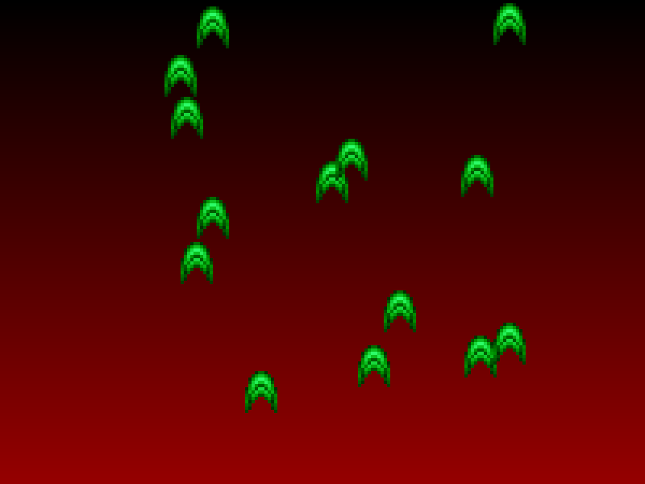

Circle is unlike other C++ compilers. It's a compiler and it's an interpreter, simultaneously. You can execute almost any code you write immediately after it parses. If you want to use an STL container like `map` or `vector` or `list` at compile time, #include the right header and use it in a meta context. If you want to run a shell command and scrape its terminal output, use something like the POSIX function `popen` in a meta context. If you want to decode a PNG file at compile time, #include "stb_image.h" and call `stbi_load` in a meta context.

No... Yes!

In the days before graphics accelerators, if you wanted to render sprites quickly, you'd write a sprite compiler. This tool would read images containing sprite images along with temadextual metadata indicating the bounding box of each sprite in the image. The tool would define a function to draw each sprite by traversing the decoded image and storing out colors for non-transparent pixels directly to memory as immediate values. The emitted code could be textual C or Pascal or ASM or whatever language you wrote your game in.

At runtime, sprite rendering would be maximally performant. There are no branches to torment the CPU. You'd only visit non-transparent pixels. And having immediate color values could greatly simplify alpha blending. It's just a straight-through run of `mov` instructions.

In this example, each sprite one row of a sprite sheet is compiled to a compute shader. Each thread in the compute shader executes a branch-free a run of `imageStore` operations to blast one instance of a sprite to an image buffer.

What's totally novel is that the sprite compiler is implicit in the definition of the compute shader. There's no intermediate tool called `sprite_compiler.exe` that takes input image and metadata and outputs textural C++ code. There's only a compute shader function template, and when specialized, it generate generates the compiled sprite directly from the compile-time decoded image.


I'm using sprites from the 1995 vertical scroller [Tyrian](https://en.wikipedia.org/wiki/Tyrian_(video_game)). The game was produced by Epic and was one of the last CPU-rendered vertical scrollers made, as commodity GPUs were soon to take over the industry. The [sprite sheets](https://lostgarden.home.blog/2007/04/05/free-game-graphics-tyrian-ships-and-tiles/) for this game were made available by its artist, Daniel Cook.

[**assets/tyrian.sprites**](assets/tyrian.sprites)
```
191 220 191
one_shot        0  42  12  56
two_shot       12  42  24  56
three_shot     24  42  36  56
four_shot      36  42  48  56
five_shot      48  42  60  56
energy         60  42  72  56
reg_fireball   72  42  84  56
blue_fireball  84  42  96  56
arched_energy  96  42 108  56
one_thin      108  42 120  56
missile       120  42 132  56
two_missile   132  42 144  56
two_thin      144  42 156  56
eagle         156  42 168  56
nuke          168  42 180  56
double_energy 180  42 192  56
blue_haduken  192  42 204  56
red_haduken   204  42 216  56
missile2      216  42 228  56
```

This game has a lot of sprites, so I'll only be rendering a set of up-pointing projectiles. The sprite sheet package didn't include metadata, so I defined my own for the fourth row of this file. The first line of the file specifies which pixel color is considered transparent. Each subsequent line sets an identifier name for the sprite and its bounding box as (left, top, right, bottom) offsets.

This metadata is all the input the sprite-rendering example gets. It'll include 19 compute shaders, because there are 19 entries in the metadata. The compiler can use data in files on disk just the same as if they're `constexpr` definitions in C++. As long as the data is _known at compile time_, it can be used to generate code.

### Decoding sprites at compile time

```cpp
#define STBI_ONLY_PNG
#define STBI_NO_SIMD
#define STB_IMAGE_IMPLEMENTATION
#include "../thirdparty/stb/stb_image.h"
#include <string>
#include <vector>
#include <gl3w/GL/gl3w.h>
#include <GLFW/glfw3.h>

struct sprite_sheet_t {
  sprite_sheet_t(const char* metadata, const char* image);
  ~sprite_sheet_t();

  struct sprite_t {
    std::string name;
    int left, top, width, height;
  };
  std::vector<sprite_t> sprites;
  uint32_t transparent;

  const uint32_t* data = nullptr;
  int width, height;
};

inline sprite_sheet_t::sprite_sheet_t(const char* metadata, const char* image) {
  FILE* f = fopen(metadata, "r");
  if(!f) {
    printf("Cannot load sprite sheet metadata %s\n", metadata);
    exit(1);
  }

  // The first three numbers in the sprite sheet are rgb components of the
  // transparency color.
  int r, g, b;
  fscanf(f, "%d %d %d", &r, &g, &b);

  // Get a transparent pixel value.
  transparent = r | (g<< 8) | (b<< 16) | (255<< 24);

  // Load in each row of the sprite sheet.
  char name[64];
  int left, top, right, bottom;
  while(5 == fscanf(f, "%s %d %d %d %d", name, &left, &top, &right, &bottom)) {
    sprites.push_back({
      name, left, top, right - left, bottom - top
    });
  }
  fclose(f);

  // Open the image with RGBA format.
  int comp;
  data = (uint32_t*)stbi_load(image, &width, &height, &comp, STBI_rgb_alpha);

  if(!data) {
    printf("Cannot load image data %s\n", image);
    exit(1);
  }
}

inline sprite_sheet_t::~sprite_sheet_t() {
  if(data)
    stbi_image_free((void*)data);
}

@meta sprite_sheet_t sprite_sheet(
  "../assets/tyrian.sprites", 
  "../assets/tyrian.png"
);

const int NumSprites = sprite_sheet.sprites.size();

// Generate an enum with a name for each sprite.
enum class sprite_name_t {
  @meta for(const auto& sprite : sprite_sheet.sprites)
    @(sprite.name);
};

// Print the loaded sprites.
@meta printf("* %s\n", @enum_names(sprite_name_t))...;
```

[STB](https://github.com/nothings/stb) is a collection of header-only utilities useful for game developer. The images library stb_image is the most valuable of them, including full PNG and JPEG decoders that can be called with no fuss. These are C headers, not C++ headers. They don't use `inline` function linkage. Rather, if you want funtion definitions, define `STB_IMAGE_IMPLEMENTATION` before including the headers. Exactly one translation unit should do this, or you'll get linker errors. Since we want to decode a PNG at compile time, our example defines `STB_IMAGE_IMPLEMENTATION` and includes stb_image.h. 

We also need to decode the sprite sheet metadata. The layout is real simple, so `fscanf` works fine. `sprite_sheet_t`s constructor reads the metadata text file into an `std::vector<sprite_t>` member. It decodes the image file and sets the `data` pointer member to the decoded RGBA data. Note that `sprite_sheet_t` is totally agnostic to runtime vs compile-time execution. You can use it for either one.

```cpp
@meta sprite_sheet_t sprite_sheet(
  "../assets/tyrian.sprites", 
  "../assets/tyrian.png"
);
```

This statement declares a `sprite_sheet` object in the meta context. That is, the object gets compile time storage, and the constructor is executed when this statement is encountered in the parser. The body of the constructor executes completely before the compiler moves on to parsing the next statement in the translation unit. `sprite_sheet` is similar to a `constexpr` object, in that it's available at compile time, but it's completely mutable at compile time, just like any normal object is at runtime.

```cpp
// Generate an enum with a name for each sprite.
enum class sprite_name_t {
  @meta for(const auto& sprite : sprite_sheet.sprites)
    @(sprite.name);
};
```

The next statement defines an enum naming each of the sprites from the name specified in the sprite sheet metadata. `@(sprite.name)` is called a dynamic name. When the argument is a string, the construct yields that same string as an identifier. The above enum-specifier expands out to this:

```cpp
enum class sprite_name_t {
  one_shot,
  two_shot,
  three_shot,
  four_shot,
  five_shot,
  energy,
  reg_fireball,
  blue_fireball,
  arched_energy,
  one_thin,
  missile,
  two_missile,
  two_thin,
  eagle,
  nuke,
  double_energy,
  blue_haduken,
  red_haduken,
  missile2,
};
```

At this point there's a compile-time `sprite_sheet_t` object with all the metadata and the decoded PNG contents, and an enumeration naming each of the sprites. The implicitly-assigned values of the enumerators identify the corresponding sprite in the sprite sheet array.

### Generating compiled sprite compute shaders

```cpp
// Treat the rgba8ui image as an r32ui image for more efficient imageStore.
[[using spirv: uniform, binding(0), format(r32ui)]]
uimage2D output_image;

[[using spirv: buffer, binding(0)]]
ivec2 sprite_locations[];

[[using spirv: uniform, location(0)]]
int sprite_count;

template<sprite_name_t name> 
[[using spirv: comp, local_size(32)]]
void comp_sprite() {  
  uint gid = glcomp_GlobalInvocationID.x;
  if(gid >= sprite_count)
    return;

  ivec2 location = sprite_locations[gid];

  @meta+ {
    printf("Generating compiled sprite shader '%s'\n", @enum_name(name));

    // Find the offset into the sprite PNG data.
    auto sprite = sprite_sheet.sprites[(int)name];
    const uint32_t* row_data = sprite_sheet.data + 
      sprite.top * sprite_sheet.width + sprite.left;

    for(int row = 0; row < sprite.height; ++row) {
      for(int col = 0; col < sprite.width; ++col) {
        // Emit an imageStore to write the compiled sprite.
        if(sprite_sheet.transparent != row_data[col]) {
          @emit imageStore(
            output_image, 
            location + ivec2(col, row), 
            uvec4(row_data[col])
          );
        }
      }

      row_data += sprite_sheet.width;
    }
  }
}
```

Retro sprite compilers generated intermediate C or ASM code which would subsequently be fed through a compiler. There's no need for that here. Circle allows us to collapse that process out by using meta control flow to emit exactly the operations we want, stated as ordinary C++ statements.

The compiled sprite compute shader is a function template parameterized over `sprite_name_t`, our meta-generated enumeration of sprite names. Sprite locations are provided by a buffer object, and the number of sprites in a uniform variable. If the thread ID of the shader maps beyond the valid sprites, we bail out of the function.

Now the fun begins.

Enter a `@meta+` curly-brace block. The plus in the context token means that all included statements, unless escaped with an `@emit` token, are themselves meta. The `printf` that announces which sprite we're compiling? That's done at compile time, as a build diagnostic. The sprite metadata object that we load out of the sprites array? That's compile time. The `const uint32_t* row_data` pointer into the decoded PNG image is compile time. The for loops over the sprite's bounding box is compile time. The test if a pixel value is transparent is compile time...

```cpp
          @emit imageStore(
            output_image, 
            location + ivec2(col, row), 
            uvec4(row_data[col])
          );
```

`@emit` is the context token to escape from the metaverse. This statement really gets emitted into the compute shader. `output_image` is the image buffer interface variable, and its the target to write each individual sprite pixel to. `ivec2(col, row)` is a compile-time integer vector with the offset of the pixel within the sprite's bounding box. It gets converted to a runtime constant vector and added to the location of the sprite, which was loaded from the buffer object. This is the first runtime instruction.

`uvec4(row_data[col])` constructs a compile-time vector of uints, which matches the third parameter of `imageStore`. We don't have to split the color components apart, because the image format is declared `r32ui`, so only the red component of the value is taken, and that is compatible with the RGBA8 internal format of the texture. That vector is converted to a runtime constant vector, and the `imageStore` call is emitted to the shader's definition, only the second instructior per sprite pixel.

```
$ spirv-dis CMakeFiles/sprites.dir/sprites.cxx.spv
...
       %2118 = OpIAdd %v2int %2039 %300
               OpImageWrite %2038 %2118 %146 ZeroExtend
       %2119 = OpIAdd %v2int %2039 %302
               OpImageWrite %2038 %2119 %99 ZeroExtend
       %2120 = OpIAdd %v2int %2039 %304
               OpImageWrite %2038 %2120 %114 ZeroExtend
       %2121 = OpIAdd %v2int %2039 %154
               OpImageWrite %2038 %2121 %83 ZeroExtend
       %2122 = OpIAdd %v2int %2039 %158
               OpImageWrite %2038 %2122 %626 ZeroExtend
       %2123 = OpIAdd %v2int %2039 %160
               OpImageWrite %2038 %2123 %626 ZeroExtend
       %2124 = OpIAdd %v2int %2039 %162
               OpImageWrite %2038 %2124 %83 ZeroExtend
       %2125 = OpIAdd %v2int %2039 %308
               OpImageWrite %2038 %2125 %114 ZeroExtend
       %2126 = OpIAdd %v2int %2039 %310
               OpImageWrite %2038 %2126 %99 ZeroExtend
```

Run the SPIR-V disassembler on the emitted shader module. You see a whole lot of this. All the logic to traverse the sprite and examine its color is missing. It's not that it was optimized out. It was never even emitted to the shader's definition.

### Compile-time calls to external libraries

It is preposterous to decode an image by compiling and then interpreting an entire PNG decoder.

First off, it's slow. Computers are fast, and the cost is acceptable for an example like this, but things add up in big projects. Decoding a small image should take zero measurable milliseconds.

Secondly, it has bloated our executable. STB isn't a C++-style header-only file. Because the functions aren't marked inline (or are implicitly inline like C++ member functions), they have linkage. They're not called _at runtime_ in our example, but they're still included in the binary. It's not acceptable to inflate your executable with code that only gets used at compile time.

The solution is to make a shared object library from STB image. If a translation unit makes a compile-time function call, or accesses a namespace-scope object, in a meta context and the definition hasn't already been processed, Circle looks through a list of pre-loaded binary libraries for the symbol, using its Itanium ABI mangled name. 

[**thirdparty/stbi.c**](thirdparty/stbi.c)
```cpp
#define STB_IMAGE_IMPLEMENTATION
#include "stb/stb_image.h"
```
```
$ gcc -shared -fPIC stbi.c -o libstbi.so
```

First thing is to create a shared object library for STB image. I could build this with Circle, but STB has a SIMD path, and my compiler doesn't yet support SSE/AVX extensions. (It's in development. The implementation is easy but very tedious.) We get the fastest executable by using plain old GCC. Build this library in the `/thirdparty` folder of the shaders project.

```
$ circle -shader -M ../thirdparty/libstbi.so sprites2.cxx -o sprites2 -lGL -lgl3w -lglfw
```

Compile by using the `-M` compiler argument and pointing it at the library to load.

```
set_source_files_properties(sprites2.cxx PROPERTIES COMPILE_FLAGS "-shader -M ../thirdparty/libstbi.so")
```

For cmake support, use `set_source_files_properties` to set this argument on a per-source basis.

[**sprites2/sprites2.cxx**](sprites2/sprites2.cxx)
```cpp
#include "../thirdparty/stb/stb_image.h"
#include <string>
#include <vector>
#include <gl3w/GL/gl3w.h>
#include <GLFW/glfw3.h>
  ...
```

In this second project we `#include stb_image.h` without defining `STB_IMAGE_IMPLEMENTATION`. The API `stbi_load` is declared but undefined. When called in a meta context, Circle searches all `-M` external libraries for this symbol and finds it in `thirdparty/libstbi.so`. It uses `dlsym` to retrieve a pointer to this symbol and makes a foreign function call to this optimized, native code.

```
$ cd sprites
$ time make -B
real  0m1.517s
user  0m1.483s
sys 0m0.035s

$ ls -al sprites
-rwxrwxr-x 1 sean sean 195664 Oct 22 13:19 sprites

$ cd ../sprites2
$ time make -B

$ ls -al sprites2
real  0m0.303s
user  0m0.288s
sys 0m0.015s

$ ls -al 
-rwxrwxr-x 1 sean sean 149912 Oct 22 13:19 sprites2

$ ls -al CMakeFiles/sprites2.dir/sprites2.cxx.spv
-rw-rw-r-- 1 sean sean 124600 Oct 22 13:19 CMakeFiles/sprites2.dir/sprites2.cxx.spv
```

The project that compiles the definitions for STB image and performs PNG decoding inside the compile-time interpreter takes 1.5s. Not too bad.

The project that calls the externally-compiled STB image library takes .3s. That's really good. That includes the generation of 19 pretty long compute shaders.

The second executable is also 50 KB slimmer. This is the size that `stbi_load` and its dependencies takes in the executable. The executable takes 149KB. All but 25KB is due to the SPIR-V module embedded inside it.

## Compiling CUDA code with C++ shaders

GPU parallel algorithms are not trivial to author. The single-source C++ model that CUDA introduced allows programmers to use templates in defining kernels, which gives sort implementations their flexibilty: key type, value type, grain size and comparators can be expressed with template parameters, allowing for a lot of customization. Domain-specific shader languages don't have the same level of generic programming support and don't interface with the host environment nearly as well, making complex, multi-pass cooperative algorithms far harder to implement.

Like CUDA, Circle is a compiler frontend that lowers C++ to a GPU intermediate representation. The beauty in the design of parallel libraries like [moderngpu](https://www.github.com/moderngpu/moderngpu), [thrust](https://github.com/NVIDIA/thrust) and [CUB](https://github.com/NVIDIA/cub) is that, for performance and customization reasons, they're already highly parameterized. This has the felicitous side effect of allowing their core algorithms to be compiled using Circle to generate OpenGL/Vulkan compute shaders.

> Part of the vision of Circle C++ Shaders is **write once, run anywhere**. Organize your logic into templates that abstract logic from API-specific requirements like parameter passing, resource binding and kernel dispatch. Use a compiler that emits SPIR-V, DXIR and PTX from a single C++ library. Write entry point points for OpenGL, Vulkan, D3D, CUDA and OpenCL to handle the platform-specific details. Sophisticated, cooperative GPGPU programs should be able to run on any device and any API.

### Moderngpu for shaders

[**cta_merge.hxx**](https://github.com/seanbaxter/mgpu-shaders/blob/master/inc/mgpu/cta_merge.hxx)
```cpp
template<bounds_t bounds = bounds_lower, typename a_keys_it,
  typename b_keys_it, typename comp_t>
int merge_path(a_keys_it a_keys, int a_count, b_keys_it b_keys, 
  int b_count, int diag, comp_t comp) {

  typedef typename std::iterator_traits<a_keys_it>::value_type type_t;
  int begin = max(0, diag - b_count);
  int end   = min(diag, a_count);

  while(begin < end) {
    int mid = (begin + end) / 2;
    type_t a_key = a_keys[mid];
    type_t b_key = b_keys[diag - 1 - mid];
    bool pred = (bounds_upper == bounds) ?
      comp(a_key, b_key) :
      !comp(b_key, a_key);

    if(pred) begin = mid + 1;
    else end = mid;
  }
  return begin;
}
```

This utility code was copied straight from the CUDA version of moderngpu 2.0. It performs a binary search of two sorted input arrays to find the _diag_-smallest element between the two of them. Put in visual terms, this finds the intersection of the merge path with a diagonal, as explained [https://moderngpu.github.io/merge.html](here).

The input arrays are abstracted behind template parameters `a_keys_it` and `b_keys_it`. While these types are often pointers, there's good reason for the parametization: it allows users to provide `zip_iterators`, `counting_iterators` and other custom types to bind disparate forms of data together in a way that resembles an array. This is the kind of parameterization that makes CUDA algorithms so flexible.

Compute shaders have very restricted support for pointers, so this not code not having any makes it much more likely to lower to a shader IR like SPIR-V or DXIR. Indeed, this routine compiles for CPU execution, PTX for execution or SPIR-V for compute shader execution.

[**kernel_partition.hxx**](https://github.com/seanbaxter/mgpu-shaders/blob/master/inc/mgpu/kernel_partition.hxx)
```cpp
template<bounds_t bounds, typename mp_it, typename a_it, typename b_it, 
  typename comp_t>
void kernel_partition(mp_it mp_data, a_it a, int a_count, b_it b, int b_count, 
  int spacing, comp_t comp) {

  int num_partitions = (int)div_up(a_count + b_count, spacing) + 1;
  int index = threadIdx.x + blockDim.x * blockIdx.x;
  if(index < num_partitions) {
    int diag = min(spacing * index, a_count + b_count);
    mp_data[index] = merge_path<bounds>(a, a_count, b, b_count, diag, comp); 
  }
}
```

I factored out the logic for the kernel that performs the partitioning into something that's API- and IR-neutral. `kernel_partition` isn't tagged with `[spirv::comp]` to make it an OpenGL/Vulkan compute shader, nor is it tagged with `__global__` to make it a CUDA kernel. But it implements all the responsibilities of a kernel. The thread ID and block ID are pulled from the `threadIdx` and `blockIdx` variables, and combined to get the global thread index within the launch. If this global index is less than the work item count, it performs the merge path search and stores the data out to `mp_data`. Even at this point, the input and output array types _are not pointers_. They remain iterators. We want to defer selection of actual data types until we reach the kernel or shader entry point, because writing explicit data types inhibits portability.

[**kernel_partition.hxx**](https://github.com/seanbaxter/mgpu-shaders/blob/master/inc/mgpu/gl/partition.hxx)
```cpp
template<bounds_t bounds, typename params_t, int mp, int ubo>
[[using spirv: comp, local_size(128)]]
void kernel_partition() {
  // Load the kernel parameters from the uniform buffer at binding=ubo.
  params_t params = shader_uniform<ubo, params_t>;
  int a_count = params.a_count;
  int b_count = params.b_count;
  int spacing = params.spacing;

  int num_partitions = num_merge_partitions(a_count + b_count, spacing);
  int index = threadIdx.x + blockDim.x * blockIdx.x;

  if(index < num_partitions) {
    int diag = min(spacing * index, a_count + b_count);

    writeonly_iterator_t<int, mp> mp_data;
    mp_data[index] = merge_path<bounds>(params.a_keys, a_count, params.b_keys,
      b_count, diag, params.comp);
  }
}

template<bounds_t bounds, typename params_t, int mp, int ubo = 0>
void launch_partition(int count, int spacing) {
  int num_ctas = div_up(num_merge_partitions(count, spacing), 128);
  gl_dispatch_kernel<kernel_partition<bounds, params_t, mp, ubo> >(num_ctas);
}
```

The `kernel_partition` compute shader is the OpenGL entry point for the partition operation. Compute shaders aren't allowed to take function parameters, so the entry point's arguments have to be baked into a buffer object, bound to the OpenGL device context, and loaded out of a UBO on the shader side. This is how parameter passing is implemented with OpenGL compute shaders, so this operation has to be implemented in the compute shader entry point itself, rather than inside utility code that we intend to keep portable.

The template parameters of `kernel_partition` specify the type of the structure that holds the compute shader's arguments, the resource at which the UBO with that data is bound, and the resource at which the SSBO holding the partitioning output is bound.

Since shader APIs don't generally support pointers (although there is a recent [Vulkan extension](https://github.com/KhronosGroup/SPIRV-Registry/blob/master/extensions/EXT/SPV_EXT_physical_storage_buffer.asciidoc) that allows pointers into some buffers), we can't get a pointer to GPU memory on the host and pass it over the CPU-GPU divide as a kernel argument, like we can with CUDA or OpenCL. We need to construct an iterator that loads from a bound SSBO directly. Fortunately, the single source C++ design model makes this pretty easy.

[**bindings.hxx**](https://github.com/seanbaxter/mgpu-shaders/blob/master/inc/mgpu/common/bindings.hxx**)
```cpp
template<auto index, typename type_t = @enum_type(index)>
[[using spirv: uniform, binding((int)index)]]
type_t shader_uniform;

template<auto index, typename type_t = @enum_type(index)>
[[using spirv: buffer, readonly, binding(index)]]
type_t shader_readonly;

template<auto index, typename type_t = @enum_type(index)>
[[using spirv: buffer, writeonly, binding(index)]]
type_t shader_writeonly;

template<auto index, typename type_t = @enum_type(index)>
[[using spirv: buffer, binding(index)]]
type_t shader_buffer;
```

I like using [variable templates](#variable-templates) to _implicitly declare_ shader variables from their point of use in a shader. To sample a _readonly_ SSBO, just specialize `shader_readonly` and provide the binding location and type of the buffer. That is, `shader_readonly<3, int2[]>[i]` causes the declaration of a read-only SSBO at binding 3 with type `int2[]` and subscripts it with index `i`.

Instead of passing pointers to the templated GPU algorithms, we'll pass class objects that implement a pointer-like interface but use variable templates to sample their arrays. 

[**bindings.hxx**](https://github.com/seanbaxter/mgpu-shaders/blob/master/inc/mgpu/common/bindings.hxx**)
```cpp
template<typename accessor_t, typename type_t = decltype(accessor_t::access(0))>
struct iterator_t : std::iterator_traits<const std::remove_reference_t<type_t>*> {

  iterator_t() = default;
  explicit iterator_t(int offset) : offset(offset) { }

  iterator_t(const iterator_t&) = default;
  iterator_t& operator=(const iterator_t&) = default;

  iterator_t operator+(int diff) const noexcept {
    return iterator_t(offset + diff);
  }
  iterator_t& operator+=(int diff) noexcept {
    offset += diff;
    return *this;
  }
  friend iterator_t operator+(int diff, iterator_t rhs) noexcept {
    return iterator_t(diff + rhs.offset);
  }

  iterator_t operator-(int diff) const noexcept {
    return iterator_t(offset - diff);
  }
  iterator_t& operator-=(int diff) noexcept {
    offset -= diff;
    return *this;
  }

  int operator-(iterator_t rhs) const noexcept {
    return offset - rhs.offset;
  }

  decltype(auto) operator*() const noexcept {
    return accessor_t::access(offset);
  }

  decltype(auto) operator[](int index) const noexcept {
    return accessor_t::access(offset + index);
  }

  int offset = 0;
};
```

The class template `iterator_t` implements the interface of a pointer, but keeps the offset as in 32-bit int data member. Actual access of the underlying data is delegated to the template parameter `accessor_t`. 

```cpp
template<typename type_t, int binding>
struct readonly_access_t {
  static type_t access(int index) noexcept {
    return shader_readonly<binding, type_t[]>[index];
  }
};

template<typename type_t, int binding>
using readonly_iterator_t = iterator_t<readonly_access_t<type_t, binding> >;

template<typename type_t, int binding>
struct writeonly_access_t {
  static type_t& access(int index) noexcept {
    return shader_writeonly<binding, type_t[]>[index];
  }
};
template<typename type_t, int binding>
using writeonly_iterator_t = iterator_t<writeonly_access_t<type_t, binding> >;

template<typename type_t, int binding>
struct buffer_access_t {
  static type_t& access(int index) noexcept {
    return shader_buffer<binding, type_t[]>[index];
  }
};
template<typename type_t, int binding>
using buffer_iterator_t = iterator_t<buffer_access_t<type_t, binding> >;
```

The candidates for substitution include the `readonly_access_t`, `writeonly_access_t` and `buffer_access_t` class templates. Each accept type and binding parameters and implement a static member function `access` which specializes and samples a variable template. Use the corresponding alias templates to mint iterators over a type and binding index.

It's important to keep in mind that the binding index of the SSBO is _part of the iterator's type_. We can aggregate iterators into a structure, optionally give them non-zero starting indices on the host, then copy them into device memory and bind to a UBO. The resource bindings in the iterators are intended to be viral, and propagate to the aggregate, and from there to the compute shader entry point and utility functions through the mechanism of template specialization.

[**kernel_merge.hxx**](https://github.com/seanbaxter/mgpu-shaders/blob/master/inc/mgpu/common/kernel_merge.hxx)
```cpp
template<
  typename a_keys_it,
  typename a_values_it,
  typename b_keys_it,
  typename b_values_it,
  typename c_keys_it,
  typename c_values_it,
  typename comp_t>
struct merge_params_t {
  a_keys_it a_keys;
  b_keys_it b_keys;
  c_keys_it c_keys;

  int spacing;           // NV * VT
  int a_count;
  int b_count;

  // Put the potentially empty objects together to take up less space.
  a_values_it a_vals;
  b_values_it b_vals;
  c_values_it c_vals;
  comp_t comp;
};
```

One possible aggregate type that provides arguments to the partition and merge is listed above. Since we're merging two streams into one, we need two input array members: `a_keys` and `b_keys`, and one output array member: `c_keys`. A comparator member is included to support customization (for example, when sorting strings you'd need a string-compare comparator). The lengths of each input are included as members, as well as the number of values merged per thread block, which specifies the inter-diagonal spacing for partitioning binary searches.

```cpp
  typedef merge_params_t< 
    // A
    readonly_iterator_t<key_t, 0>,
    readonly_iterator_t<val_t, 4>,

    // B
    readonly_iterator_t<key_t, 1>,
    readonly_iterator_t<val_t, 5>,

    // C
    writeonly_iterator_t<key_t, 2>,
    writeonly_iterator_t<val_t, 6>,

    comp_t
  > params_t;
```

The `merge_pipeline_t` class implements the user-facing interface for launching a merge operation. This class decides the policy for associating input buffers with UBO and SSBO bindings. The `merge_params_t` class template is specialized with the input and output key and value resources. The actual data is bound to the shader from the host side with `glBindBufferBase`. It's accessed on the GPU side through these specially-typed iterators.

References to shader variables like UBOs and SSBOs yield ordinary C++ lvalues. These may decay to pointers and be used as pointers, as long as the pointer values don't cross the CPU-GPU interface. This capability relies on Circle's ability to optimize out pointer operations using CFG passes in the SPIR-V backend. This is a capability under development. Relying on iterators throughout the kernel is more robust.

[**kernel_merge.hxx**](https://github.com/seanbaxter/mgpu-shaders/blob/master/inc/mgpu/common/kernel_merge.hxx**)
```cpp
template<
  int nt, int vt, 
  typename mp_it,
  typename a_keys_it, typename a_vals_it,
  typename b_keys_it, typename b_vals_it,
  typename c_keys_it, typename c_vals_it,
  typename comp_t
>
void kernel_merge(
  mp_it mp_data,
  a_keys_it a_keys, a_vals_it a_vals, int a_count,
  b_keys_it b_keys, b_vals_it b_vals, int b_count,
  c_keys_it c_keys, c_vals_it c_vals, comp_t comp) {

  typedef typename std::iterator_traits<a_keys_it>::value_type key_t;
  typedef typename std::iterator_traits<a_vals_it>::value_type val_t;

  const int nv = nt * vt;
  int tid = threadIdx.x;
  int cta = blockIdx.x;
 
  struct shared_t {
    key_t keys[nv + 1];
    int indices[nv];
  };
  [[spirv::shared]] shared_t shared;

  // Load the range for this CTA and merge the values into register.
  int mp0 = mp_data[cta + 0];
  int mp1 = mp_data[cta + 1];
  merge_range_t range = compute_merge_range(a_count, b_count, cta, nv, 
    mp0, mp1);

  merge_pair_t<key_t, vt> merge = cta_merge_from_mem<bounds_lower, nt, vt>(
     a_keys, b_keys, range, tid, comp, shared.keys);

  int dest_offset = nv * cta;
  reg_to_mem_thread<nt>(merge.keys, tid, range.total(), c_keys + dest_offset,
    shared.keys);
  
  if constexpr(!std::is_same_v<empty_t, val_t>) {
    // Transpose the indices from thread order to strided order.
    std::array<int, vt> indices = reg_thread_to_strided<nt>(merge.indices, tid, 
      shared.indices);
  
    // Gather the input values and merge into the output values.
    transfer_two_streams_strided<nt>(a_vals + range.a_begin, range.a_count(),
      b_vals + range.b_begin, range.b_count(), indices, tid, 
      c_vals + dest_offset);
  }
}
```

The partitioning kernel doesn't require communication between threads. It's _embarrassingly parallel_. Stuff gets challenging when hundreds of threads have to communicate in a low-latency, mechanical way. The merge kernel uses the results of the partitioning kernel to cooperatively merge two streams of sorted data.

`kernel_merge` is moderngpu's CUDA merge kernel. The inputs and outputs were already parameterized to support data transformations like `zip_iterator` and `counting_iterator`. The only significant modification required was to change the `shared_t` type from a union to a structure. GLSL/SPIR-V doesn't support union types yet. I'm working on CFG transformation to allow compact shared memory in a SPIR-V kernel, which delivers the space-saving benefits of a union without the exact aliasing behaviors, but it isn't ready for this release. In the near future, that `struct` will go back to a `union`, and GPU occupancy when executing will kernel, bringing throughput up to par with the CUDA original.

The utilites that `kernel_merge` invokes are similarly API-agnostic. There's really no additional technical challenging in having cooperative CUDA algorithms compile for shader IRs, once you're abstracting input and output sources using templates.

### The particles demo

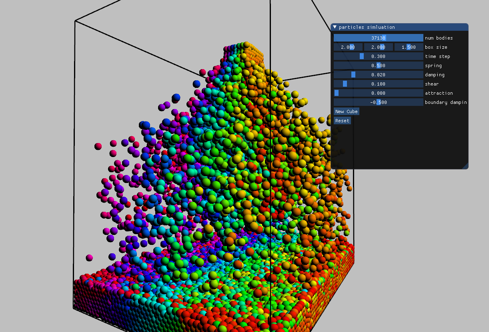

[Simon Green](https://twitter.com/simesgreen)'s 2007 CUDA demo _particles_ was the first really sophisticated CUDA sample. By using a parallel to sort to order particles by their cell hashes, it required more technology than was generally available with fragment shaders at the time.

Rather than compute all pair-pair interactions, a quadratic cost operation, at each frame particles are quantized into cells, and those IDs are combined into a hash. The particle hash are then sorted, and particles and velocities reordered according to this hash. A cell-range data structure is built that describes the range of particles that map to each cell. With this data structure, the all-pairs interaction is reduced to a traversal of a 3x3x3 finite support domain around the cell of the particle being processed. By leveraging the sort algorithm, a quadratic-time embarrassingly parallel simulation becomes a linear-time embarrassingly parallel simulation.

The high-performance [moderngpu mergesort](https://moderngpu.github.io/mergesort.html) was ported to Circle and compiles to OpenGL compute shaders in the same way the merge kernel does. 

[**particles.cxx**](particles/particles.cxx)
```cpp
struct SimParams {
  // Particle characteristics.
  int   numBodies         = 30000;
  float particleRadius    = 1.f / 64;

  // Particle distribution. This world box is always centered at the origin.
  vec3  worldSize         = vec3(2, 2, 1.5);
  vec3  cellSize          = 0;
  ivec3 gridSize          = 0;

  // Integration.
  vec3  gravity           = vec3(0, -.0003, 0);
  float deltaTime         = 0.3f;
  float globalDamping     = 1;

  // Physics.
  float spring            = 0.5f;
  float damping           = 0.02f;
  float shear             = 0.1f;
  float attraction        = 0;
  float boundaryDamping   = -0.5f;

  // TODO: The wrecking ball.
  vec3  colliderPos       = vec3(-1.2, -0.8, 0.8);
  float colliderRadius    = 0.2f;

  // Rendering parameters.
  mat4 view               = mat4();
  mat4 proj               = mat4();
  float pointScale        = 0;
  float pointRadius       = 0.0625f;
  float fov               = radians(60.0f);

  vec3 worldMin() const noexcept { return -worldSize / 2; }
  vec3 worldMax() const noexcept { return  worldSize / 2; }

  int numCells() const noexcept {
    return gridSize.x * gridSize.y * gridSize.z;
  }

  int cellHash(ivec3 cell) const noexcept {
    return cell.x + gridSize.x * (cell.y + gridSize.y * cell.z);
  }
};

// Park the simulation parameters at ubo 1 and keep it there throughout the
// frame. UBO 0 is reserved for gl_transform.
[[using spirv: uniform, binding(1)]]
SimParams sim_params_ubo;
```

`SimParams` was taken from Simon's original CUDA Toolkit sample. It holds simulation-wide parameters. In this rewrite of the sample, there's a local copy and a copy in an OpenGL buffer bound to UBO 1 under the name `sim_params_ubo`. All the compute and raster shaders in the program can access this constant data.

```cpp
inline vec3 collide_spheres(vec3 posA, vec3 posB, vec3 velA, vec3 velB,
  float radiusA, float radiusB, const SimParams& params) {

  vec3 relPos = posB - posA;
  float dist = length(relPos);
  float collideDist = radiusA + radiusB;

  vec3 force { };
  if(dist < collideDist) {
    vec3 norm = relPos / dist;

    // relative velocity.
    vec3 relVel = velB - velA;

    // relative tangential velocity.
    vec3 tanVel = relVel - dot(relVel, relVel) * norm;

    // spring force.
    force = -params.spring * (collideDist - dist) * norm;
    
    // dashpot (damping) fgorce
    force += params.damping * relVel;

    // tangential shear force
    force += params.shear * tanVel;

    // attraction
    force += params.attraction * relPos;
  }

  return force;
}
```

The pair-interaction function `collide_spheres` implements the physics of the simulation. The function can execute on the CPU or from a shader program, because its dependence on the simulation parameters is through a reference, rather than on the `sim_params_ubo` variable directly. Not all abstraction has to be with template types; sometimes just passing references is sufficient to abstract the CPU or GPU resources that would otherwise prohibit portability.

```cpp
void system_t::sort_particles() {
  int num_particles = params.numBodies;

  // Hash particles into cells.
  auto pos_data = positions.bind_ssbo<0>();
  auto hash_data = cell_hash.bind_ssbo<1>();

  // 1. Quantize the particles into cells. Hash the cell coordinates
  //    into an integer.
  mgpu::gl_transform([=](int index) {
    vec3 pos = pos_data[index].xyz;
    ivec3 gridPos = calcGridPos(pos, sim_params_ubo);
    int hash = hashGridPos(gridPos, sim_params_ubo);

    hash_data[index] = hash;

  }, num_particles);

  // 2. Sort the particles by their hash. The value of the sort is the index
  //    of the particle.
  sort_pipeline.sort_keys_indices(cell_hash, gather_indices, num_particles);

  // 3. Reorder the particles according to their gather indices.
  auto pos_in = positions.bind_ssbo<0>();
  auto vel_in = velocities.bind_ssbo<1>();
  auto hash_in = cell_hash.bind_ssbo<2>();
  auto gather_in = gather_indices.bind_ssbo<3>();
  auto pos_out = positions_out.bind_ssbo<4>();
  auto vel_out = velocities_out.bind_ssbo<5>();

  // Clear the ranges array because we'll never visit cells with no
  // particles.  
  cell_ranges.clear_bytes();
  auto cell_ranges_out = cell_ranges.bind_ssbo<6>();

  mgpu::gl_transform([=](int index) {
    // Load the gather and hash values.
    int gather = gather_in[index];
    int hash = hash_in[index];
    int hash_prev = index ? hash_in[index - 1] : -1;

    // Load the particle data.
    vec4 pos = pos_in[gather];
    vec4 vel = vel_in[gather];

    // Write the cell ranges.
    if(hash_prev < hash) {
      if(index) cell_ranges_out[hash_prev].y = index;
      cell_ranges_out[hash].x = index;
    }

    if(index == sim_params_ubo.numBodies - 1)
      cell_ranges_out[hash].y = sim_params_ubo.numBodies;

    // Write the particles to memory.
    pos_out[index] = pos;
    vel_out[index] = vel;

  }, num_particles);

  // Swap the old containers with the new ones.
  positions.swap(positions_out);
  velocities.swap(velocities_out);
}
```

`sort_particles` is the heart of the particles simulation. It executes three phases:
1. Quantize the particles into cells. Hash the cell coordinates to an integer.
2. Sort the cell hashes. Produce a gather index as value.
3. Reorder the particles from the gather indices and produce cell ranges.

Phases 1 and 3 are embarrassingly parallel and implemented in C++ lambdas. Their closures capture iterators returned from the `gl_buffer_t::bind_ssbo` calls.

Phase 2 is provided by the `mgpu::sort_pipeline_t` object. This maintains auxiliary buffers for executing the sort. Using the sort from the host is a single member function call: `sort_keys_indices`. Key and value buffers are provided and the library performs resource binding and shader dispatches.

## Advanced compute with Vulkan

### Shader parameters and push constants

All shader stage entry points in both GLSL are HLSL return void and take no function parameters. To pass data to a shader stage, you have to explicitly collect it into uniform or shader-stage buffer objects and bind those resources to the graphics context. This differs from OpenCL and CUDA, which accept kernel arguments through the [clSetKernelArg](https://www.khronos.org/registry/OpenCL/specs/3.0-unified/html/OpenCL_API.html#_setting_kernel_arguments) and [cudaLaunchKernel](https://docs.nvidia.com/cuda/cuda-runtime-api/group__CUDART__EXECUTION.html#group__CUDART__EXECUTION_1g5064cdf5d8e6741ace56fd8be951783c) APIs. These arguments are sent to the device as part of the kernel dispatch command, so no explicit binding is required.

GLSL and Vulkan lack shader parameter support. However, they support _push constants_, small binary assets that are specified with each compute, graphics or ray-tracing pipeline launch. Push constant data isn't involved in descriptor binding; it is encoded directly into the command buffer. All Vulkan devices support push constants of at least 128 bytes. The [vkCmdPushConstants](https://www.khronos.org/registry/vulkan/specs/1.2-extensions/man/html/vkCmdPushConstants.html) sets the associated data with a Vulkan pipeline object.

To provide a smoother experience that more closely tracks CUDA and OpenCL, Circle implicitly declares a push constant object when a shader entry point is marked with the `[[spirv::push]]` C++ attribute. Each function parameter is mapped to a data member in the push constant structure. When the shader is executed, the push constant is implicitly disaggregated, and each of its members is copied to an automatic storage duration variable in the shader body, to mimic the behavior of real function parameters.

```cpp
template<int nt = 128, typename type_t>
[[using spirv: comp, local_size(NT), push]]
void saxpy(int count, type_t a, const type_t* x, type_t* y) {
  int index = glcomp_GlobalInvocationID.x;
  if(index < count)
    y[index] += a * x[index];
}
```

When specialized over `float`, the `saxpy` function template shader gets a 24-byte push constant, where the parameters are implicitly stored in a structure with natural alignment. To enable this behavior, you must mark the shader with the `[[spirv::push]]` attribute. You can extend the 128-byte constant limit by passing an optional size to the attribute: `[[spirv::push(256)]]` allows parameters up to 256 bytes in size.

### Chevron launches

CUDA kernels are launched with a chevron. For example,

```cpp
template<int nt = 128, typename type_t>
__global__ void saxpy(int count, type_t a, const type_t* x, type_t* y) {
  int index = threadIdx.x + blockIdx.x * blockDim.x;
  if(index < count)
    y[index] += a * x[index];
}

saxpy<<<num_blocks, 128, 0, stream>>>(count, a, x, y);
```

The chevron takes four arguments:
1. The number of blocks in the grid. This may be a 1, 2, or 3-dimensional unit.
2. The size of each thread group. This may be a 1, 2, or 3-dimensional unit.
3. Extra shared memory in bytes to provision for the thread group.
4. The stream to dispatch the kernel on.

The chevron syntax, which is implemented by the compiler, coordinates with the CUDA runtime API to abstract the task of loading and compiling the kernel, pushing its arguments to the driver, and actually dispatching the job. Arguments inside the chevron are for coordinating the launch of the compute grid. Arguments the function parenthesis are pushed to the driver and made available to the kernel on the device side. This helps facilitate generic programming, as template argument deduction is still performed for the kernel's function parameters, without requiring a textual of those arguments from the arguments in the chevron.

Circle implements _programmable_ chevrons to allow Vulkan developers to configure their pipeline shader stages with the same ease of use. Circle supports 14 different shader stages (5 legacy raster, task+mesh, compute and six ray-tracing stages), and invoking the chevron syntax on a function from any stage forwards the arguments to a user-defined chevron function:

* `spirv_chevron_vert`
* `spirv_chevron_tesc`
* `spirv_chevron_tese`
* `spirv_chevron_geom`
* `spirv_chevron_frag`
* `spirv_chevron_comp`
* `spirv_chevron_kern`
* `spirv_chevron_task`
* `spirv_chevron_mesh`
* `spirv_chevron_rgen`
* `spirv_chevron_rint`
* `spirv_chevron_rahit`
* `spirv_chevron_rchit`
* `spirv_chevron_rmiss`
* `spirv_chevron_rcall`

Using a chevron launch on a compute shader looks for functions called `spirv_chevron_comp`. Unqualified name lookup and argument-dependent lookup in associated namespaces of the chevron arguments collects function overloads of `spirv_chevron_comp`. Overload resolution finds the candidate that accepts the provided chevron arguments. The shader function is passed as a non-type template parameter, which allows the chevron function to get its mangled name without ODR-using it from the host. 

**launch.hxx**
```cpp
// Chevron launch on a SPIR-V compute shader performs ADL lookup to find
// this symbol, and overload resolution to select this overload.
template<auto F, typename... params_t>
static void spirv_chevron_comp(int num_blocks, cmd_buffer_t& cmd_buffer, 
  params_t... params) {

  static_assert((... && std::is_trivially_copyable_v<params_t>));
  tuple_t<params_t...> storage { params... };

  cmd_buffer.context.dispatch_compute(
    cmd_buffer,
    @spirv(F),
    cmd_buffer.context.create_module(__spirv_data, __spirv_size),
    num_blocks,
    sizeof(storage),
    &storage
  );
}
```

This chevron function matches chevron launches that provide the block count and command buffer as chevron arguments. Arguments to the shader are implicitly converted to the shader function's parameter types and passed through the variadic template. The chevron function aggregates the function parameters into a structure, which matches their layout in the push constant specified by the SPIR-V for the compiled shader. The `@spirv` extension yields the mangled name of the shader inside its SPIR-V module. And the `__spirv_data` and `__spirv_size` variables locate the SPIR-V shader module binary within the translation unit. These terms are sent to Vulkan client code which loads the shader module, defines and creates the compute pipeline layout, and sets the push constant and dispatches the grid launch to the command buffer.

Why provide an overloadable chevron function? You might define parameters for specifying synchronization before or after the launch. Or take descriptor sets to bind. Or take individual UBO, image, sampler or texture assets and implicitly bind those to the descriptor set and that to the pipeline. Or pass a logger. The chevron is a convenient mechanism to pass any number of additional terms from the caller down to the deepest levels of the Vulkan user code. 

```cpp
template<int NT = 128, typename type_t>
[[using spirv: comp, local_size(NT), push]]
void saxpy(int count, type_t a, const type_t* x, type_t* y) {
  int index = glcomp_GlobalInvocationID.x;
  if(index < count)
    y[index] += a * x[index];
}

float* x = context.alloc_gpu<float>(count);
float* y = context.alloc_gpu<float>(count);
const int NT = 64;    // Use 64 threads per block.
int num_blocks = mgpu::div_up(count, NT);
saxpy<NT><<<num_blocks, cmd_buffer>>>(count, M_PIf32, x, y);
```

This chevron launch passes the grid size and buffer as chevron arguments. Argument deduction is executed on the `saxpy` function template shader arguments, setting `type_t` to `float`. These arguments are converted to function's parameter types and sent, along with the chevron arguments, to the user-defined launch chevron. Note the `[[spirv::push]]` attribute on the compute shader; we need this enable shader parameters.

### Physical storage buffers

The last two sections have casually thrown pointers around. There's nary a shader-stage buffer object in sight.

Pointers into buffers are supported in Vulkan 1.2, with support structures listed under [VK_EXT_buffer_device_address](https://www.khronos.org/registry/vulkan/specs/1.2-extensions/man/html/VK_EXT_buffer_device_address.html). This is a very good feature. You can allocate buffers with the [VK_BUFFER_USAGE_SHADER_DEVICE_ADDRESS_BIT](https://www.khronos.org/registry/vulkan/specs/1.2-extensions/man/html/VkBufferUsageFlagBits.html) flag and get a pointer to that buffer's device memory with [vkGetBufferDeviceAddress](https://www.khronos.org/registry/vulkan/specs/1.2-extensions/man/html/vkGetBufferDeviceAddress.html).

We can pass the pointer through a push constant, or through a shader parameter passed via a push constant, or through a uniform or shader-stage buffer object. There is no descriptor set binding involved. You can even pass pointers to complex data structures, chase linked lists, and so on. I think it's the killer feature that makes Vulkan a viable compute platform.

Pointers into device memory have been available on CUDA and OpenCL for more than a decade. This is the first time they're available on a cross-platform, cross-IHV _graphics_ API. You can use pointers from any shader stage, and they're already frequently used, via the [GLSL_EXT_buffer_reference](https://github.com/KhronosGroup/GLSL/blob/master/extensions/ext/GLSL_EXT_buffer_reference.txt) extension, in ray tracing applications.

Together, these three Circle C++ shader features--parameter push constants, chevron launches and physical storage buffer pointer--dramatically improve the usability of Vulkan.

### Lambda dispatch

CUDA and SYCL programs often use C++ lambdas to capture variables from the environment on the host and pass them over the CPU-GPU interface as shader parameters. This functionality can be implemented with Circle shaders in just a few lines of code:

**transform.hxx**
```cpp
template<int nt, typename func_t>
[[using spirv: comp, local_size(nt), push]]
void launch_cs(func_t func) {
  func(threadIdx.x, blockIdx.x);
}

template<int nt, typename func_t>
static void launch(int num_blocks, cmd_buffer_t& cmd_buffer, func_t func) {
  launch_cs<nt><<<num_blocks, cmd_buffer>>>(func);
}
```

The `launch` function provides a function template compute shader to host a user-provided function object or lambda. Instead of having to externally define a compute shader, you can define it in line, right in the `launch` call:

**vk_transform.cxx**
```cpp
  launch<NT>(num_blocks, cmd_buffer, [=](int tid, int cta) {
    // tid and cta are the thread and workgroup IDs.
    // combine them for a global ID or read glcomp_GlobalInvocationID.x.
    int gid = tid + NT * cta;

    // Use the default-copy closure to capture the kernel parameters.
    if(gid < count) {
      // SAXPY these terms.
      y[gid] += a * x[gid];
    }
  });
```

Default capture-by-value brings the `a`, `x` and `y` variables into the lambda's closure. This function object is passed to `launch`, which uses argument deduction to specialize `launch_cs`'s `func_t` parameter as the type of the lambda. The body of the shader just passes the thread and block IDs to the lambda function.

**transform.hxx**
```cpp
template<int nt = 256, typename func_t>
[[using spirv: comp, local_size(nt), push]]
void transform_cs(int count, func_t func) {
  int gid = glcomp_GlobalInvocationID.x;

  if(gid >= count)
    return;

  func(gid);
}

template<int nt = 256, typename func_t>
static void transform(int count, cmd_buffer_t& cmd_buffer, func_t func) {
  int num_blocks = div_up(count, nt);
  transform_cs<nt><<<num_blocks, cmd_buffer>>>(count, func);
}
```

The `transform` function adds even more convenience. It executes the provided function exactly once for each thread below `count`. Since the last block is only partially executed, the job size is passed to the shader alongside the lambda.

**vk_transform.cxx**
```cpp
  transform(count, cmd_buffer, [=](int index) {
    x[index] *= sqrt(y[index]);
  });
```

`transform` concisely executes a function in parallel N number of times. The lambda closure captures all variables named in the shader. This is a kind of convenience unprecedented in graphics API programming.

### Moderngpu for Vulkan

The [mgpu-shaders](https://github.com/seanbaxter/mgpu-shaders) rewrite of [Moderngpu](https://github.com/moderngpu/moderngpu/tree/master/src/moderngpu) now targets Vulkan as well as OpenGL. The differences are striking. Push constant parameters, chevron launches and physical storage buffer pointers have allowed us to jettison almost all of the API-specific binding code from the OpenGL path. We can pass pointers into device from from the client straight through to the shader. The moderngpu code that performs the actual mergesort logic is still abstracted from the underlying data type, by way of template parameterization. One entry point for this algorithm supports OpenGL, which uses UBOs and variable templates to pass data and bind data. The other entry point supports Vulkan, and uses push constants to capture parameters and ordinary C++ pointers to provide the data. This is a _bindless_ model. It's faster and much easier to use.

**mergesort.hxx**
```cpp
template<int nt = 128, int vt = 7, bool sort_indices = false, 
  typename key_t, typename val_t, typename comp_t = std::less<key_t> >
void mergesort_kv(cmd_buffer_t& cmd_buffer, memcache_t& cache, 
  key_t* keys, val_t* vals, int count, comp_t comp = comp_t()) {

  static_assert(!sort_indices || std::is_same_v<int, val_t>);
  constexpr bool has_values = !std::is_same_v<empty_t, val_t>;

  int num_ctas = div_up(count, nt * vt);
  int num_passes = find_log2(num_ctas, true);

  if(0 == num_passes) {
    // For a single CTA, sort in place and don't require any cache memory.
    launch<nt>(num_ctas, cmd_buffer, [=](int tid, int cta) {
      kernel_blocksort<sort_indices, nt, vt>(keys, vals, keys, vals, 
        count, comp);
    });

  } else {
    int num_partitions = num_ctas + 1;

    // Allocate temporary storage for the partitions and ping-pong buffers.
    const size_t sizes[] {
      sizeof(int) * num_partitions,
      sizeof(key_t) * count,
      has_values ? sizeof(val_t) * count : 0ul
    };
    void* allocations[3];
    cache.allocate(sizes, 3, allocations);

    int* mp = (int*)allocations[0];
    key_t* keys2 = (key_t*)allocations[1];
    val_t* vals2 = (val_t*)allocations[2];

    key_t* keys_blocksort = (1 & num_passes) ? keys2 : keys;
    val_t* vals_blocksort = (1 & num_passes) ? vals2 : vals;

    // Blocksort the input.
    launch<nt>(num_ctas, cmd_buffer, [=](int tid, int cta) {
      kernel_blocksort<sort_indices, nt, vt>(keys, vals, keys_blocksort,
        vals_blocksort, count, comp);
    });

    if(1 & num_passes) {
      std::swap(keys, keys2);
      std::swap(vals, vals2);
    }

    for(int pass = 0; pass < num_passes; ++pass) {
      int coop = 2<< pass;

      // Partition the partially-sorted inputs.
      transform(num_partitions, cmd_buffer, [=](int index) {
        int spacing = nt * vt;
        merge_range_t range = compute_mergesort_range(count, index, coop, 
          spacing);
        int diag = min(spacing * index, count) - range.a_begin;
        mp[index] = merge_path<bounds_lower>(keys + range.a_begin,
          range.a_count(), keys + range.b_begin, range.b_count(), diag, comp);
      });

      // Launch the merge pass.
      launch<nt>(num_ctas, cmd_buffer, [=](int tid, int cta) {
        kernel_mergesort_pass<nt, vt>(mp, keys, vals, keys2, vals2, count,
          coop, comp);
      });
      
      std::swap(keys, keys2);
      std::swap(vals, vals2);
    }
  }
}
```

This is the entirety of the Vulkan entry point for the GPU mergesort. It's worth examining in its entirety.

First, the number of passes is calculated. If only the blocksort is required, with no merge passes, execute the blocksort on the data, in-place, and return. Otherwise, use the memcache object to allocate storage for the merge path partitions and the ping-pong arrays.

We now blocksort the input and enter the loop to merge pairs of sorted sequences until the entire input is sorted. The `transform` function, which is used to launch embarrassingly parallel tasks, computes the merge path intersection for each workgroup. This entire operation is encoded in line, at the point of the launch, inside a lambda. Device pointers are captured from the host function, bound into the lambda closure, and uploaded to the GPU over a push constant. Inside the shader, they're extracted back into function parameters. This sequence of operations is textually seamless.

The real logic of the mergesort, the parallel merge, is implemented in a data-agnostic way in `kernel_mergesort_pass`. We call this function from a `launch` invocation, forwarding it the function's parameters via the closure and push constant.

This implementation closely tracks the original CUDA moderngpu code. The OpenGL entry-point is more contorted, as it lacks pointers and a way to pass shader parameters. The Vulkan entry-point uses these new features, along with the chevron launch which serves the `transform` and `launch` functions, to present a smooth, bindless approach to Vulkan compute shaders.

## Ray Tracing with Vulkan RTX

Nvidia's ray tracing extension [GLSL_nv_ray_tracing](
https://github.com/KhronosGroup/GLSL/blob/master/extensions/nv/GLSL_NV_ray_tracing.txt) is a big chunk of work, nearly doubling the surface area of the core GLSL specification in terms of new storage classes, interface qualifiers and shader stages. The Circle shader project already supports a most features in this massive extension.

I ported three existing ray-tracing projects to build this capability in the Circle compiler.

### Mini path-tracing tutorial


The simplest example is [Neil Bickford's](https://twitter.com/neilbickford) [Mini Path Tracing tutorial](https://github.com/nvpro-samples/vk_mini_path_tracer). This project includes a series of examples that bootstrap a simple path tracer, starting from a compute shader and evolving to the multi-stage Vulkan KHR ray tracing extension.

This sample relies on a heavy-weight set of libraries collectively called "nvpro". For this reason, my port is maintained as a branch of that original project. Build instructions are here:
[vk_mini_path_tracer for Circle](https://github.com/seanbaxter/vk_mini_path_tracer).

Hardware ray-tracing has a much different workflow from the rasterization pipeline. Work originates with a ray generation shader (_rgen_), which is similar to a compute shader. It generates a number of ray queries per pixel, which get averaged to reduce noise, and then written to a storage image. 

The generated rays pass through an _acceleration structure_ named by the ray tracing invocation. This performs bounding-box and triangle intersections. The hardware collects and sorts the results, and calls the closest-hit shader _rchit_ for rays that hit geometry, and the ray-miss shader _rmiss_ for rays that don't.

The _rchit_ shader is where the interesting code goes. It's fulfills the same duty as the fragment shader--it colors pixels. But while the fragment shader is the end of the line for a rasterization pass, the _rchit_ shader is potentially recursive. You can fire off additional rays from _rchit_ to assist in coloring the fragment. For example, shooting rays from the surface to each of the light sources is an occlusion test, and determines if the fragment is in shadow or not.

Path tracing uses the _rchit_ stage to compute indirect lighting on a fragment. Each surface has a material definition, which defines how rays scatters off it. This is evaluated to help guide the out-going rays from the _rchit_ stage.

Material definitions are part of the intellectual property of a path tracer. The Circle C++ shader extension encourages a factorization of code into C++ classes, that are abstracted from the particularities of GLSL interface variables and the Vulkan API. We want self-contained, reusable classes that combine data and functionality, and can be called from CPU path tracers, CUDA and Optix path tracers, and shader API path tracers.

[**main.cpp**](https://github.com/seanbaxter/vk_mini_path_tracer/blob/circle/checkpoints/e11_rt_pipeline_3/main.cpp)
```cpp
struct HitInfo {
  vec3 objectPosition;  // The intersection position in object-space.
  vec3 worldPosition;   // The intersection position in world-space.
  vec3 worldNormal;     // The double-sided triangle normal in world-space.
  vec3 rayDirection;    // Direction of incoming ray.
  int primitiveID;
};

struct ReturnedInfo {
  vec3 color;         // The reflectivity of the surface.
  vec3 rayOrigin;     // The new ray origin in world-space.
  vec3 rayDirection;  // The new ray direction in world-space.
};

// A diffuse material where the color of each triangle is determined by its
// primitive ID (the index of the triangle in the BLAS)
struct material7_t {
  ReturnedInfo sample(HitInfo hit, uint& rngState) const noexcept {
    ReturnedInfo result;
    result.color        = clamp(vec3(hit.primitiveID) / vec3(36, 9, 18), 0.f, 1.f);
    result.rayOrigin    = offsetPositionAlongNormal(hit.worldPosition, hit.worldNormal);
    result.rayDirection = diffuseReflection(hit.worldNormal, rngState);
    return result;
  }
};

// A diffuse material with transparent cutouts arranged in slices of spheres.
struct material8_t {
  ReturnedInfo sample(HitInfo hit, uint& rngState) const noexcept {
    ReturnedInfo result;
    if(mod(length(hit.objectPosition), wavelength) >= transparency) {
      result.color        = color;
      result.rayOrigin    = offsetPositionAlongNormal(hit.worldPosition, hit.worldNormal);
      result.rayDirection = diffuseReflection(hit.worldNormal, rngState);
    } else {
      result.color        = vec3(1.0);
      result.rayOrigin    = offsetPositionAlongNormal(hit.worldPosition, -hit.worldNormal);
      result.rayDirection = hit.rayDirection;
    }
    return result;
  }

  vec3 color = vec3(0.7);
  float wavelength = .2f;
  float transparency = .05;
};
```

These two material classes take self-contained input, `HitInfo` and yield self-contained output, `ReturnedInfo`. 

We can employ these classes in a number of ways. The [e10_materials](https://github.com/seanbaxter/vk_mini_path_tracer/blob/circle/checkpoints/e10_materials/main.cpp) checkpoint implements a path tracer from a compute shader but supports 9 different materials. The Circle implementation aggregates an instance of each material into a container class, `my_materials_t`:

```cpp
struct my_materials_t {
  material0_t mat0;
  material1_t mat1;
  material2_t mat2;
  material3_t mat3;
  material4_t mat4;
  material5_t mat5;
  material6_t mat6;
  material7_t mat7;
  material8_t mat8;
};
```

An instance of this can be bound to a UBO, allowing the data members of each material to be controlled by the application. Alternatively, we can instantiate the collection in the compute shader itself, exposing the default member initializers as constants to the shader compiler's backend.

```cpp
        switch(sbtOffset) {
          @meta for(int i = 0; i < @member_count(materials_t); ++i) {
            case i:
              returnedInfo = mat.@member_value(i).sample(hitInfo, rngState);
              break;
          }
        }
```

We reflect over the members of `materials_t` to generate a switch statement with a case for each material. This preserves the idea having a _single point of definition_ for the materials, namely the collection `materials_t`. This type becomes a manifest for the path shader. We can add or remove materials from that type, and both the shader and host code follows suit.

[**main.cpp**](https://github.com/seanbaxter/vk_mini_path_tracer/blob/circle/checkpoints/e11_rt_pipeline_3/main.cpp)
```cpp
template<typename material_t>
[[spirv::rchit]]
void rchit_shader() {
  HitInfo hitInfo = getObjectHitInfo();
  
  material_t mat;
  ReturnedInfo returned = mat.sample(hitInfo, shader_pld_in.rngState);
  
  shader_pld_in.color        = returned.color;
  shader_pld_in.rayOrigin    = returned.rayOrigin;
  shader_pld_in.rayDirection = returned.rayDirection;
  shader_pld_in.rayHitSky    = false;
}
```

When the full multi-stage ray tracing pipeline is adopted, the device will sort ray intersections by the shader-binding table ID of the facet it struck. Accordingly, there will be a different _rchit_ shader for each material. This gets around the execution divergence of the compute-shader implementation, which struggles mightily as the number of materials in the scene increases.

An _rchit_ shader function template is defined and specialized over each of the materials in the scene. The `sample` member function is called, and the result is stored in the ray payload, which gets delivered back to the _rchit_ or _rgen_ stage that issued the ray.

```cpp
enum typename my_materials_t {
  material0_t,
  material1_t,
  material2_t,
  material3_t,
  material4_t,
  material5_t,
  material6_t,
  material7_t,
  material8_t,
};
```
```cpp
    // Stages 2 through the end will be closest-hit shaders.
    @meta for(int i = 0; i < NUM_C_HIT_SHADERS; ++i) {
      stages[2 + i] = stages[0];
      stages[2 + i].stage = VK_SHADER_STAGE_CLOSEST_HIT_BIT_KHR;
      stages[2 + i].pName = @spirv(rchit_shader<@enum_type(my_materials_t, i)>);
    }
```

In this example, a typed enum is used to collect all the scene's materials. The host code that sets up the Vulkan ray tracing pipeline enters a compile-time loop (meta for) to visit each enumerator in `my_materials_t` and instantiate the generic `rich_shader` function template over it. As with the compute shader example, we can add and subtract materials from the scene simply by modying the list of them in the manifest type.

This mini path tracer tutorial uses the [GLSL_EXT_ray_tracing](https://github.com/KhronosGroup/GLSL/blob/master/extensions/ext/GLSL_EXT_ray_tracing.txt) extension, which is the main collection of hardware ray-tracing primitives. This is the full-fat experience, where ray tracing operations spawn new shader launches, which can recursively generate more rays. Dynamic shaders are registered in  _shader binding table_.

The tutorial also features declarations from [GLSL_EXT_ray_query](https://github.com/KhronosGroup/GLSL/blob/master/extensions/ext/GLSL_EXT_ray_query.txt). This extension exposes ray tracing hardware without requiring developers to adopt the dynamic shader model.

[**e10_materials/main.cpp**](https://github.com/seanbaxter/vk_mini_path_tracer/blob/circle/checkpoints/e10_materials/main.cpp)
```cpp
    // Limit the kernel to trace at most 32 segments.
    for(int tracedSegments = 0; tracedSegments < 32; tracedSegments++) {
      // Trace the ray and see if and where it intersects the scene!
      // First, initialize a ray query object:
      gl_rayQuery rayQuery;
      gl_rayQueryInitialize(rayQuery,              // Ray query
                            shader_tlas,           // Top-level acceleration structure
                            gl_RayFlagsOpaque,     // Ray flags, here saying "treat all geometry as opaque"
                            0xFF,                  // 8-bit instance mask, here saying "trace against all instances"
                            rayOrigin,             // Ray origin
                            0.0,                   // Minimum t-value
                            rayDirection,          // Ray direction
                            10000.0);              // Maximum t-value
      while(gl_rayQueryProceed(rayQuery));

      // Get the type of committed (true) intersection - nothing, a triangle, or
      // a generated object
      if(gl_rayQueryGetIntersectionType(rayQuery, true) == 
        gl_RayQueryCommittedIntersectionTriangle) {

        // Get the ID of the shader:
        const int sbtOffset = gl_rayQueryGetIntersectionInstanceShaderBindingTableRecordOffset(rayQuery, true);

        // Ray hit a triangle
        HitInfo hitInfo = getObjectHitInfo(rayQuery);
        ReturnedInfo returnedInfo { };

        // Accumulate a color.
        ...
      }
    }
```

This code is contained in a compute shader, and execution never leaves the compute shader. `gl_rayQueryProceed` (which is the Circle name for `rayQueryProceedEXT`) advances the ray until it hits a surface, at which point it returns _false_. The shading binding table offset for the struck facet is accessed with `gl_rayQueryGetIntersectionInstanceShaderBindingTableRecordOffset`. In full ray-tracing pipeline, the _rchit_ shader registered at that index would be called.

From here, execution resembles an _rchit_ shader. GLSL_EXT_ray_query provides analogs to GLSL_EXT_ray_tracing variables that identify the exact primitive intersected.

The ray query extension allows shader developers to dip their toe in the pool, and add ray tracing features into compute shaders, gaining experience without having to adopt the full recursive dynamic shader programming model.

### Vulkan Ray Tracing in a Weekend


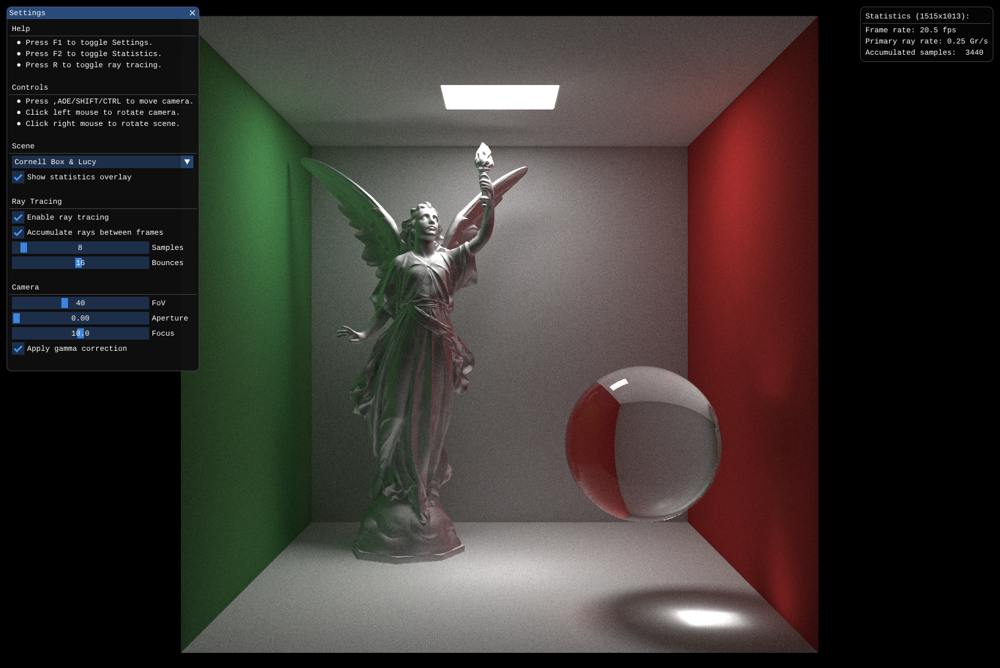

I took an existing Vulkan ray tracing project, [GPSnoopy's implementation](https://github.com/GPSnoopy/RayTracingInVulkan) of Peter Shirley's [Ray Tracing in One Weekend book](https://raytracing.github.io/books/RayTracingInOneWeekend.html), stripped out all the GLSL code, and replaced it with C++ shaders. This example produces stunning images with a small amount of code.

The ray tracing shaders are located [here](https://github.com/seanbaxter/RayTracingInVulkan/src/Vulkan/RayTracing/Shaders.cpp). A second set of shaders for rasterizing each scene are [here](https://github.com/seanbaxter/RayTracingInVulkan/src/Vulkan/Shaders.cpp).

[**Shaders.cpp**](https://github.com/seanbaxter/RayTracingInVulkan/blob/circle/src/Vulkan/RayTracing/Shaders.cpp)
```cpp
[[spirv::rint]]
void rint_sphere() {
  vec4 sphere = Spheres[glray_InstanceCustomIndex];
  vec3 center = sphere.xyz;
  float radius = sphere.w;

  vec3 origin = glray_WorldRayOrigin;
  vec3 dir = glray_WorldRayDirection;
  float tMin = glray_Tmin;
  float tMax = glray_Tmax;

  vec3 oc = origin - center;
  float a = dot(dir, dir);
  float b = dot(oc, dir);
  float c = dot(oc, oc) - radius * radius;
  float discriminant = b * b - a * c;

  float t1 = (-b - sqrt(discriminant)) / a;
  float t2 = (-b + sqrt(discriminant)) / a;

  bool b1 = tMin <= t1 && t1 < tMax;
  bool b2 = tMin <= t2 && t2 < tMax;
  if(discriminant >= 0 && (b1 || b2)) {
    SphereHit = sphere;
    gl_reportIntersection(b1 ? t1 : t2, 0);
  }
}
```

This example adds a layer of sophistication beyond the mini path tracer example: non-triangular geometry. Vulkan ray tracing has built-in support for intersecting rays with triangles. To intersect rays with procedural geometry, supply your own ray intersection shader. The `rint_sphere` shader tests a ray against procedural geometry identified by `glray_InstanceCustomIndex`. If the ray intersections the geometry, the closest hit is returned with `gl_reportIntersection`.

We now have two _rchit_ shaders, one for triangle geometry and one for spheres. These two shaders draw from the same material definitions, but compute their normals differently. For triangles, vertex normals are linearly interpolated using the barycentric coordinates of the intersection. For spheres, the analytical form is used.

### Nonuniform resource array access

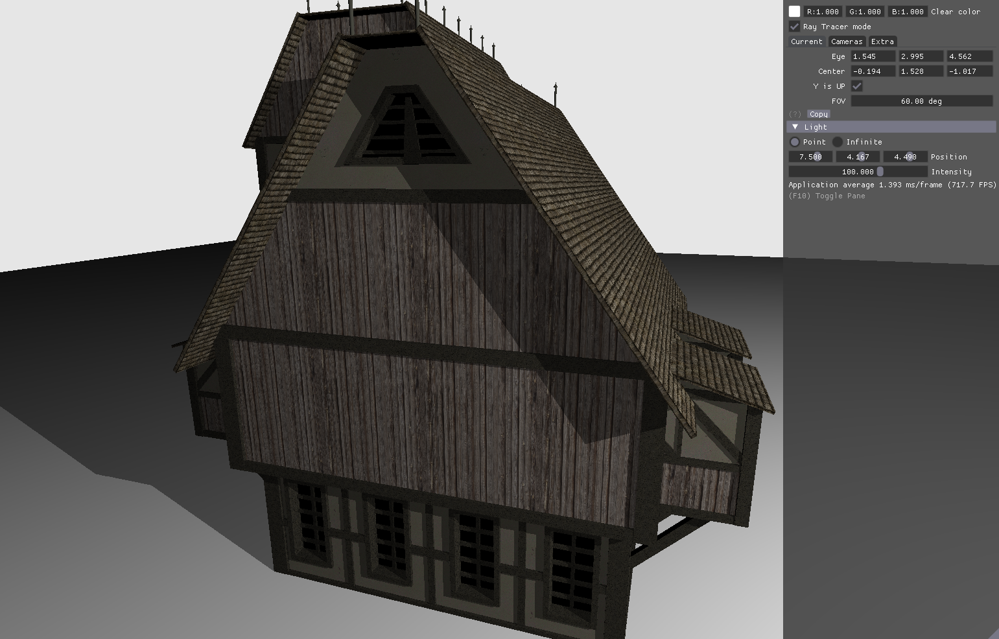

The third project I ported is [Martin-K Lefrançois's](https://twitter.com/doragonhanta) [Ray tracing tutorial](https://nvpro-samples.github.io/vk_raytracing_tutorial_KHR/). 

Build instructions are here: [vk_raytracing_tutorial_KHR](https://github.com/seanbaxter/vk_raytracing_tutorial_KHR/) for Circle.

The visuals are simple, but from a shader compiler's perspective, it's the most challenging sample of the three. Unlike the other two, it doesn't implement a path tracer. The ray tracing code shoots a ray from the _rchit_ fragment at the light source as an occlusion test for shadowing, and that's the only advanced lighting feature. But the foundation for supporting multiple object files and complex scenes is supported, using Vulkan's _resource arrays_.

Raster stages typically bind one sampler, storage image, uniform buffer or shader storage buffer per bind point. Materials are typically sorted between draw calls, so one resource per bind point is all you need.

But ray tracing is incoherent. You don't know what objects a ray will strike, so they all need to be accessible, in some form, to the shader. The application can load each model into its own set of buffers and textures, and manage those memory resources independently. 

[VkWriteDescriptorSet](https://www.khronos.org/registry/vulkan/specs/1.2-extensions/man/html/VkWriteDescriptorSet.html) sets a descriptor binding to a range of buffer or image objects. In this ray tracing example, each buffer may hold vertex information for a different model, and each texture may hold material data for a different model.

The binding model makes sense, but accessing resource arrays in a shader is error-prone. When performing a [dynamically-nonuniform subscript](https://developer.nvidia.com/blog/improved-glsl-syntax-vulkans-descriptorset-indexing/) of a resource array, GLSL requires you modify the subscript expression with the [`nonuniformEXT`](https://github.com/KhronosGroup/GLSL/blob/master/extensions/ext/GL_EXT_nonuniform_qualifier.txt). Failing to do so is undefined behavior, and may produce rendering artiacts.

A dynamically-nonuniform access is when different lanes within a block access different resource array elements. In ray tracing, where rays scatter incoherently all across the scene, there's a high chance that neighboring lanes intersect different objects. Rather than requiring the user to insert `nonuniformEXT` at all dynamically-nonuniform subscripts, Circle inserts the `NonUniform` SPIR-V decoration implicitly and automatically. A heuristic is run by the compiler's code generator to see if it can drop the decorator. Constants and loads from UBOs, push constants and read-only images and SSBOs are inherently uniform. Arithmetic on uniform terms is itself uniform. When the subscript expression is uniform, the decoration is not emitted. This provides high-performance for uniform access while defaulting to a more robust mechanism than GLSL.

[**raytrace.cxx**](https://github.com/seanbaxter/vk_raytracing_tutorial_KHR/blob/circle/ray_tracing__simple/raytrace.cxx)
```cpp
[[using spirv: uniform, binding(0), set(1)]]
camera_t cam;

[[using spirv: buffer, binding(1), set(1)]]
struct [[spirv::block]] {
  WaveFrontMaterial m[];
} materials[];

[[using spirv: buffer, binding(2), set(1)]]
SceneDesc sceneDescs[];

[[using spirv: uniform, binding(3), set(1)]]
sampler2D textureSamplers[];

[[using spirv: buffer, binding(4), set(1)]]
struct [[spirv::block]] {
  int i[];
} matIndices[];
```

Circle C++ shaders uses a simpler syntax for defining interface variables than GLSL. To declare a UBO or SSBO of a given type, just write the type. If the UBO or SSBO holds an array type, write that array type. `cam` is a UBO of type `camera_t`. `sceneDescs` is a single UBO with a runtime-array of type `SceneDesc`.

```cpp
// GLSL
layout(binding=1, set=2)
buffer MyBuffer {
  WaveFrontMaterial m[];
} materials[];

// Equivalent C++
[[using spirv: buffer, binding(1), set(2)]]
struct [[spirv::block]] {
  WaveFrontMaterial m[];
} materials[];
```

To create a _buffer resource array_, where multiple buffers are associated with a single UBO or SSBO binding, define the contents of a single element inside a `[[spirv::block]]`-decorated structure, then declare an array of that block type.

```cpp
// GLSL
layout(binding=3, set=1)
uniform sampler2D textureSamplers[];

// Equivalent C++
[[using spirv: uniform, binding(3), set(1)]]
sampler2D textureSamplers[];
```

Image and sampler arrays arrays are always resource array types, supporting multiple resources attached to a single descriptor binding.

[**raytrace.cxx**](https://github.com/seanbaxter/vk_raytracing_tutorial_KHR/blob/circle/ray_tracing__simple/raytrace.cxx)
```cpp
[[spirv::rchit]]
void rchit_shader() {
  // Object of this instance.
  SceneDesc desc = sceneDescs[glray_InstanceCustomIndex];
  int objId = desc.objId;

  mat4 transfo(desc.transfo);
  mat4 transfoIT(desc.transfoIT);

  // Get the push constants.
  Constants constants = shader_push<Constants>;

  // Note that nonuniformEXT is implicitly added by Circle when using a 
  // dynamic non-uniform index into a resource array.
  int indx = indices[objId].i[3 * glray_PrimitiveID + 0];
  int indy = indices[objId].i[3 * glray_PrimitiveID + 1];
  int indz = indices[objId].i[3 * glray_PrimitiveID + 2];

  Vertex v0 = vertices[objId].v[indx];
  Vertex v1 = vertices[objId].v[indy];
  Vertex v2 = vertices[objId].v[indz]; 

  ...
```

This raytrace tutorial sample supports rendering multiple objects each with multiple triangles. Inside the shader, the object entity is accessed through `glray_InstanceCustomIndex`. The `sceneDescs` array at this location yields the transformation matrix to bring the model from model space into world space.

Accessing the triangle's vertex information requires nonuniform loads. There is a separate index array for each object. The `indices[objId]` subscript is implicitly dynamically-nonuniform, because it is an index into a buffer resource array with a data-dependent subscript. The compiler automatically marks this access as `NonUniform`. Access into the `vertices` array is also nonuniform on the object ID. Note that the second part of the accesses, over `glray_PrimitiveID` and `indx`, respectively, while certainly nonuniform (they're data dependent), don't require any special decoration, as they are accessing different elements within a buffer rather, than different buffers within a multi-buffer descriptor binding.

## The mesh shader pipeline

The [GLSL_NV_mesh_shader](https://github.com/KhronosGroup/GLSL/blob/master/extensions/nv/GLSL_NV_mesh_shader.txt) extension, implemented on NVIDIA Turing and Ampere devices, provides an alternative set of vertex-processing stages for rasterization. The old sequence of vertex->control->evaluation->geometry->fragment is replaced by task->mesh->fragment. Get an overview [here](https://developer.nvidia.com/blog/introduction-turing-mesh-shaders/).

The two new shader stages are compute shaders with attached queues. Each workgroup in the task shader emits a task count and data for each task. The fixed-function part of the pipeline performs a prefix sum on the task counts, and dynamically launches a mesh shader grid, with one workgroup per task. In HLSL, the task stage is called "amplification", because it amplifies tasks into full compute shader workgroups.

### The meshlet cadscene sample


I forked [Christoph Kubisch](https://twitter.com/pixeljetstream)'s **[Vulkan meshlet cadscene sample](https://github.com/nvpro-samples/gl_vk_meshlet_cadscene/)** into this [Circle branch](https://github.com/seanbaxter/gl_vk_meshlet_cadscene/tree/circle). The program was simplified by removing some options, all GLSL was removed, and the shaders were re-written with Circle's C++ shaders extension.

[**mesh_shaders.cxx**](https://github.com/seanbaxter/gl_vk_meshlet_cadscene/blob/circle/mesh_shaders.cxx)
```cpp
struct Task {
  uint baseID;
  uint8_t subIDs[GROUP_SIZE];
};

[[spirv::perTaskOut]] Task taskOut;
[[spirv::perTaskIn]] Task taskIn;

[[using spirv: task, local_size(GROUP_SIZE)]]
void task_shader() {
  uint baseID = glcomp_WorkGroupID.x * GROUP_SIZE;
  uint laneID = glcomp_LocalInvocationID.x;

  baseID += push.assigns.x;
  uvec4 desc = meshletDescs[min(baseID + laneID, push.assigns.y) + 
    push.geometryOffsets.x];

  bool render = !(baseID + laneID > push.assigns.y || earlyCull(desc, object));
  
  uvec4 vote  = gl_subgroupBallot(render);
  uint  tasks = gl_subgroupBallotBitCount(vote);
  uint  voteGroup = vote.x;

  if (laneID == 0) {
    glmesh_TaskCount = tasks;
    taskOut.baseID = baseID;
  }

  uint idxOffset = gl_subgroupBallotExclusiveBitCount(vote);

  if (render)
    taskOut.subIDs[idxOffset] = laneID;
}
```

Like many compute shaders, the task/amplification shader uses a prefix sum to generate work items. Each thread in the task shader loads the bounding box for a different meshlet. The bounding box is culled against the view frustum, and in this sample, against user-adjustable clipping planes. 

If the meshlet is not culled, it is rendered by generating a task for the subsequent mesh shader stage. Each thread submits its render bit to `gl_subgroupBallot`, a warp-synchronous instruction which combines the flags from each lane and returns them in a single value. The OpenGL/Vulkan subgroup extension supports subgroups up to 128 lanes, which is why the result object is a uvec4: it needs 128 bits. (The subgroup is 32 lanes wide on NVIDIA and 64 lanes wide on AMD hardware.)

`gl_subgroupBallotBitCount` and `gl_subgroupBallotExclusiveBitCount` are misleadingly named, as they aren't actually warp-synchronous instructions. The former intrinsic counts the number of set bits in its operand, which is a reduction yielding the number of meshlets this block is forwarding to the mesh shader. The latter intrinsic performs an exclusive prefix sum on the operand, yielding the total number of bits set that occur prior to the lane submitting the request. This compresses task shader lanes that have meshlets to render, filtering out those with meshlets that are culled.

```cpp
template<int vert_count, int prim_count, bool clip_primitives>
[[using spirv:
  mesh(triangles, vert_count, prim_count), 
  local_size(GROUP_SIZE)
]]
void mesh_shader() {
  constexpr int vert_runs = div_up(vert_count, GROUP_SIZE);
  constexpr int index_runs = div_up(3 * prim_count, 8 * GROUP_SIZE);

  uvec4 geometryOffsets = shader_push<uvec4>;

  uint meshletID = taskIn.baseID + taskIn.subIDs[glcomp_WorkGroupID.x];
  uint laneID = glcomp_LocalInvocationID.x;

  // decode meshletDesc
  uvec4 desc = meshletDescs[meshletID + geometryOffsets.x];
  meshlet_t meshlet = decodeMeshlet(desc);
```

The `spirv::perTaskOut` storage class provisions memory for detailing each task scheduled by the task shader. A view into the same memory is declared on the mesh shader side with the `spirv::perTaskIn` storage class. Each task generated by the task shader, through the `glmesh_TaskCount` declaration, causes the dispatch of one block in the mesh shader grid, identified by `glcomp_WorkGroupID.x`. The workgroup ID is used to index into the per-task data between these shader stages. The lane ID `glcomp_LocalInvocationID.x` is used to cooperatively stream geometry out of the mesh shader and into the vertex queue.

```cpp
template<int vert_count, bool clip_primitives>
vec4 procVertex(uint vert, uint vidx, uint meshletID) {
  // Stream the vertex position.
  vec3 oPos = texelFetch(texVbo, vidx).xyz;
  vec3 wPos = (object.worldMatrix  * vec4(oPos,1)).xyz;
  vec4 hPos = (scene.viewProjMatrix * vec4(wPos,1));
  
  vec3 oNormal = texelFetch(texAbo, vidx).xyz;
  vec3 wNormal = mat3(object.worldMatrixIT) * oNormal;

  glmesh_Output[vert].Position = hPos;

  Vertex vertex { };
  vertex.pos = wPos;
  vertex.dummy = 0;
  vertex.normal = wNormal;
  vertex.meshletID = meshletID;
  shader_out<0, Vertex[vert_count]>[vert] = vertex;
  
  // Perform clipping against user clip planes.
  if constexpr(clip_primitives) {
    glmesh_Output[vert].ClipDistance[0] = dot(scene.wClipPlanes[0], vec4(wPos,1));
    glmesh_Output[vert].ClipDistance[1] = dot(scene.wClipPlanes[1], vec4(wPos,1));
    glmesh_Output[vert].ClipDistance[2] = dot(scene.wClipPlanes[2], vec4(wPos,1));
  }

  return hPos;
}
```

`procVertex` is responsible for streaming geometry from the mesh shader to GPU's triangle setup engine. The `shader_out` variable template is specialized on a `Vertex` array, which is sized to the max number of vertices per block for this sample (126 primitives). These four terms are interpolated by the GPU and recovered by the fragment shader as `in` parameters and rasterized.


## Vectors and matrices

gcc has builtin vector types to serve as containers for SIMD instructions. But they're not richly featured, and won't serve the needs of shader programmers. The Circle compiler extends the vector types for feature parity with GLSL, while opting for initializer syntax that is idiomatic C++. Builtin matrix types are also available.

Builtin vectors are available with `bool`, integral and floating-point element types. Use the GCC extension `vector_size` to specify the number of components.

```cpp
typedef float    vec2    __attribute__((vector_size(8)));
typedef float    vec3    __attribute__((vector_size(12)));
typedef float    vec4    __attribute__((vector_size(16)));
 
typedef double   dvec2   __attribute__((vector_size(16)));
typedef double   dvec3   __attribute__((vector_size(24)));
typedef double   dvec4   __attribute__((vector_size(32)));
 
typedef int      ivec2   __attribute__((vector_size(8)));
typedef int      ivec3   __attribute__((vector_size(12)));
typedef int      ivec4   __attribute__((vector_size(16)));
 
typedef unsigned uvec2   __attribute__((vector_size(8)));
typedef unsigned uvec3   __attribute__((vector_size(12)));
typedef unsigned uvec4   __attribute__((vector_size(16)));

typedef bool     bvec2    __attribute__((vector_size(2)));
typedef bool     bvec3    __attribute__((vector_size(3)));
typedef bool     bvec4    __attribute__((vector_size(4)));
```

These vector declarations are automatically injected into the translation unit when compiling with the `-shader` compiler argument. Each vector has alignment equal to the largest power-of-two of its size. That is, `vec2` has alignment 8, `vec3` has alignment 4 and `vec4` has alignment 16. The large alignment for power-of-two element vectors matches the requirements already in place for supporting SIMD instruction sets like AVX. 

### Vector swizzle

Circle adds source and destination swizzle to vectors. This functionality can't sanely be implemented within C++, so custom frontend treatment is a requirement.

```cpp
vec cross(vec3 a, vec3 b) {
  return a.yzx * b.zxy - b.yzx * a.zxy;
}
```

There are three naming domains for vector swizzles:
* `xyzw` - positions
* `rgba` - colors
* `stpq` - textures

You can use components from any name domain, but can't mix domains within a swizzle. That is, `.rgrg` is a good swizzle, but `.rgxy` is a bad swizzle.

Swizzling a vector yields a (potentially smaller) vector expression in the same value category. That is, swizzling a prvalue vector yields a prvalue, and swizzling a glvalue yields a glvalue.

You may not assign to a swizzle where the same component is listed multiple times. `v.xy = v.yx;` is legal, but `v.xx = v.yx` is not. Additionally the address of a swizzle lvalue cannot be taken, and you can't bind a non-const reference to a swizzle expression. Swizzle lvalues are syntactic conveniences supporting load and store. They aren't true lvalues.

```cpp
vec4 v(1, 2, 3, 4);
v.xw = v.yz;
```

This expression assigns the inner elements of a vector to its outer elements. It's clear here that the lvalue `v.xw` cannot have its address taken, because the storage it refers to isn't even contiguous in memory.

### Vector initializers

GLSL is, for the most part, similar to C++, but it differs considerably when it comes to initializers. The builtin vector and matrix types in Circle use C++-style initializers. They provide both constructors and aggregate initializers.

```cpp
// Copy-initializer.
vec3 v1 = vec3(1, 2, 3);

// Direct initializer.
vec3 v2(4, 5, 6);

// Braced initializer.
vec3 v3 { 7, 8, 9 }; 
```

To initialize single vectors, you can use a copy-initializer, direct initializer or braced initializer.

```cpp
// Constructors in array initializer.
vec3 array[] {
  vec3(1, 2, 3),
  vec3(4, 5, 6),
  vec3(7, 8, 9),
};

// Aggregate initializer.
vec3 array2[] {
  1, 2, 3,
  4, 5, 6, 
  7, 8, 9,
};

// Mixed initializer.
vec3 array3[] {
  1, 2, 3,
  vec3(4, 5, 6), 
  7, 8, 9,
};
```

To initialize an array of vectors (or matrices), you can provide a vector for each array element (`array`) or you can provide scalars, which will be grouped into vectors, and from there into the array. These forms may be mixed on a per-element basis. The latter form is called [aggregate initialization](https://en.cppreference.com/w/cpp/language/aggregate_initialization).

```cpp
vec2 a(1, 2);     // (1, 2)
vec3 b(a, 3);     // (1, 2, 3)
vec4 c(a, a);     // (1, 2, 1, 2)
vec4 d(a, a.yx);  // (1, 2, 2, 1)


vec4 array[] {
  b, 4,           // (1, 2, 3, 4)
  a, a,           // (1, 2, 1, 2)
  1, 2, d.zz,     // (1, 2, 2, 2)
};
```

You can construct vectors from both scalars and smaller vectors. This initialization style extends to aggregates: when initializing an array of vecN, N scalars at a time are assigned to each array element.

When a vector constructor is only provided a single scalar argument, that scalar performs a "splat" initialization of the vector, setting all elements equal to it. Vectors implicitly converted from scalars are also splat initialized.

```cpp
vec3 v(5);        // (5, 5, 5)
```

Initializing a matrix on a single scalar argument sets its off-diagonal elements to 0 and splats that argument to the diagonal.

```cpp
mat2 m(3);        // (1, 0, 0, 1)
```

You can load vectors and matrices from a pointer to data of its scalar type. This is slightly different from casting data to a pointer to the vector/matrix type and dereferencing it, as that requires data be vector/matrix-aligned, whereas the pointer initializer only requires scalar-alignment.

```cpp
float x[4];
vec4 v(x);

float y[16];
mat4 m(y);
```

### Element-wise vector operations

Almost all operations on vectors yield vectors. Builtin unary operators like +, - and ! as well as binary operators like +, -, /, * and % yield vectors when either operand is a vector. More surprisingly, the ternary operator ?:, the two comparison (== and !=) and four relational (<, >, <= and >=) operators also yield vectors. This allows us to vectorize entire expressions component-wise. Circle does diverge from GLSL's treatment of vectors in how functions are called: GLSL will implicitly call a function with scalar parameters once for each vector component when its arguments are vectors; Circle does not.

The Circle vector is an extension of the [GCC vector type](https://gcc.gnu.org/onlinedocs/gcc/Vector-Extensions.html), which was introduced to support SIMD instructions sets. It inherits all of that type's behaviors, including an unexpected treatment of comparison and relational operations.

> Vector comparison is supported with standard comparison operators: ==, !=, <, <=, >, >=. Comparison operands can be vector expressions of integer-type or real-type. Comparison between integer-type vectors and real-type vectors are not supported. The result of the comparison is a vector of the same width and number of elements as the comparison operands with a signed integral element type.

This behavior was selected so that comparisons on vectors would produce bit-masks for the next instruction in a SIMD program. For the sake of consistency, this behavior, though surprising, has been retained. However, you can cast the result object of a comparison to a boolean vector or source it directly in a logical operator.

```cpp
vec3 a(1, 2, 3);
vec3 b(2, 2, 2);

// Comparison/relational operators on vectors yield vectors.
// If one side is a scalar, it'll be promoted to the vector type of the
// other side.
bvec3 c = a <= b;
printf("%d %d %d\n", c.x, c.y, c.z);  // 1 1 0 

// The result type of a comparison is actually a vector of signed integer
// types. The result type isn't necessarily a bool vector.
printf("%s\n", @type_string(decltype(a <= b)));  // <3 x int>

// The left expression of a ternary operator is a vector, so 
// the second and third arguments are promoted to vector types.
vec3 d = c ? 5.f : 6.f;
printf("%f %f %f\n", d.x, d.y, d.z);  // 5 5 6
```

Builtin operators are vector compatible. Circle also includes an extension, `__vector_apply` for vectorizing calls to functions. This makes it easy to achieve feature parity with GLSL. All the vector version of elementary functions are implemented with `__vector_apply`:

```cpp
GLSL_PREFIX float  [[spirv::GLSLstd450(13)]] sin(float a) noexcept { return                __builtin_sinf( a); }
GLSL_PREFIX vec2   [[spirv::GLSLstd450(13)]] sin(vec2  a) noexcept { return __vector_apply(__builtin_sinf, a); }
GLSL_PREFIX vec3   [[spirv::GLSLstd450(13)]] sin(vec3  a) noexcept { return __vector_apply(__builtin_sinf, a); }
GLSL_PREFIX vec4   [[spirv::GLSLstd450(13)]] sin(vec4  a) noexcept { return __vector_apply(__builtin_sinf, a); }
extern "C"  double [[spirv::GLSLstd450(13)]] sin(double ) noexcept;
GLSL_PREFIX dvec2  [[spirv::GLSLstd450(13)]] sin(dvec2 a) noexcept { return __vector_apply(__builtin_sin,  a); }
GLSL_PREFIX dvec3  [[spirv::GLSLstd450(13)]] sin(dvec3 a) noexcept { return __vector_apply(__builtin_sin,  a); }
GLSL_PREFIX dvec4  [[spirv::GLSLstd450(13)]] sin(dvec4 a) noexcept { return __vector_apply(__builtin_sin,  a); }
GLSL_PREFIX long double sin(long double a) noexcept { return __builtin_sinl(a); }
```

This extension takes two or more arguments. The first argument is the name of a function. The remaining arguments are forwarded to this function. Scalar arguments are forwarded directly. Vector arguments are broken into their constituent parts. At least one vector argument must be provided. The result objects from each scalarized function call are collected into a new vector (matching the dimensions of the argument vectors) and returned from the intrinsic.

In this overload of `sin`, the `__builtin_sinf` function is called twice for a `vec2` argument, three times for a `vec3` argument and four times for a `vec4` argument. The results are combined back into a vector.

### Vector conversion to bool

Vector types don't convert to bool as simply as scalars do, so Circle has special rules for making life easier on the user while also always doing the thing you want it to do.

```cpp
bvec4 v(false, false, true, true);

bool a = v;   // Error: "cannot convert lvalue bvec4 to bool"
bool b = __vector_any(v);   // true
bool c = __vector_all(v);   // false

vec3 v2(1, 2, 3);
vec3 v3(1, 2, 4);
printf("%s\n", @type_string(decltype(v2 < v3)));  // Prints "<3 x int>"

// Allow conversion from a comparison/relational operator.
bool d = v2 == v3;          // false
bool e = v2 != v3;          // true
bool f = v2 < v3;           // true
bool g = v2 >= v3;          // false
```

You can't just convert a vector (even vector of bool) to type bool. You may use the functions `any` or `all` to affect a conversion. These map to the intrinsic `__vector_any` and `__vector_all`. 

Comparison and relational expressions involving vectors are directly convertible to bool. operator== evaluates true if _all_ of the component-wise comparisons are equal. operator!= converts true if _any_ of the component-wise comparisons differ. 

The relational expressions <, >, <= and >= provide tuple-like evaluations when converted to bool. The first components are compared, and if not equal, true or false is returned. The second components are compared, and if not equal, true or false is compared, and so on. The relational vector conversions to bool are unlikely to be useful in shaders, but may help host code implement sortable structures with vector data members.

### Matrix types

```cpp
typedef vec2     mat2x2  __attribute__((matrix_size(16)));
typedef vec2     mat3x2  __attribute__((matrix_size(24)));
typedef vec2     mat4x2  __attribute__((matrix_size(32)));
typedef vec3     mat2x3  __attribute__((matrix_size(24)));
typedef vec3     mat3x3  __attribute__((matrix_size(36)));
typedef vec3     mat4x3  __attribute__((matrix_size(48)));
typedef vec4     mat2x4  __attribute__((matrix_size(32)));
typedef vec4     mat3x4  __attribute__((matrix_size(48)));
typedef vec4     mat4x4  __attribute__((matrix_size(64)));
typedef mat2x2   mat2;
typedef mat3x3   mat3;
typedef mat4x4   mat4;
 
typedef dvec2    dmat2x2  __attribute__((matrix_size(32)));
typedef dvec2    dmat3x2  __attribute__((matrix_size(48)));
typedef dvec2    dmat4x2  __attribute__((matrix_size(64)));
typedef dvec3    dmat2x3  __attribute__((matrix_size(48)));
typedef dvec3    dmat3x3  __attribute__((matrix_size(72)));
typedef dvec3    dmat4x3  __attribute__((matrix_size(96)));
typedef dvec4    dmat2x4  __attribute__((matrix_size(64)));
typedef dvec4    dmat3x4  __attribute__((matrix_size(96)));
typedef dvec4    dmat4x4  __attribute__((matrix_size(128)));
typedef dmat2x2  dmat2;
typedef dmat3x3  dmat3;
typedef dmat4x4  dmat4;
```

Builtin matrix types are implicitly declared to match those provided by GLSL. As in GLSL, matrices use _column-major_ storage, and the number of columns is written first in the typedef. That is, `mat2x3` is a matrix with two columns and three rows.

Matrices have similar initializers as vectors. You may aggregate initialize matrices with a mix of scalar and vector types.

Constructing a matrix on a vector yields a matrix with that vector its diagonal, and zeroes for all off-diagonal elements. Constructing a matrix on a scalar yields a matrix with that element on all diagonal elements.

## Shader extension declarations

To support a GLSL-like environment, the Circle compiler injects itself with thousands of declarations. Some of these are for self-contained functions. Some of them are type, object and function declarations which are backed by the compiler frontend. Until a reference guide is ready, this implicit declaration file is the best way to learn which facilities are available for shader programming.

**Implicit SPIR-V declarations file [implicit/spirv.cxx](implicit/spirv.cxx)**

As more GLSL extensions are implemented, this file will grow to accommodate them.

## Under construction features

There are many features in development:

* Better control flow graph passes to allow correct lowering of C++ code to the `Logical` addressing model of SPIR-V:
    1. mem2reg
    2. de-pointerization
    3. common subexpression elimination
    4. loop invariant code motion

* Buffer layout attributes:
    1. `[[spirv::layout(std140)]]`
    2. `[[spirv::layout(std430)]]`
    3. `[[spirv::layout(scalar)]]`

* More shader extensions:
    1. `OVR_multiview` for faster stereo head-mounted display rendering.

* Separated samplers/textures. (Vulkan only.)
* Subpass inputs. (Vulkan only.)

* A `#pragma spirv` namespace for issuing module-wide SPIR-V directives.

* A pipeline-like markup for naming shaders which may appear in the same shader program. This will enable automatic assignment of resources bindings.

Some larger features I want to get to ASAP:

* A Circle compiler for Windows. I need Microsoft's cooperation in accessing the Visual C++ ABI docs for this to happen.
* A Circle extension for DXIR, to support Direct3D programs.
* A Circle extension for the PlayStation Shading Language (PSSL) binary format, to support PS4 and PS5.

A single set of shader attributes can be rich enough for all three shader backend targets, so that the `spirv` attribute namespace can be replaced with the more generic `shader` namespace.

* A software support library for shader interface variables. The shadertoy sample already supports CPU debugging on click, but those shaders don't use textures, for example. Writing CPU-side interface variable definitions would increase the shader feature set available for CPU debugging.

